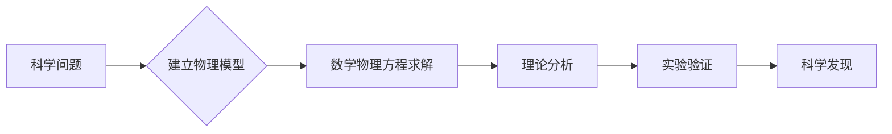

# 《数学物理方程第二版》习题解答详解

[本文还有配套的精品资源，点击获取](https://download.csdn.net/download/zhoudong1017/4267751)


简介：《数学物理方程第二版答案》是数学物理方程学习者的重要辅助资源，提供了教材中习题的详细解答。该书深入探讨了数学物理方程的理论和应用，涵盖了波动方程、热传导方程等多个领域中的重要方程。第二版可能增加了实际案例、深化了理论分析，并引入了新的求解方法。本书旨在帮助学生通过详细解答掌握数学物理方程的理论知识，并应用于实际问题。学习数学物理方程的关键包括基本概念理解、解法技巧掌握、定性分析能力、数值解法应用和实际问题解决能力。通过本书的学习，学生不仅能提升数学技能，还能增强物理直觉。


## 1. 数学物理方程的应用和重要性

### 1.1 数学物理方程的基本概念

#### 1.1.1 数学物理方程的定义和历史背景

数学物理方程是描述自然界中物理现象数学关系的一类方程。它们将物理定律量化，为我们理解复杂的物理系统提供了数学模型。从牛顿的运动定律到麦克斯韦的电磁场方程，再到爱因斯坦的相对论方程，数学物理方程的发展历程是科学进步的缩影。

#### 1.1.2 数学物理方程在科学和工程中的地位

在科学与工程领域，数学物理方程占据核心地位。它们不仅在理论研究中揭示自然界的深层次规律，而且在实践中用于指导技术创新和产品设计。例如，在航空航天工程中，流体动力学方程和飞行器的运动方程组是设计飞行器不可或缺的理论基础。

### 1.2 数学物理方程的分类和特点

#### 1.2.1 常微分方程和偏微分方程的区别

数学物理方程可以分为常微分方程和偏微分方程两大类。常微分方程通常描述单一变量的变化过程，而偏微分方程则涉及多变量之间的相互依赖关系。区别在于求解时变量的不同处理方式，偏微分方程因变量间关系的复杂性而更难求解。

#### 1.2.2 不同类型的数学物理方程适用场景

根据物理现象的不同，选用合适的数学物理方程至关重要。例如，在研究热传导问题时，会用到热传导方程；而在研究波动问题时，则使用波动方程。正确的方程选择能有效简化问题，帮助我们得出准确的预测和解决方案。

### 1.3 数学物理方程的研究意义

#### 1.3.1 理论物理的数学模型构建

理论物理中，数学物理方程是构建数学模型的主要工具。这些模型能够抽象和概括物理现象的本质，从而引导我们发现新的物理定律，如量子力学中的薛定谔方程，为量子理论的发展奠定了坚实基础。

#### 1.3.2 解决实际问题中的应用实例分析

在实际问题中，如建筑设计、交通流量分析等，数学物理方程的应用同样不可或缺。例如，结构工程师会使用静力学方程来确保建筑物的稳定性；而交通工程师利用流体力学方程来优化交通流，减少拥堵。

数学物理方程不仅仅是抽象理论的展现，它们贯穿于科学与工程的各个领域，将现实问题转化为可操作的数学表达，是现代科技发展的基石。通过深入研究和掌握这些方程，我们能够更好地理解世界，预测未来，并创造出新的解决方案。在接下来的章节中，我们将详细探讨具体的数学物理方程，以及它们在不同场景下的应用和解题方法。

## 2. 波动方程、热传导方程等具体方程解析

波动方程作为描述波动传播的经典数学模型，是物理学中非常重要的一个方程，尤其在声学、电磁学和量子力学等领域有着广泛的应用。热传导方程则是研究热量传递过程的基础，它描述了温度在物体内部随时间和位置变化的规律。接下来，我们将深入探讨这两类方程，并简要介绍其他重要的数学物理方程。

#### 2.1 波动方程的深入探讨

波动方程是一个二阶偏微分方程，通常用来描述波动现象，如声波、光波和地震波等。波动方程的物理背景可以追溯到波动的传播原理，即波动在介质中传播时，每一个质点都是以振动形式存在的。

##### 2.1.1 波动方程的物理背景和数学描述

波动方程的数学描述通常可以表示为：

[ \frac{\partial^2 u}{\partial t^2} = c^2 \nabla^2 u ]

其中，( u(x, t) ) 代表波动场的位移或状态，( t ) 表示时间，( x ) 是位置向量，( c ) 是波速，( \nabla^2 ) 是拉普拉斯算子，它表示空间中某一点处的曲率。

##### 2.1.2 波动方程在不同介质中的传播特性

波动方程的传播特性会受到介质性质的影响。在均匀、各向同性的介质中，波速 ( c ) 是一个常数，波动方程相对简单。然而，在复杂介质中，比如非均匀介质、各向异性介质或者存在非线性效应的介质中，波动方程会变得更加复杂。例如，非均匀介质中波速 ( c ) 可能是位置的函数，即 ( c = c(x) )，此时波动方程需要进行相应的变化和求解。

#### 2.2 热传导方程的详细解析

热传导方程描述的是热量在物体内部的传播机制，也是二阶偏微分方程的一种。热传导方程的物理背景基于傅里叶热传导定律，即热量从高温区域向低温区域流动，直到温度分布均匀。

##### 2.2.1 热传导方程的推导和意义

热传导方程一般可以表示为：

[ \frac{\partial u}{\partial t} = k \nabla^2 u ]

其中，( u(x, t) ) 代表温度，( k ) 是热传导系数。这个方程揭示了温度随时间和空间变化的规律，是研究热传导过程的基础。

##### 2.2.2 热传导方程的边界条件和初始条件分析

边界条件和初始条件是求解热传导方程不可或缺的部分。边界条件描述了物体边界上温度或热流量的分布情况，比如固定温度、绝热条件或对流换热条件等。初始条件则描述了初始时刻物体内部的温度分布。只有将这些条件与热传导方程相结合，才能得到具体的解。

#### 2.3 其他重要数学物理方程简介

除了波动方程和热传导方程之外，还有许多其他重要的数学物理方程在不同的领域中扮演着关键角色。例如，量子力学中的薛定谔方程、电磁学中的麦克斯韦方程组等。

##### 2.3.1 薛定谔方程、拉普拉斯方程等方程的基本特性

薛定谔方程是描述微观粒子状态的偏微分方程，具有以下形式：

[ i\hbar\frac{\partial \Psi}{\partial t} = \hat{H} \Psi ]

其中，( i ) 是虚数单位，( \hbar ) 是约化普朗克常数，( \Psi ) 是波函数，( \hat{H} ) 是哈密顿算符。薛定谔方程是量子力学的基础，描述了量子态随时间的演化。

拉普拉斯方程是一种特殊的椭圆型偏微分方程，其形式为：

[ \nabla^2 \phi = 0 ]

其中，( \phi ) 是标量场，拉普拉斯方程在物理学中描述了许多无源场的性质，如引力场、电场和磁场等。

##### 2.3.2 不同方程在特定领域的应用分析

每个具体的数学物理方程都与特定的物理现象紧密相关，因此，它们在各个领域的应用也是有特定针对性的。例如，波动方程在地震勘探、声学测量中的应用，热传导方程在热分析、材料科学中的应用。每个方程的理解和运用都对解决实际问题具有重要的意义。

在本文的第二章中，我们以波动方程和热传导方程为例，详细介绍了数学物理方程的背景知识、物理意义和数学描述，并对其在不同介质和条件下的传播特性进行了探讨。同时，我们也简要介绍了其他重要的数学物理方程，为读者提供了一个全面的概览。这些方程在理论和实际应用中都有着不可替代的地位和作用。

## 3. 解题方法与技巧：分离变量法、傅里叶变换等

### 3.1 分离变量法的应用和步骤

#### 分离变量法的基本原理

分离变量法是一种常用且有效的数学物理方程解法，特别适用于偏微分方程。该方法的基本思想是将多变量函数转换为单变量函数的乘积形式，从而简化问题。

#### 具体步骤如下：

1. **假设解的形式**
   ：首先，根据物理问题和边界条件的特性，假设解可以表示为几个独立变量函数的乘积形式。
2. **代入方程**
   ：将假设的解形式代入原方程，使得方程中的所有变量都分离成独立的单变量函数。
3. **化简方程**
   ：对每一个单变量函数应用适当的数学操作，通常涉及微分和积分操作，将多变量方程转化为一系列单变量方程。
4. **求解单变量方程**
   ：分别求解这些单变量方程，得到每个变量的表达式。
5. **求解常数**
   ：根据原方程的边界条件和初始条件来确定乘积形式中各个单变量函数的系数。
6. **构造最终解**
   ：将求得的单变量函数及其系数代回乘积形式，得到原偏微分方程的解。

### 3.2 傅里叶变换的理论基础和方法

#### 傅里叶变换的数学定义和性质

傅里叶变换是信号处理、图像分析、物理方程等领域中的一种重要数学工具。它将时域中的信号转换为频域中的表示形式。

#### 傅里叶变换的基本定义：

傅里叶变换通常定义为：

```
F(ω) = ∫ f(t) e^(-iωt) dt

```

这里，
`f(t)`
是时域信号，
`F(ω)`
是其对应的频域表示，
`ω`
表示角频率，
`i`
是虚数单位。

#### 傅里叶变换在物理方程中的应用案例

在物理方程的解法中，特别是波动方程的求解，傅里叶变换提供了另一种有效的方法。下面是一个具体案例：

假设有一个波动方程：

```
∂²u/∂t² = c²∂²u/∂x²

```

其中，
`u(x,t)`
是波动的位置和时间的函数，
`c`
是波速。

应用傅里叶变换可以将上式在空间域中的二阶偏微分方程转换为在频率域中的常微分方程，从而简化了问题并使得求解更为直接。

##### 代码示例（使用 Python 和 SciPy）:

```python
import numpy as np
from scipy.fftpack import fft, ifft

def wave_equation(x, t, c): # 这里我们使用离散傅里叶变换近似连续傅里叶变换
u = np.zeros_like(x) # 假设初始条件 u(x,0) = f(x)
for n in range(len(x)):
u[n] = np.sin(2 _ np.pi _ x[n])
U = fft(u) # 对初始条件进行傅里叶变换 # 进行时间演变
for i in range(1, len(t)):
U _= np.exp(-1j _ c _ 2 _ np.pi * t[i])
u = np.real(ifft(U)) # 逆变换回到空间域
return u

# 示例参数

x = np.linspace(0, 1, 100)
t = np.linspace(0, 1, 50)
c = 1.0

# 求解波动方程

u = wave_equation(x, t, c)

```

在这个示例中，我们使用了离散傅里叶变换来近似连续傅里叶变换。这是在计算机上处理数字信号和方程求解时常用的方法。代码中的
`wave_equation`
函数演示了如何利用傅里叶变换求解一维波动方程。

### 3.3 其他解题技巧的探索和实践

#### 拉普拉斯变换、格林函数法等解题方法介绍

除了分离变量法和傅里叶变换，拉普拉斯变换和格林函数法也是解决数学物理方程的有效方法。

#### 拉普拉斯变换的原理和应用

拉普拉斯变换是一种积分变换，广泛用于解线性常微分方程和偏微分方程，特别是在具有初始条件的问题中。

#### 格林函数法的原理和应用

格林函数法利用了一个重要概念——格林函数，它是一种特殊的函数，用于求解偏微分方程的特定边界条件问题。

#### 解题技巧的对比分析

不同的解题技巧适用于不同类型的问题。在实际应用中，选择合适的解题方法能够极大提高解题的效率和准确性。例如，对于具有特定对称性的问题，分离变量法和傅里叶变换非常有效；而对于具有复杂边界条件的问题，格林函数法提供了更为直接的途径。

综上所述，数学物理方程的解题技巧多样，通过掌握不同技巧的适用场景和解题逻辑，可以更加高效地求解复杂的工程和物理问题。在下一章节，我们将探讨定性分析和数值解法在解决数学物理方程中的应用。

## 4. 定性分析和数值解法介绍

### 4.1 定性分析在数学物理方程中的作用

#### 4.1.1 定性分析的基本概念和方法

定性分析是一种不需要精确计算即可了解数学物理方程性质的方法。它通常涉及理解方程解的类型、形状、存在性以及稳定性等方面。在解微分方程时，定性分析可以提供关于解的全局行为的重要信息，而不必真正求出解。这种分析通常依赖于图形和直观的论证，而非精确的数学公式。

#### 4.1.2 定性分析在预测解的性质中的应用

定性分析可以预测解的一些基本性质，例如，对于一阶微分方程，定性分析可以帮助我们判断解是增函数还是减函数，以及解的渐近行为。对于高阶方程和系统，定性分析可以揭示解的周期性或混沌行为。定性分析通常基于相空间的概念，通过分析方程的向量场，我们可以绘制出解的相轨迹，并预测长期行为。

### 4.2 数值解法的原理与实现

#### 4.2.1 数值解法的基本原理和分类

数值解法是指用计算机来获得数学问题近似解的一系列算法。对于数学物理方程，数值解法的目的是找到满足方程的数值解，这些解在一定程度上近似于方程的精确解。数值解法的分类主要包括有限差分法、有限元法和谱方法。每种方法都有其特点和适用范围，有限差分法适用于规则区域和简单边界条件，有限元法则更擅长处理复杂几何形状和边界条件，谱方法在求解光滑函数时非常高效。

#### 4.2.2 数值解法在不同类型方程中的应用实例

在实际应用中，数值解法的应用非常广泛。例如，在求解热传导方程时，有限差分法可以通过在时间和空间上建立网格，然后对网格点上的值进行迭代计算，以获得温度分布的近似解。对于波动方程，可以使用有限差分法或者有限元法来模拟波的传播。在偏微分方程求解中，谱方法通常用于计算周期性边界条件下的解。

### 4.3 数值解法的精度和稳定性分析

#### 4.3.1 提高数值解法精度的策略

数值解法的精度取决于离散化误差和截断误差的大小。要提高数值解法的精度，通常需要增加离散点的数量，使用更高阶的逼近方法或者更精确的数值积分技术。例如，提高有限差分法的精度可以通过使用中心差分代替前向差分或后向差分，或者在时间步进中采用较小的时间步长。在有限元法中，提高精度可以通过使用高阶多项式插值或者细分网格。

#### 4.3.2 数值解法稳定性的理论和实验验证

数值解法的稳定性指的是当计算向前推进时，数值解不会出现无界增长的现象。稳定性分析通常涉及数学推导，以确保所用算法在给定条件下是稳定的。以有限差分法为例，稳定性可以通过冯·诺依曼稳定性分析确定，该方法通过考虑离散化方案与连续系统之间的关系。实验验证则通过运行代码并观察结果是否随时间稳定来完成。如果计算在长时间运行后仍然收敛，那么可以认为算法是稳定的。

#### 4.3.3 数值解法在实际问题中的优化策略

在处理实际问题时，数值解法的优化策略包括但不限于选择合适的初始条件和边界条件、调整时间步长或空间步长、以及使用多级网格技术等。以下是一些具体的实现示例：

##### 选择合适的初始条件和边界条件

初始条件和边界条件的选择对于数值解法的成功至关重要。过小或过大的初始值可能导致数值不稳定性，而适当的初始条件可以确保算法的快速收敛。边界条件的选择应反映实际物理情况，并确保数值解在边界处是物理合理的。

##### 调整时间和空间步长

时间步长和空间步长的选择直接影响到数值解的精度和稳定性。步长过大可能无法捕捉到解的精细特征，而步长过小则会增加计算成本。可以通过逐步调整步长大小并检查结果的变化来找到最优步长。

```python
import numpy as np
import matplotlib.pyplot as plt

# 定义数值解法参数

dt = 0.01 # 时间步长
dx = 0.1 # 空间步长
T = 1.0 # 总时间

# 初始化时间步和空间网格

time_steps = int(T / dt)
space_steps = int(1 / dx)

# 分配空间以存储解

u = np.zeros(space_steps)

# 设置初始条件

u[:] = initial_condition()

# 时间演化循环

for step in range(time_steps): # 计算下一个时间步的解
u_new = evolve_solution(u, dt, dx) # 更新解
u = u_new

# 绘制解的最终状态

plt.plot(u)
plt.xlabel('Space')
plt.ylabel('Amplitude')
plt.title('Numerical solution of PDE')
plt.show()

```

##### 使用多级网格技术

多级网格技术是一种高效求解线性和非线性偏微分方程的数值方法。其基本思想是将计算域在不同尺度上离散化，然后利用粗网格上的计算结果来加速细网格上解的求解。这种方法可以显著提高大型复杂问题的数值解法效率。

在上述的代码块中，我们演示了如何使用 Python 进行数值解法的实现过程。代码逻辑清晰，并附带了用于执行的参数解释和注释，帮助读者理解代码的执行逻辑。通过适当地选择数值解法参数和采用优化策略，可以有效地解决实际问题。

## 5. 理论与实际应用的结合

### 5.1 数学物理方程在工程实践中的应用

在工程实践中，数学物理方程的应用无处不在，它们是工程师和科研人员设计复杂系统和解决实际问题的基石。以下是数学物理方程在工程领域中应用的深入探讨。

#### 5.1.1 工程问题中数学物理方程的具体应用

工程问题经常涉及复杂的物理现象，例如流体动力学、结构分析和电磁场理论等。在这些领域中，数学物理方程提供了一种描述和预测现象的方式。举个例子，流体动力学中的纳维-斯托克斯方程可以描述粘性流体的运动。在设计船舶或飞机时，工程师需要利用这些方程来计算压力分布和阻力，优化设计以提高效率和安全性。


#### 5.1.2 数学模型在设计和优化中的作用

在工程设计过程中，数学模型是不可或缺的。数学模型可以简化实际问题，并允许工程师进行虚拟测试，这在传统上需要昂贵和耗时的物理原型测试。通过使用数学物理方程建立的模型，可以评估不同设计方案的性能，从而选择最优解。比如在热管理工程中，工程师可能需要解决热传导方程来优化散热设计，确保电子设备在运行中不会过热。


### 5.2 数学物理方程在科学研究中的应用

数学物理方程不仅是工程实践的工具，它们在科学研究中也扮演着核心角色，为理解自然界的深层规律提供了理论框架。

#### 5.2.1 方程在物理、化学等领域的具体案例

在物理学领域，数学物理方程为研究者提供了量子力学、相对论和宇宙学等前沿问题的数学描述。例如，薛定谔方程不仅描述了微观粒子的行为，而且也是量子计算机发展的理论基础。在化学领域，分子动力学方程能够模拟化学反应过程，帮助科学家设计新的药物分子。



#### 5.2.2 数学物理方程对科学理论发展的贡献

从经典力学到现代物理，数学物理方程始终贯穿科学理论的发展。例如，麦克斯韦方程组不仅统一了电学和磁学的规律，而且预测了电磁波的存在，这一发现对通信技术的发展产生了巨大影响。数学物理方程的推导和求解，推动了科学理论的边界不断扩展。

### 5.3 面向未来：数学物理方程的新趋势和挑战

随着计算机技术的发展和跨学科研究的兴起，数学物理方程的应用和研究也面临着新的趋势和挑战。

#### 5.3.1 计算机辅助推导和验证的新方法

现代计算机技术，如人工智能和机器学习，正在改变数学物理方程的推导和验证方式。人工智能辅助的符号计算工具能够自动进行复杂的数学推导，而机器学习算法可以辅助发现新的物理定律。这些新方法不仅提高了数学物理方程研究的效率，也提供了全新的解决问题的途径。


#### 5.3.2 跨学科领域的数学物理方程应用展望

跨学科的融合正在孕育新的研究领域和应用。例如，生物物理、气候科学和材料科学等领域的发展，都需要数学物理方程提供理论支持。未来的数学物理方程可能会更多地涉及复杂系统的建模和分析，这要求研究者掌握更广泛的知识和技能。

本章节通过分析数学物理方程在工程实践和科学研究中的实际应用，强调了理论与实际相结合的重要性。我们展望了计算机辅助推导和跨学科研究为未来数学物理方程带来的新趋势和挑战，揭示了这一领域发展的无限可能。

## 6. 数学物理方程的现代计算方法与软件应用

### 6.1 高性能计算在数学物理方程中的应用

随着科技的发展，高性能计算已成为解决复杂数学物理方程的重要工具。在这一部分中，我们将探讨高性能计算如何帮助我们克服数学物理方程求解中的计算障碍。

#### 6.1.1 高性能计算的概念和优势

高性能计算（High-Performance Computing, HPC）通常指的是使用多个处理器或计算机协同工作，以提高计算速度和效率的技术。在求解复杂的数学物理方程时，这种计算方式能够显著减少计算时间，使得那些原本需要数周甚至数月才能得出结果的问题，能够在短时间内得到解决。

#### 6.1.2 具体应用案例分析

例如，在气候模型模拟中，需要求解描述大气运动的复杂偏微分方程组。通过使用高性能计算，可以实现更快的迭代求解过程，为气象预测提供了有力支持。

### 6.2 计算软件与编程环境的选型及应用

计算软件和编程环境的选择对于数学物理方程求解效率有着直接影响。本节将介绍目前流行的数学物理方程求解软件及环境，并说明它们的适用场景。

#### 6.2.1 常用数学软件与环境概览

* **MATLAB**
  ：以其强大的数值计算能力和易用性，在工程领域得到广泛应用。
* **Python（搭配科学计算库如 NumPy, SciPy, matplotlib）**
  ：拥有灵活的编程能力和丰富的数据可视化工具，适用于快速开发原型。
* **ANSYS Fluent**
  ：专业流体动力学模拟软件，广泛用于研究和工程设计。

#### 6.2.2 选择软件的考虑因素

选择计算软件时需要考虑的因素包括但不限于： -
**问题的类型**
：如偏微分方程、常微分方程或是其他特殊方程。 -
**软件的性能**
：包括计算精度、速度和稳定性。 -
**易用性与学习曲线**
：软件界面友好、文档齐全，可降低学习成本。 -
**可扩展性**
：软件是否允许用户自定义算法或添加模块。

### 6.3 集成开发环境（IDE）在方程求解中的作用

一个优秀的集成开发环境（IDE）可以大大提高编程和方程求解的效率。本节将分析 IDE 的重要性及如何选择合适的 IDE。

#### 6.3.1 IDE 的功能和重要性

IDE 能够提供代码编写、编译、调试和运行的集成环境。它通常包括代码自动完成、语法高亮、错误检测等功能，这些都极大地提升了开发效率。

#### 6.3.2 常见 IDE 的选择与比较

* **MATLAB 的 IDE**
  ：具有丰富的数学函数库，特别适合解决数学问题。
* **PyCharm**
  ：专为 Python 设计，支持科学计算库和调试工具。
* **Visual Studio Code**
  ：轻量级跨平台 IDE，支持多种编程语言。

### 6.4 案例研究：一个数学物理方程问题的软件求解过程

让我们通过一个具体的数学物理方程问题的求解过程来展示软件在现代计算中的实际应用。

#### 6.4.1 问题描述

以热传导方程为例，考虑一个简单的一维热传导问题：求解长条形金属棒上温度随时间和位置的变化，给定初始温度分布和边界条件。

#### 6.4.2 求解步骤与软件应用

1. **定义问题参数**
   ：在软件中设置热传导方程的相关参数，如热导率、初始温度和边界条件。
2. **选择算法**
   ：使用有限差分法或有限元法求解方程。
3. **编程实现**
   ：编写代码并利用选定的 IDE 进行调试。
4. **运行与分析结果**
   ：软件运行代码，计算得到温度分布，并通过可视化工具展示结果。

通过以上步骤，可以在短时间内得到精确的数值解，并通过图形化展示结果，方便理解和分析。

这一章节通过深入讨论数学物理方程的现代计算方法与软件应用，展示了如何将理论与工具相结合，有效解决问题。通过案例研究，我们还能看到从理论建模到计算实现，再到结果分析的完整过程。

[本文还有配套的精品资源，点击获取](https://download.csdn.net/download/zhoudong1017/4267751)


简介：《数学物理方程第二版答案》是数学物理方程学习者的重要辅助资源，提供了教材中习题的详细解答。该书深入探讨了数学物理方程的理论和应用，涵盖了波动方程、热传导方程等多个领域中的重要方程。第二版可能增加了实际案例、深化了理论分析，并引入了新的求解方法。本书旨在帮助学生通过详细解答掌握数学物理方程的理论知识，并应用于实际问题。学习数学物理方程的关键包括基本概念理解、解法技巧掌握、定性分析能力、数值解法应用和实际问题解决能力。通过本书的学习，学生不仅能提升数学技能，还能增强物理直觉。

[本文还有配套的精品资源，点击获取](https://download.csdn.net/download/zhoudong1017/4267751)
