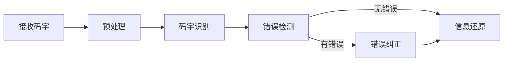
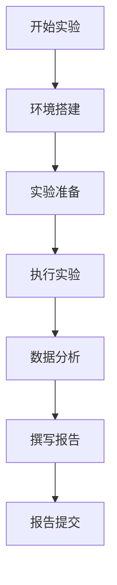

# 哈工大深圳无线通信网实验课程设计与实践

[本文还有配套的精品资源，点击获取](https://download.csdn.net/download/weixin_32393347/89310975)


简介：《哈工大深圳-无线通信网（实验）》是一门理论与实践相结合的课程，通过编程实践深入理解无线通信网络工作原理，掌握关键算法。实验资料包括源码文件和项目说明书，涵盖基础信号传输模拟到复杂错误检测和纠正策略的多个实验任务。README.md提供实验目标和步骤，帮助学生快速上手并完成实验。课件包含教学材料，帮助建立理论基础，而课程报告则要求学生分析实验结果。整体而言，课程设计旨在全面培养学生设计、分析和优化无线通信系统的能力。


## 1. 无线通信网络技术与应用概述

### 1.1 无线通信技术演进

无线通信技术已经从最初的无线电报发展到了今天的4G/5G网络。每一代技术的演进都伴随着传输速度的飞跃和用户体验的显著提升。5G技术，以其高速率、低延迟、大连接数的特性，正成为智慧城市建设的基础设施。

### 1.2 无线通信技术的关键应用

无线通信技术在多个行业领域有广泛应用，比如物联网、智慧城市、远程医疗、自动驾驶等。它们对无线网络的依赖性日益增强，需求不断推动无线通信技术的创新和升级。

### 1.3 未来无线通信的趋势

未来无线通信技术的发展方向，主要包括更高频段的利用、网络切片技术以及边缘计算等。这些技术的发展将为终端用户带来更为稳定和高效的通信体验，并推动社会各行业的数字化转型。

在接下来的章节中，我们将具体探讨无线通信网络技术的编程实践、工作原理、通信模型、算法实现、多址接入协议、信道编码与解码技术、错误检测与纠正策略以及实验流程和报告撰写。通过深入分析，我们旨在为读者提供一个全面的技术视角，使他们能够更深刻理解无线通信网络技术与应用的奥秘。

## 2. 编程实践与通信网络工作原理

#### 2.1 编程实践基础

编程是实现网络功能和通信协议模拟的基石。在本节中，我们将探讨选择合适的网络编程语言、环境配置以及编程实践中的核心概念和术语。

##### 2.1.1 网络编程语言选择与环境配置

在众多编程语言中，C、C++、Python和Java是实现网络编程的常用选择。C语言因其高效性和直接操作硬件的能力，在系统编程和网络协议实现中应用广泛。Python语言简洁易学，广泛用于快速开发和测试通信协议。Java语言跨平台且具有良好的网络编程支持。每种语言都有其特定的应用场景，选择时需考虑开发效率、性能要求和特定需求。

以Python为例，环境配置通常包括安装Python解释器、网络编程库（如socket编程库）以及可能需要的其他依赖项（如用于网络分析的scapy包）。在Linux环境下，可以通过包管理器（如apt-get）安装所需的库。而在Windows系统上，可能需要从官方网站下载并安装相应的库文件。

示例代码块：

```python
import socket  # 导入Python的socket库

# 创建 socket 对象

s = socket.socket(socket.AF_INET, socket.SOCK_STREAM)

# 获取本地机器名

host = socket.gethostname()

# 设置一个端口

port = 12345

try: # 连接到服务器
s.connect((host, port)) # 发送数据
s.send("Hello, server".encode()) # 接收小于 1024 字节的数据
msg = s.recv(1024)
except socket.error as e:
print("发生错误：", e)
finally: # 关闭连接
s.close()

```

在这个示例中，我们创建了一个 TCP/IP 的 socket 连接，并向服务器发送了一条消息。

##### 2.1.2 编程实践中的基本概念和术语

网络编程中常见的基本概念和术语包括 IP 地址、端口号、套接字（Socket）、TCP/IP 协议栈等。IP 地址是网络中设备的唯一标识，端口号用于区分同一台设备上运行的不同应用。套接字是网络通信的端点，通过它应用程序可以发送和接收数据。TCP/IP 协议栈是互联网的基础，定义了数据如何在网络上进行传输。

在编程时，开发者需要熟悉这些概念，并能根据需求选择使用 TCP 或 UDP 协议。TCP 是面向连接的协议，保证了数据的可靠传输；而 UDP 则是无连接的，传输速度快但数据可靠性较低。理解这些术语和概念对于编写高质量的网络通信代码至关重要。

#### 2.2 通信网络工作原理

通信网络的基本工作原理是信息在设备间传输的基础，其中无线通信原理和网络体系结构是核心内容。

##### 2.2.1 无线通信基本原理

无线通信是指利用电磁波在空间中传输信息的技术。它包括了一系列处理过程，如调制、编码、传输、解调等。无线通信的关键在于将原始数据转换为适合无线传输的形式，通过无线电波发送，并在接收端进行相应的逆向处理以恢复原始数据。

无线通信的关键技术包括频分多址（FDMA）、时分多址（TDMA）、码分多址（CDMA）和正交频分多址（OFDMA）。这些技术允许在同一物理媒介上同时传输多个信号，提高了频谱资源的使用效率。

##### 2.2.2 无线网络体系结构详解

无线网络体系结构涉及不同的层次，主要遵循国际标准化组织（ISO）提出的开放系统互连（OSI）模型。该模型分为七层：物理层、数据链路层、网络层、传输层、会话层、表示层和应用层。每一层都有其特定的功能和服务，例如物理层负责数据传输的物理媒介，数据链路层负责在相邻节点间可靠地传输数据帧。

在无线网络中，移动通信系统的体系结构尤为重要，如全球移动通信系统（GSM）和通用移动通信系统（UMTS）。在这些体系结构中，基站（BS）、移动交换中心（MSC）、归属位置寄存器（HLR）和访问位置寄存器（VLR）等是关键组件，它们协同工作以提供无缝的移动通信服务。

在下一节中，我们将详细探讨如何通过模拟软件来实现多址接入协议，并对模拟结果进行分析。

## 3. 通信模型与算法实现

### 3.1 通信模型构建

#### 3.1.1 理解基本通信模型

通信模型是描述通信过程中信息传递的基本框架，它包括信息源、发送器、信道、接收器和目的地五个基本组成部分。理解通信模型是设计和优化无线通信系统的基础。一个基本的通信模型通常可以分解为以下几个步骤：信息源的产生、编码、调制、传输、接收、解调、解码以及最终的信息恢复。

在无线通信中，信道的特点包括噪声、衰减和多径效应，这些因素都会对信号的质量产生影响。因此，在设计通信模型时，必须考虑信道特性对信号传输的影响。

#### 3.1.2 模型的数学抽象与表达

为了便于分析和优化，通信模型通常需要使用数学语言进行抽象和表达。这种数学表达通常包括概率论、随机过程、线性代数和信号处理等多个数学领域的知识。

例如，对于一个简单的数字通信系统，可以使用以下数学模型进行表达：

[ X(f) = \int_{-\infty}^{\infty} x(t) e^{-j2\pi ft} dt ] [ Y(f) = X(f)H(f) + N(f) ] [ y(t) = \int_{-\infty}^{\infty} Y(f) e^{j2\pi ft} df ]

其中，( X(f) ) 是发送信号的频谱，( H(f) ) 是信道的传递函数，( N(f) ) 是噪声项，而 ( Y(f) ) 是接收到的信号频谱。

### 3.2 算法实现技巧

#### 3.2.1 算法设计的基本步骤

在构建通信模型时，算法的设计是至关重要的环节。设计一个好的算法，一般遵循以下步骤：

1. **问题定义**
   ：明确算法需要解决的问题。
2. **需求分析**
   ：分析算法性能的评估标准，如时间复杂度、空间复杂度、准确率等。
3. **设计方法**
   ：选择合适的算法设计方法，如贪心算法、动态规划、回溯算法等。
4. **伪代码编写**
   ：将算法设计思路转化为伪代码，便于理解和交流。
5. **代码实现**
   ：根据伪代码实现算法。
6. **测试与验证**
   ：编写测试用例，验证算法的正确性。
7. **性能优化**
   ：分析算法的性能，进行必要的优化。

#### 3.2.2 算法性能优化方法

算法优化方法多种多样，常见的优化手段包括：

* **时间复杂度优化**
  ：通过减少不必要的计算、使用更有效的数据结构、循环优化等方式降低算法的时间复杂度。
* **空间复杂度优化**
  ：优化算法以减少内存消耗，例如通过循环展开、使用位操作等技巧。
* **并行计算**
  ：当算法能够分解为多个独立部分时，可以采用并行计算来缩短执行时间。
* **缓存优化**
  ：合理安排数据读写顺序，提升缓存利用率。

下面是使用 Python 实现的一个简单的算法性能优化示例：

```python
import time

# 算法优化前

def sum_numbers 未经优化(unoptimized_list):
total = 0
for number in unoptimized_list:
total += number
return total

# 算法优化后

def sum_numbers 优化版(optimized_list):
total = sum(optimized_list)
return total

# 创建一个大数据集进行测试

large_list = range(1000000)

# 计时

start_time = time.time()
sum_numbers 未经优化(large_list)
end_time = time.time()
print(f"未经优化的算法运行时间: {end_time - start_time}秒")

start_time = time.time()
sum_numbers 优化版(large_list)
end_time = time.time()
print(f"优化后的算法运行时间: {end_time - start_time}秒")

```

在上面的代码中，
`sum_numbers 优化版`
函数通过使用内置的
`sum`
函数替代了传统的循环累加，极大地提高了计算效率。从时间复杂度角度来看，它减少了算法的操作次数，从而达到性能优化的目的。

## 4. 多址接入协议模拟实践

在无线通信领域中，多址接入技术是确保多个用户能够有效共享无线资源的核心技术之一。本章节将深入探讨多址接入技术的分类、各类技术的对比分析、模拟软件的搭建与使用以及模拟结果的解读与分析。

### 4.1 多址接入技术理解

#### 4.1.1 多址接入技术分类

在多址接入技术中，最为常见的有频分多址（FDMA）、时分多址（TDMA）、码分多址（CDMA）和正交频分多址（OFDMA）等。下面将对这些技术进行逐一介绍。

**频分多址（FDMA）** -
**描述**
：FDMA 技术通过将可用频带分成多个较窄的频段，每个用户分配一个固定的频段进行通信。 -
**优点**
：用户之间的隔离度较好，互不干扰。 -
**缺点**
：频谱利用率较低，且不适用于突发数据传输。

**时分多址（TDMA）** -
**描述**
：TDMA 技术通过将时间分割成周期性的帧，每个帧再分割成若干时隙，用户在各自时隙内发送数据。 -
**优点**
：提高了频谱利用率，更适合突发数据传输。 -
**缺点**
：时延和时钟同步要求较高。

**码分多址（CDMA）** -
**描述**
：CDMA 使用一系列不同的编码序列区分不同用户，每个用户在同一时间、同一频段使用不同的编码进行传输。 -
**优点**
：抗干扰能力强，安全性高。 -
**缺点**
：系统容量受限于功率控制精度。

**正交频分多址（OFDMA）** -
**描述**
：OFDMA 技术是 OFDM（正交频分复用）技术在多址接入上的应用，它将子载波分为多个较小的单元，可以分配给多个用户。 -
**优点**
：频谱效率高，适用于宽带传输，适合高数据速率的应用。 -
**缺点**
：对同步要求极高，系统设计复杂。

#### 4.1.2 各类技术的对比分析

多址接入技术的选择取决于应用场景的特定需求，不同的技术具有不同的优缺点。例如，在 2G、3G 移动通信中，FDMA 和 TDMA 联合使用，而在 4G LTE 中主要采用了 OFDMA 技术。5G 技术中，除了 OFDMA，还引入了新的多址接入技术如非正交多址技术（NOMA）来进一步提高频谱效率。

### 4.2 协议模拟操作与分析

#### 4.2.1 模拟软件的搭建与使用

为了更好地理解和分析多址接入协议，我们可以使用各种通信仿真软件如 NS-3、MATLAB 通信工具箱等进行模拟。这里以 NS-3 为例，介绍如何搭建模拟环境。

**安装 NS-3** - 首先，确保系统已安装必要的开发工具，如 g++、Python 等。 - 下载 NS-3 源代码并编译。 - 配置环境变量以便在任何目录中运行 NS-3。

**创建模拟脚本** - 使用 NS-3 的 Python 绑定来编写模拟脚本。 - 定义网络拓扑、设备类型、协议栈等。

**运行模拟** - 执行模拟脚本，启动模拟。 - 可以通过日志输出或使用可视化工具来观察模拟过程。

#### 4.2.2 模拟结果的解读与分析

模拟完成后，需要对输出结果进行分析，从而了解不同多址接入技术在特定场景下的性能表现。

**性能指标** - 常用的性能指标包括吞吐量、时延、丢包率、频谱效率等。

**结果解读** - 分析不同负载条件下的性能指标变化。 - 对比分析不同多址接入技术在相同的模拟条件下表现如何。

**案例研究** - 通过一个具体案例展示多址接入技术的实际应用。

##### 示例代码块

```python
import ns.core as ns
import ns.wifi as wifi

# 创建仿真节点

node = ns.NodeContainer()
node.Create(2)

# 设置无线模块

wifi_helper = wifi.WifiHelper()
wifi_device = wifi_helper.Install(node)

# 配置信道和网络

channel = ns.YansWifiChannelHelper.Default()
channel.SetPropagationDelay("ns3::ConstantSpeedPropagationDelayModel")
channel.AddPropagationLoss("ns3::FriisPropagationLossModel")
ns_config.SetChannel(channel.Create())

# 开始模拟

ns Simulator.Run()
ns Simulator.Destroy()

```

在上述代码中，我们创建了一个简单的 NS-3 模拟脚本，用 Python 语言搭建了两个节点，并为这些节点安装了无线模块。通过这个基础的模拟框架，可以进一步添加多址接入技术的配置，并观察其对网络性能的影响。

## 5. 信道编码与解码技术

信道编码与解码技术在无线通信领域扮演着至关重要的角色，它们通过增加冗余信息的方式提高数据传输的可靠性，减少错误的发生。在本章中，我们将探讨信道编码的理论基础、常见的编码技术，以及如何实现解码并评估解码效果。

### 5.1 信道编码基础

#### 5.1.1 信道编码的理论基础

信道编码的核心思想是在信息传输的过程中引入一定的冗余度，以允许接收端检测和纠正传输错误。这种冗余度通常是通过特定的算法添加额外的码字来实现的，这些码字提供了错误检测和纠正的能力。信道编码理论是信息论的一个分支，它为如何高效地在噪声信道中传输信息提供了数学模型和编码策略。

#### 5.1.2 常见信道编码技术介绍

在无线通信领域，有多种信道编码技术被广泛应用，包括但不限于：

* **汉明码（Hamming Code）**
  ：一种线性纠错码，能够检测并纠正单个错误。它通过增加少量的校验位来实现错误检测和纠正。
* **循环冗余校验（CRC）**
  ：利用循环群的性质对数据进行校验，广泛用于网络数据传输中检测数据是否发生变化。
* **卷积码（Convolutional Code）**
  ：一种前向纠错码，通过卷积操作产生码字，具有较低的解码复杂度和较高的错误纠正能力。
* **低密度奇偶校验码（LDPC）**
  ：一类具有稀疏校验矩阵的线性分组码，以其高性能纠错能力和较低的复杂度而著名。
* **涡轮码（Turbo Code）**
  ：一种迭代纠错码，通过两个或多个递归系统卷积码的并行级联，极大地提高了通信系统的误码率性能。

### 5.2 信道解码实现

#### 5.2.1 解码算法的实现步骤

解码过程是编码过程的逆过程，其目的是从接收到的含有噪声和可能错误的数据中恢复原始信息。解码算法的实现步骤通常包括以下几个阶段：

1. **接收信号处理**
   ：首先对接收到的信号进行预处理，如滤波和同步。
2. **码字识别**
   ：将预处理后的信号与已知的编码信息进行匹配，识别出码字。
3. **错误检测**
   ：使用算法检测码字中可能存在的错误。
4. **错误纠正**
   ：根据检测到的错误类型，采取相应的纠正措施。
5. **信息还原**
   ：完成错误纠正后，从码字中提取出原始信息。

以下是一个简单的伪代码示例，展示了 CRC 解码过程：

```plaintext
输入: 接收码字 R，生成多项式 G
输出: 是否通过错误检测

过程:

1. 将接收码字 R 乘以 x^n，其中 n 为生成多项式的阶数
2. 计算乘积和生成多项式的余数
3. 若余数为 0，则表示没有错误，否则表示有错误
   
```

#### 5.2.2 解码效果的评估与优化

解码效果的好坏直接影响通信系统的性能，因此评估和优化解码过程是非常重要的。评估解码效果通常采用误码率（BER）作为指标，误码率越低表示解码效果越好。优化解码效果可以通过以下几种方法：

* **选择高效的编码算法**
  ：不同的编码算法适用于不同的场合，选择合适的编码算法可以提高解码效果。
* **调优解码参数**
  ：根据通信信道的特性，调整解码算法中的参数，如 CRC 码的多项式。
* **迭代解码**
  ：对于一些复杂的编码技术，如涡轮码，通过迭代过程可以逐步提高解码的准确性。
* **信道估计与均衡**
  ：在解码前对信道进行估计，然后进行信道均衡，可以减少因信道特性引起的误码。

**表格展示信道编码技术对比**
:

| 编码技术 | 检错能力 | 纠错能力 | 复杂度 | 适用场合 | |---------|---------|---------|--------|----------| | 汉明码 | 强 | 中等 | 低 | 数据存储 | | CRC | 强 | 弱 | 中 | 网络通信 | | 卷积码 | 中等 | 较强 | 中 | 低速率数据传输 | | LDPC | 弱 | 强 | 高 | 高速数据传输 | | 涡轮码 | 强 | 强 | 高 | 卫星通信 |

**Mermaid 流程图展示解码过程**
:



在这一章节中，我们深入讨论了信道编码的理论基础、常见的信道编码技术以及如何实现解码。下一章节，我们将深入探讨错误检测与纠正策略，这是进一步提高通信系统性能的关键步骤。

## 6. 错误检测与纠正策略

### 6.1 错误检测技术

#### 6.1.1 错误检测原理与方法

在无线通信网络中，数据传输的可靠性是至关重要的。由于噪声、干扰以及其他因素，传输过程中可能会发生数据损坏或者错误。错误检测技术是确保数据完整性的一种重要方法，通过在数据中增加额外的信息，接收方可以检测到数据在传输过程中是否发生了错误。

错误检测原理基于数据的冗余检查。当发送方将数据打包发送之前，会根据特定的算法计算出一个检查值（如校验和、循环冗余校验 CRC 等），并将这个检查值附在数据包的末尾。接收方收到数据后，使用同样的算法重新计算数据的检查值，如果计算出的结果与接收到的检查值一致，则认为数据没有错误；如果不一致，则表明数据在传输过程中遭到了损坏。

常见的错误检测方法包括：

* 奇偶校验
* 检查和
* 循环冗余校验（CRC）
* 海明码

#### 6.1.2 错误检测算法的实现

**循环冗余校验（CRC）算法示例：**

```python
def crc32(data):
   crc_table = generate_crc_table()
   crc = initial_crc_value
   for byte in data:
   crc = ((crc << 8) & 0xffffffff) ^ crc_table[((crc >> 24) ^ byte) & 0xff]
   return crc ^ final_xor_value

def generate_crc_table(): # CRC 表生成逻辑
pass

# 示例数据

data = b"Hello, world!"

# 计算 CRC 校验值

crc_value = crc32(data)
print(f"Calculated CRC value: {crc_value}")

```

逻辑分析：这个 Python 代码展示了 CRC 校验值的基本计算流程。
`generate_crc_table`
函数用于生成 CRC 表，
`crc32`
函数则是核心的 CRC 计算函数。CRC 表的生成基于特定的多项式，该多项式用于 CRC 的计算过程。计算过程中，输入数据和 CRC 表中的值进行位运算，最终产生一个 32 位的 CRC 校验值。

参数说明：函数
`crc32`
中的
`initial_crc_value`
代表初始 CRC 值，通常为 0xffffffff；
`final_xor_value`
为最终异或值，通常也为 0xffffffff。

### 6.2 错误纠正策略

#### 6.2.1 错误纠正的基本概念

错误纠正策略不仅能够检测数据传输中的错误，还能够对错误进行纠正，即自动恢复损坏的数据。这在对数据传输的可靠性要求极高的通信系统中，如深空通信、军事通信和数据存储等领域，是至关重要的。

错误纠正策略涉及的关键技术包括：

* 奇偶校验码
* 海明码
* 里德-所罗门码（Reed-Solomon code）
* 卷积码

这些技术各有特点和应用场景，它们利用冗余数据和数学算法，能够精确地定位和修正错误。

#### 6.2.2 纠错算法在通信系统中的应用

以海明码为例，该码通过在数据位中插入校验位，实现了对单个位错误的检测和纠正。海明码的实现依赖于精心设计的校验位和数据位的分布。

**海明码的简单实现示例：**

```python
def calculate_parity_bits(data_bits, num_parity_bits):
parity_bits = [0] * num_parity_bits
parity_positions = [2**i for i in range(num_parity_bits)]
for i in range(num_parity_bits):
parity_bits[i] = data_bits.count(parity_positions[i]) % 2
return parity_bits

def correct_errors(data_bits, parity_bits):
errors = [] # 假设错误发生在数据位中，校验位总是正确的
for i in range(len(parity_bits)):
if parity_bits[i] != data_bits.count(2**i) % 2:
errors.append(2**i)
return errors

# 示例数据位和校验位

data_bits = [1, 0, 1, 1]
num_parity_bits = 3

# 计算校验位

parity_bits = calculate_parity_bits(data_bits, num_parity_bits)
print(f"Parity bits: {parity_bits}")

# 假设发生了错误

data_bits_with_error = [1, 1, 1, 1]
errors = correct_errors(data_bits_with_error, parity_bits)
print(f"Corrected errors: {errors}")

```

逻辑分析：在上面的代码示例中，我们定义了
`calculate_parity_bits`
函数来计算校验位，这些校验位与数据位一起能够组成完整的海明码。
`correct_errors`
函数可以检测和纠正数据位中的错误。这个实现假设校验位是正确的，仅对数据位进行错误检测和纠正。

参数说明：
`calculate_parity_bits`
函数中的
`data_bits`
为原始数据位序列，
`num_parity_bits`
为校验位的数量。在
`correct_errors`
函数中，我们假设错误只发生在数据位中。

### 表格：常见错误检测与纠正算法对比

| 特性/算法 | 奇偶校验 | 检查和 | CRC | 海明码 | 里德-所罗门码 | 卷积码 | |-----------------|---------|-------|------|------|-------------|-------| | 处理位数 | 单个 | 多个 | 多个 | 单个 | 多个 | 多个 | | 纠错能力 | 无 | 无 | 无 | 单个 | 多个 | 单个或多个 | | 编码效率 | 低 | 中 | 高 | 低 | 中 | 高 | | 实现复杂度 | 简单 | 中等 | 高 | 中等 | 高 | 中等 | | 应用场景 | 简单系统 | 网络通信 | 通用 | 简单系统 | 高可靠性系统 | 移动通信 |

表格展示了不同错误检测与纠正算法之间的特性对比，帮助读者了解各种算法的优缺点和适用场景。

通过本章内容的介绍，我们可以看到错误检测与纠正技术是无线通信网络中不可或缺的一部分，它们确保了数据传输的高可靠性和准确性。下一章我们将深入探讨多址接入协议模拟实践，这是进一步提高网络通信效率和性能的重要步骤。

## 7. 实验流程与课程报告撰写

### 7.1 实验流程详细说明

#### 7.1.1 实验环境与工具准备

在进行无线通信网络实验之前，首先要确保实验环境的搭建和工具的准备。实验环境通常需要具备以下条件：

* 一台或多台计算机，安装有虚拟化软件（如 VMware 或 VirtualBox）。
* 虚拟机中安装的操作系统，最好是具备网络配置功能的 Linux 发行版。
* 必要的网络模拟软件，例如 ns-3、Mininet 或其他网络模拟工具。
* 相关编程环境，例如 Python 或 C++，以及通信网络相关的库和工具。

此外，如果实验涉及到硬件测试，还需要准备无线通信模块、网络测试仪等硬件设备。

#### 7.1.2 实验步骤与注意事项

实验步骤是根据实验目的和要求制定的，下面以“多址接入技术实验”为例进行说明：

1. **实验目的和要求**
   ：理解不同多址接入技术的工作原理及其性能差异。
2. **实验环境搭建**
   ：搭建虚拟网络环境，模拟不同的多址接入场景。
3. **实验准备**
   ：配置网络环境，确保各个节点能够正确通信。
4. **执行实验**
   ：运行模拟软件，收集数据。
5. **数据分析**
   ：对收集到的性能数据进行分析，比较不同技术的效果。

注意事项：

* 在实验前，仔细检查网络拓扑结构，确保没有逻辑错误。
* 实验过程中，注意记录实验参数，如流量负载、节点数等。
* 对于可能出现的网络延迟和丢包问题，要进行多次实验，取平均值以减少偶然误差。
* 实验结束后，要彻底清理实验环境，避免数据残留干扰后续实验。

### 7.2 课程报告撰写指南

#### 7.2.1 报告结构与内容要点

课程报告的结构通常包括以下部分：

* **封面**
  ：包含实验名称、课程名称、学生姓名和学号、提交日期等基本信息。
* **摘要**
  ：简要介绍实验的目的、主要内容、实验结果和结论。
* **引言**
  ：介绍实验的背景知识和相关理论基础。
* **实验环境与工具**
  ：详细描述实验使用的软件、硬件和网络配置。
* **实验步骤**
  ：具体描述实验的操作过程，包括实验设计、执行的详细步骤。
* **结果与分析**
  ：展示实验数据和图表，并进行详尽的分析。
* **结论**
  ：总结实验结果，归纳实验发现和存在的问题。
* **参考文献**
  ：列出实验报告中引用的文献资料。

#### 7.2.2 数据整理与图表绘制技巧

数据整理和图表绘制是报告撰写中至关重要的部分，能够直观展示实验结果。在处理数据时，应注意以下几点：

* 使用表格清晰展示实验数据，表格应包括标题、行列标志以及必要的单位。
* 利用图表如柱状图、折线图、饼图等，形象地表达数据的变化趋势和比较结果。
* 在图表中应有图例、标题和坐标轴标签等信息，确保读者能理解图表所表达的内容。
* 使用专业的数据可视化工具或软件，例如 Matplotlib、Excel 等，以提高图表质量。

此外，建议在报告中使用流程图来表示复杂的实验流程或者概念模型，使用 mermaid 格式的流程图可以方便地在 Markdown 文档中生成美观的图表。下面是一个流程图的示例代码：



在实验报告中合理使用这些技巧，可以大幅提高报告的专业性和可读性。

[本文还有配套的精品资源，点击获取](https://download.csdn.net/download/weixin_32393347/89310975)


简介：《哈工大深圳-无线通信网（实验）》是一门理论与实践相结合的课程，通过编程实践深入理解无线通信网络工作原理，掌握关键算法。实验资料包括源码文件和项目说明书，涵盖基础信号传输模拟到复杂错误检测和纠正策略的多个实验任务。README.md 提供实验目标和步骤，帮助学生快速上手并完成实验。课件包含教学材料，帮助建立理论基础，而课程报告则要求学生分析实验结果。整体而言，课程设计旨在全面培养学生设计、分析和优化无线通信系统的能力。

[本文还有配套的精品资源，点击获取](https://download.csdn.net/download/weixin_32393347/89310975)
