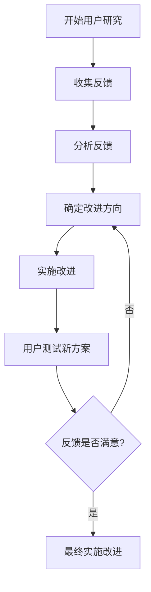

# 高效后台管理界面设计：27款DIV+CSS模板集锦

[本文还有配套的精品资源，点击获取](https://download.csdn.net/download/lzjyrg/3894774)


简介：本主题深入探讨了如何使用HTML的
`DIV`
元素和CSS样式表来构建强大且视觉吸引的后台管理系统界面。内容包括
`DIV`
的使用、CSS的多样性以及包括响应式设计在内的多种设计模板特点。开发者可利用这些模板创建符合业务需求的后台界面，提高用户体验和工作效率。


## 1. HTML的DIV元素在界面设计中的应用

网页设计是一个复杂的过程，其中HTML的DIV元素起着至关重要的作用。DIV元素是一个通用的容器，可以用来创建网页上的区块，为网页布局提供结构性框架。通过理解DIV元素的属性、类（class）和ID选择器，设计师可以有效地将页面分为多个部分，从而实现复杂的布局和设计。

### 1.1 DIV元素的基本使用

DIV元素在HTML文档中以
`<div>`
标签的形式出现，它本身不带有任何特定的含义，但通过CSS可以赋予它各种样式。例如，为DIV设置不同的背景颜色、边框、字体样式等，可以使得网站的界面变得更加丰富和直观。

```html
<div id="header">
    <h1>网站标题</h1>
</div>
<div id="content">
    <p>主要内容区域。</p>
</div>
<div id="footer">
    <p>版权信息。</p>
</div>

```

以上代码创建了三个DIV块，分别对应网页的头部、内容区和页脚部分。它们都是网页布局的基础组成部分，能够帮助设计师组织内容，提供良好的用户界面。

### 1.2 使用DIV元素进行布局的优势

使用DIV元素进行布局的优势之一是其灵活性。通过CSS的浮动（float）和定位（positioning）属性，开发者可以灵活地排列和调整这些DIV元素的位置，以构建出响应式和适应不同屏幕尺寸的设计。

例如，通过CSS的float属性，可以实现列布局：

```css
#left-column {
    float: left;
    width: 200px;
}
#right-column {
    float: right;
    width: 200px;
}

```

通过这种方法，我们可以创建两个侧边栏，而中间则放置主内容区。当屏幕尺寸变化时，可以通过媒体查询（media queries）调整布局，使网站在移动设备上也能保持良好的用户体验。

总之，DIV元素是网页设计师手中非常强大和灵活的工具。通过合理使用DIV元素和CSS，可以实现复杂的网页布局，并提供更加丰富和互动的用户体验。接下来的章节会深入探讨CSS的使用和布局技术，让网页设计达到一个更高的水平。

## 2. CSS样式表的介绍和重要性

#### 2.1 CSS的基础知识

##### 2.1.1 CSS选择器的使用

CSS选择器是CSS规则的基础，用于确定哪些元素应当被应用样式。基本的选择器包括标签选择器、类选择器、ID选择器和属性选择器。

```css
/* 标签选择器 */
p {
    color: blue;
}

/_ 类选择器 _/
.class-name {
color: green;
}

/_ ID 选择器 _/
#id-name {
color: red;
}

/_ 属性选择器 _/
a[href="***"] {
color: yellow;
}

```

* 标签选择器：将样式应用于所有指定的 HTML 标签。
* 类选择器：将样式应用于具有特定 class 属性的元素。
* ID 选择器：将样式应用于具有特定 id 属性的元素。
* 属性选择器：根据元素的属性及属性值选择元素。

##### 2.1.2 CSS 盒子模型

CSS 盒子模型（Box Model）是 CSS 布局的基础，规定了元素框处理元素内容（content）、内边距（padding）、边框（border）和外边距（margin）的方式。

```css
.box {
width: 300px;
padding: 20px;
border: 5px solid black;
margin: 10px;
}

```

* 内容：元素的实际内容。
* 内边距：内容周围的透明区域。
* 边框：围绕内边距和内容的线。
* 外边距：边框外的透明区域，用于创建元素之间的空间。

#### 2.2 CSS 布局技术

##### 2.2.1 浮动布局和定位布局

浮动布局（Float）允许文本和内联元素环绕块级元素，而定位布局（Positioning）用于精确定义元素的位置。

```css
/_ 浮动布局 _/
.left-column {
float: left;
width: 50%;
}

/_ 定位布局 _/
.fixed-header {
position: fixed;
top: 0;
width: 100%;
}

```

* 浮动布局：通过
  `float`
  属性控制元素是否浮动以及浮动的方向。
* 定位布局：通过
  `position`
  属性和相关的
  `top`
  、
  `right`
  、
  `bottom`
  、
  `left`
  属性控制元素的位置。

##### 2.2.2 Flexbox 布局和 Grid 布局

Flexbox 和 Grid 是 CSS3 引入的两种布局模型，提供了更灵活和强大的布局方式。

```css
/_ Flexbox 布局 _/
.flex-container {
display: flex;
justify-content: space-around;
}

/_ Grid 布局 _/
.grid-container {
display: grid;
grid-template-columns: repeat(3, 1fr);
gap: 20px;
}

```

* Flexbox 布局：通过设置父元素
  `display: flex`
  ，子元素可以根据需要自动调整大小。
* Grid 布局：创建了一个基于网格的布局容器，允许我们定义多个列和行。

#### 2.3 CSS 高级特性

##### 2.3.1 响应式设计中的媒体查询

媒体查询（Media Queries）允许为不同的媒体类型和条件定义样式规则，是响应式设计的核心。

```css
@media screen and (max-width: 600px) {
.column {
float: none;
width: 100%;
}
}

```

* 在屏幕宽度小于 600 像素时，列将不再浮动且宽度占满整个屏幕。

##### 2.3.2 CSS 过渡和动画

CSS 过渡提供了一种方式来平滑地从一个样式配置过渡到另一个，而 CSS 动画则允许对元素应用复杂的动画效果。

```css
/_ 过渡 _/
button {
transition: background-color 0.3s;
}

button:hover {
background-color: #4CAF50;
}

/_ 动画 _/
@keyframes example {
from {background-color: red;}
to {background-color: yellow;}
}

div {
width: 100px;
height: 100px;
background-color: red;
animation-name: example;
animation-duration: 4s;
}

```

* 过渡应用：当鼠标悬停在按钮上时，背景颜色平滑过渡。
* 动画应用：一个 div 元素通过
  `@keyframes`
  定义了颜色变化的动画。

以上章节展示了 CSS 样式的不同方面，包括基础知识、布局技术、以及响应式设计和动画等高级特性。理解并掌握这些基础知识对于创建美观且功能性强的 Web 页面至关重要。

## 3. 后台管理系统界面设计要点

### 3.1 设计理念和原则

在后台管理系统的界面设计中，设计理念和原则的贯彻是保证产品最终呈现高质量用户体验的基础。以下是设计后台管理系统时需要遵循的两个主要原则：

#### 3.1.1 设计的一致性和简洁性

一致性和简洁性是后台管理系统界面设计中最为重要的理念之一。一致性确保了用户在不同页面和不同模块之间切换时，能够快速适应和理解界面结构，减少认知负担。此外，简洁的界面不仅让用户聚焦于核心任务，还有助于减少视觉干扰。

一个后台管理系统的界面设计应该从以下几个方面保持一致性：

* **布局一致性**
  ：使用统一的布局结构，比如导航栏位置、菜单和内容区域的相对位置保持不变。
* **风格一致性**
  ：选择统一的色彩方案、字体、按钮样式以及间距等，确保整体风格协调统一。
* **交互一致性**
  ：交互元素如按钮、链接和表单控件的行为应保持一致，避免用户混淆。

简洁性要求界面元素的去除应以不干扰核心功能为前提。对于后台管理界面来说，去除非必要的装饰和元素，保持清晰的功能区分，是达到简洁性的关键。例如，精简的颜色使用、避免不必要的动画效果、以及将复杂功能的细节隐藏在高级设置中。

#### 3.1.2 用户体验与可用性

用户体验（User Experience, UX）和可用性（Usability）是设计后台管理系统时同样不可或缺的原则。好的用户体验和高可用性可以让用户在使用后台系统时更为高效和愉悦。

要提升用户体验，后台管理系统设计需要考虑以下几点：

* **任务流程的优化**
  ：分析和优化用户完成任务的步骤，减少不必要的操作。
* **清晰的导航**
  ：确保用户可以快速找到他们需要的功能和信息。
* **直观的界面设计**
  ：确保元素的标签和布局直观易懂，用户能够一目了然地了解其用途。

可用性关注点包括：

* **错误处理**
  ：提供清晰的错误提示，并给出解决方法。
* **反馈机制**
  ：及时反馈用户的操作结果，比如成功提示、警告信息等。
* **可访问性**
  ：确保后台系统对不同用户（包括有特殊需求的用户）都是易于使用的。

### 3.2 组件化设计方法

组件化是现代前端框架推崇的设计模式，通过将界面拆分成独立、可复用的组件，可以提高开发效率，确保设计的一致性，并且有助于维护。

#### 3.2.1 组件的创建和复用

组件化设计通常涉及以下步骤：

* **定义组件**
  ：确定界面中有哪些重复出现的元素，并将它们定义为组件。
* **构建组件**
  ：为每个组件创建结构（HTML）、样式（CSS）和行为（JavaScript）。
* **使用组件**
  ：在不同的页面或模板中重复使用这些组件。

例如，一个后台系统中可能包含如下组件：

* **导航菜单**
  ：包含多个导航链接的垂直列表。
* **表单输入**
  ：用于收集用户输入的数据。
* **按钮组**
  ：一系列按钮，执行不同的动作。

组件可以是简单的，如按钮和图标，也可以是复杂的，如整个仪表板页面。创建组件时，要考虑到可扩展性，以便在不同的上下文中使用。同时，组件的样式应该遵循设计指南，确保在整个系统中保持一致。

#### 3.2.2 组件之间的交互模式

组件之间的交互模式是确保用户能够顺畅地与后台系统互动的关键。这包括：

* **事件通信**
  ：当一个组件事件发生时（如按钮点击），它如何影响另一个组件。
* **数据流动**
  ：组件间如何共享和传递数据。
* **状态管理**
  ：保持组件状态的一致性和同步。

例如，一个组件的改变可能导致其他组件的更新或重新渲染。这些组件需要通过事件和状态管理来响应彼此的变化。一个常见的实现方式是使用状态管理库（如 Redux 或 Vuex），它可以全局管理组件状态。

### 3.3 设计实践中的注意事项

设计后台管理系统时，除了遵循上述理念和原则之外，还需关注一些实际操作中的具体事项，以确保最终产品的质量。

#### 3.3.1 设计审查和反馈收集

设计审查是确保后台系统界面符合既定标准和原则的重要步骤。通过组织设计审查会议，团队可以：

* **审查设计的一致性**
  ：团队成员共同检查设计是否遵循了既定的风格和布局规范。
* **评估可用性问题**
  ：从用户体验的角度出发，找出可能存在的可用性问题。
* **收集反馈**
  ：来自不同角色的团队成员可以提供不同视角的反馈和建议。

设计审查之后，应收集并整理反馈，以便进行必要的设计迭代和优化。

#### 3.3.2 持续迭代与优化

后台系统界面设计是一个持续的过程，需要根据用户反馈、技术发展和业务需求的变化进行不断的迭代和优化。

优化可以从以下方面进行：

* **性能优化**
  ：减少加载时间、提高渲染效率。
* **功能更新**
  ：根据用户需求，定期添加新功能或更新现有功能。
* **用户反馈响应**
  ：分析用户反馈，解决用户遇到的问题。

迭代的目的是不断完善后台系统，使其更加贴合用户的实际使用场景和需求。

### 代码块：组件化示例

这里是一个简化的组件化设计示例，展示了如何使用 React 创建一个可复用的导航菜单组件。

```javascript
import React from 'react';
import './styles.scss'; // 导入组件的样式文件

// 导航菜单组件
const NavigationMenu = () => {
return (
<nav className="navigation-menu">
<ul>
<li><a href="/dashboard">仪表板</a></li>
<li><a href="/users">用户管理</a></li>
<li><a href="/settings">设置</a></li>
</ul>
</nav>
);
};

export default NavigationMenu;

```

CSS 样式：

```css
.navigation-menu ul {
list-style-type: none;
padding: 0;
}

.navigation-menu li {
display: inline-block;
margin-right: 20px;
}

.navigation-menu a {
text-decoration: none;
color: #333;
}

```

在上述代码中，创建了一个简单的导航菜单组件，并定义了其基本的样式。组件被设计为可复用的，能够轻易地在不同的页面或模板中嵌入使用。

总结和应用：

* 组件化的目的是为了提升开发效率、保持界面一致性，并易于后续的维护和迭代。
* 上述代码展示了一个基本的组件化实践案例，它可以被用于构建更复杂和功能丰富的后台系统界面。
* 实际应用中，设计师和开发人员需要协作，确保组件在不同情境下均能提供一致的用户体验。

## 4. 响应式设计的实现

响应式设计是一种网页设计方法，旨在为不同设备（如桌面电脑、平板电脑和手机）提供最优的浏览体验。响应式网站能够识别用户的屏幕尺寸、分辨率、方向和脚本功能，并相应地调整布局和内容，以确保一致且良好的用户体验。

### 4.1 响应式设计的核心理念

#### 4.1.1 响应式设计的必要性

在当今移动设备普及的时代，用户可能随时随地访问您的网站。如果网站内容在移动设备上难以阅读或导航，这可能导致用户快速流失。响应式设计有助于克服这些问题，确保网站在不同设备上都能提供良好的用户体验。此外，响应式设计可以降低维护成本，因为您只需要维护一个网站版本，而不是为不同的设备或屏幕尺寸创建多个网站。

#### 4.1.2 设备类型与分辨率的考虑

实现响应式设计时，需要考虑不同设备类型的屏幕尺寸和分辨率。设计师需要为常见的屏幕尺寸定义断点，并为每个断点设计布局。随着新的设备和屏幕尺寸的不断出现，设计人员需要定期评估和更新其响应式策略，以适应新的变化。

### 4.2 响应式布局策略

#### 4.2.1 流式布局和弹性盒模型

响应式设计中常用的布局策略包括流式布局和弹性盒模型。流式布局使用百分比宽度而不是固定宽度，这允许元素在不同屏幕尺寸下灵活调整大小。弹性盒模型（Flexbox）提供了一种更加高效的方法来排列项目，使其能够适应不同屏幕尺寸和设备方向的变化。

**示例代码块：**

```css
.container {
display: flex;
flex-wrap: wrap;
}

.item {
flex: 1 1 200px; /_ Growth/shrink basis, minimum width _/
margin: 10px;
}

```

**参数说明：** -
`display: flex;`
将容器设置为弹性容器。 -
`flex-wrap: wrap;`
允许项目换行。 -
`flex: 1 1 200px;`
表示项目可以增长和缩小的基础值，以及其最小宽度。

**逻辑分析：**
上述代码实现了一个简单的响应式布局，其中项目根据可用空间自动调整大小。
`flex`
属性是弹性项目的关键，它允许每个项目根据需要伸缩。

#### 4.2.2 断点的选择和媒体查询的使用

在响应式设计中，媒体查询是根据设备的特定特征（如屏幕宽度）应用不同 CSS 样式规则的技术。设计人员可以为不同的断点定义 CSS 规则，以提供适合不同屏幕尺寸的布局和设计。

**示例代码块：**

```css
/_ CSS for larger devices _/
@media screen and (min-width: 1200px) {
body {
font-size: 16px;
}
}

/_ CSS for tablets _/
@media screen and (min-width: 768px) and (max-width: 1199px) {
body {
font-size: 14px;
}
}

/_ CSS for mobile phones _/
@media screen and (max-width: 767px) {
body {
font-size: 12px;
}
}

```

**参数说明：** -
`@media screen and (min-width: 1200px)`
定义了一个媒体查询，当屏幕宽度最小为 1200px 时应用内部的 CSS 规则。 -
`font-size`
是字体大小，根据不同断点进行调整以优化阅读体验。

**逻辑分析：**
通过使用媒体查询，设计师可以为不同设备类别提供不同的样式规则。在上述例子中，对于较大的设备屏幕尺寸，字体大小被设置为 16px，对于平板电脑是 14px，而对于手机则是 12px。这保证了在所有设备上内容的可读性和美观性。

### 4.3 响应式设计的测试与优化

#### 4.3.1 跨浏览器和设备测试

为了确保响应式设计在各种设备和浏览器上都能正常工作，进行全面的测试是必不可少的。这包括使用真实设备进行测试，模拟不同屏幕尺寸和操作系统，以及使用浏览器的开发者工具进行模拟测试。测试应覆盖常见浏览器，如 Chrome、Firefox、Safari 和 Edge。

#### 4.3.2 性能优化与兼容性处理

响应式设计的性能优化对保持良好用户体验至关重要。页面加载速度、图像优化和代码压缩是性能优化的关键部分。此外，兼容性处理确保了旧版浏览器和设备也能访问网站，即使不完全支持响应式特性。

**示例代码块：**

```html
<picture>
<source media="(min-width: 650px)" srcset="img_wide.jpg">
<source media="(min-width: 465px)" srcset="img_tablet.jpg">

</picture>

```

**参数说明：** -
`<picture>`
元素允许开发者指定不同屏幕尺寸下的图片资源。 -
`<source>`
元素定义了针对不同条件的媒体查询和图片资源。 -
``
元素是图片在不支持
`<picture>`
标签的浏览器中的后备方案。

**逻辑分析：**
上述代码块展示了如何使用
`<picture>`
元素和
`<source>`
元素，根据不同的屏幕宽度加载不同的图片资源。这种技术不仅提升了页面的加载速度，因为它只加载适合用户屏幕大小的图片，同时也提高了视觉质量。

以上内容介绍了响应式设计的核心理念、布局策略以及测试与优化的方法。响应式设计是网页设计的重要组成部分，对于提供良好用户体验至关重要。随着技术的发展和用户需求的多样化，响应式设计将成为网页设计标准的重要一部分。

## 5. 导航与信息架构设计

### 5.1 导航设计的类型和结构

在网站和应用程序中，导航是一个不可或缺的元素，它帮助用户理解如何从一个页面跳转到另一个页面。良好的导航设计可以提高用户体验，减少用户在寻找信息时的困惑。本小节将探讨几种常见的导航设计类型及其结构。

#### 5.1.1 顶部导航和侧边导航

顶部导航通常位于页面的最上方，它简单、直观，易于用户发现和使用。侧边导航则常常用于放置深度的链接和层次结构较多的内容，便于用户展开和浏览。一个优秀的顶部导航需要具备清晰的标签，而侧边导航则需要有足够的空间来展示多个链接或菜单项。

```html
<!-- 示例：顶部导航 -->
<nav>
<ul>
<li><a href="#home">首页</a></li>
<li><a href="#services">服务</a></li>
<li><a href="#about">关于我们</a></li>
</ul>
</nav>

<!-- 示例：侧边导航 -->
<div id="sidebar">
<ul>
<li><a href="#section1">章节 1</a></li>
<li><a href="#section2">章节 2</a></li>
<li><a href="#section3">章节 3</a></li>
</ul>
</div>

```

#### 5.1.2 下拉菜单和面包屑导航

下拉菜单为顶部导航提供了额外的空间，允许用户在不离开当前页面的情况下展开更多选项。面包屑导航则提供了一个返回的路径，特别适合多层次的信息结构。它们让导航变得更加灵活和强大，但设计时需要考虑到它们的可访问性和对空间的占用。

```html
<!-- 示例：下拉菜单 -->
<nav>
<ul>
<li class="dropdown">
<a href="#" class="dropbtn">服务</a>
<div class="dropdown-content">
<a href="#sub1">子服务 1</a>
<a href="#sub2">子服务 2</a>
</div>
</li>
</ul>
</nav>

<!-- 示例：面包屑导航 -->
<nav aria-label="Breadcrumb">
<ol>
<li><a href="#home">首页</a></li>
<li><a href="#category">类别</a></li>
<li>当前页面</li>
</ol>
</nav>

```

### 5.2 信息架构的组织方法

信息架构是组织、标签化、导航和搜索网站或应用程序内容的设计过程。良好的信息架构可以帮助用户更快地找到他们想要的信息，同时也便于网站管理员维护和更新内容。

#### 5.2.1 分类和标签的运用

分类和标签的运用是信息架构设计中的基础。分类需要简洁明了，而标签则应与用户查询习惯相匹配。它们的运用可以依据内容特性进行分组，形成清晰的层次结构，以帮助用户轻松导航。

```markdown
# 示例：分类和标签组织结构

- 服务
  - 网站建设
    - 前端开发
    - 后端开发
  - 数据分析 - 数据挖掘 - 数据可视化
    
```

#### 5.2.2 搜索功能和过滤器设计

为了提升用户体验，信息架构中还应包含搜索功能和过滤器设计。搜索功能可以帮助用户快速定位信息，而过滤器则可以缩小用户查询范围。设计时应确保搜索结果的相关性和排序，以及过滤器的逻辑和可操作性。

### 5.3 导航与信息架构的交互

导航和信息架构之间的交互至关重要。它们共同协作，决定着用户在网站或应用程序中的浏览路径和任务流程。设计时需要深入理解用户的行为，从而创造出直观而流畅的交互体验。

#### 5.3.1 用户路径和任务流程分析

了解用户在网站中的浏览路径和完成任务的流程对于设计有效的导航至关重要。设计人员可以通过用户测试、数据分析等方法来识别和优化用户的路径。

#### 5.3.2 交互反馈和错误处理机制

良好的导航设计应考虑交互反馈，例如鼠标悬停时的高亮显示、点击后的效果等。此外，错误处理机制如 404 页面的友好设计，也是提升用户体验的关键部分。

接下来，我们将进入第六章，探讨视觉设计元素的综合应用。

## 6. 视觉设计元素的综合应用

### 6.1 色彩搭配的视觉效果

色彩不仅仅是视觉艺术的基础元素，它还是构建网站和应用程序中用户体验的关键。色彩搭配恰当，能够引起用户的注意，传达特定的情绪和信息，甚至引导用户的行为。

#### 6.1.1 色彩心理学在设计中的应用

色彩心理学是研究颜色对人类心理活动的影响的科学。设计师在进行视觉设计时，可以借助色彩心理学来影响用户的感受和行为。例如，蓝色常常与科技、专业和信任相关联，因此常被用于金融服务或企业网站上。红色则可以激发能量和紧迫感，常用于销售和促销活动，以吸引用户的注意力。

#### 6.1.2 配色方案的制定和运用

制定一个有效的配色方案需要考虑对比、平衡和一致性。使用在线配色工具可以帮助快速生成一个色彩方案，例如 Adobe Color 或 Coolors。设计师还需要考虑色盲用户的需求，确保色彩的使用不会导致信息的丢失。

### 6.2 图标和图形的设计与运用

图标和图形是视觉设计中用于传达信息的图像元素，它们可以增强用户界面的可用性和吸引力。

#### 6.2.1 图标风格和设计规范

图标设计需要遵循一定的风格和规范，以保持视觉上的一致性和专业感。常见的图标设计风格包括扁平化、线性、材料设计等。设计师还需要确保图标大小、颜色和形状之间的协调性，以便用户可以轻松地识别和使用它们。

#### 6.2.2 图形元素在信息表达中的作用

图形元素如图表、插图和照片等能够直观地传达复杂的数据和概念。在设计中合理地使用图形元素，可以提高内容的可读性和吸引力，同时还能帮助用户更快地理解和记忆信息。

### 6.3 交互设计的反馈机制

在用户体验设计中，反馈机制是让系统与用户进行“对话”的重要组成部分。良好的反馈机制能够提升用户与界面交互的满意度和效率。

#### 6.3.1 状态反馈与操作反馈的设计

状态反馈是指系统如何告诉用户他们的操作是否成功，例如按钮点击后出现的提示消息。操作反馈则是指系统对用户操作的即时响应，例如鼠标悬停时按钮颜色的变化。设计师需要确保这些反馈清晰且及时，以便用户可以理解他们当前的交互状态。

#### 6.3.2 动画和微交互在提升体验中的应用

动画和微交互是现代界面设计中的重要元素，它们可以引导用户的注意力，提供愉悦的使用体验，并传达反馈。例如，加载动画告诉用户一个进程正在进行中，而按下按钮后的微动效则强化了用户的操作感。设计师需要谨慎使用动画效果，以避免过度干扰用户体验。

为了更直观地理解色彩搭配和反馈机制的重要性，下面将展示一个色彩搭配实例和一个交互反馈的案例：

#### 实例：色彩搭配方案

假设我们正在为一家健康食品的网站设计配色方案。我们可以选择绿色调，因为它通常与健康、自然和新鲜相关联。我们可以将主色调定为深绿色，以传达专业和信任。辅助色可以选择一些明亮的绿色或黄色，以增加活力和希望的感觉。为了确保对比度和可读性，我们还需要一个中性的背景色，如浅灰色。

#### 代码示例：反馈动画实现

```css
/_ CSS 配置 _/
    .button {
    background-color: #007B3B; /_ 按钮背景 _/
    color: white; /_ 文字颜色 _/
    padding: 10px 20px; /_ 内边距 _/
    border: none; /_ 去掉边框 _/
    cursor: pointer; /_ 鼠标悬停时的光标样式 _/
    transition: background-color 0.3s; /_ 过渡效果 _/
    }

.button:hover {
background-color: #005F2E; /_ 鼠标悬停时的背景颜色 _/
}

.button:active {
background-color: #004422; /_ 按钮被按下时的背景颜色 _/
}

```

```html
<!-- HTML 结构 -->
<button class="button">点击我</button>

```

在上面的代码示例中，我们定义了一个按钮的基本样式，并通过 CSS 的
`:hover`
和
`:active`
伪类来添加动画效果，实现状态反馈。当用户将鼠标悬停在按钮上时，按钮的背景颜色会逐渐变暗，给人以按下的视觉效果；当用户点击按钮时，背景颜色会变得更暗，模拟了按压的物理反馈。

通过色彩搭配和反馈机制的应用，设计师可以创造出既美观又实用的用户界面，提高整体的用户体验。

## 7. 表单与数据展示的用户体验优化

在现代的 Web 应用和移动应用中，表单是收集用户信息和数据的重要工具。同时，如何有效地展示数据，使其清晰、易于理解，也成为了提升用户体验的关键一环。本章将探讨表单设计的原则和方法，数据可视化的设计应用，并通过实践案例，分析如何通过用户研究和反馈收集，优化用户体验。

### 7.1 表单设计原则和方法

#### 7.1.1 表单布局和字段设计

良好的表单布局能够引导用户按照预期的顺序填写信息，减少用户在填写过程中出现的疑惑和错误。在设计表单布局时，应该遵循以下原则：

* **清晰的标签和说明**
  ：每个输入字段上方应该有清晰的标签，说明该字段的作用。对于具有特殊要求的字段，应在标签附近提供简洁明了的说明。
* **合理的字段分组**
  ：将相关联的字段组合在一起，例如将联系信息分为一组，个人信息分为另一组。
* **有效的布局方向**
  ：根据语言阅读习惯（如中文和英文的从左到右、从上到下），合理安排布局顺序，通常是从上到下、从左到右。
* **逐步填写提示**
  ：对于长表单，可以使用进度条或分步表单的设计，让使用者明白填写进度。

```html
<!-- 表单布局的 HTML 代码示例 -->
<form>
<fieldset>
<legend>个人信息</legend>
<label for="name">姓名：</label>
<input type="text" id="name" name="name" required><br><br>
<label for="email">邮箱：</label>
<input type="email" id="email" name="email" required><br><br>
</fieldset>
<fieldset>
<legend>联系信息</legend>
<label for="phone">电话：</label>
<input type="tel" id="phone" name="phone" required><br><br>
</fieldset>
<input type="submit" value="提交">
</form>

```

#### 7.1.2 输入验证和错误提示

在表单设计中，有效的输入验证和错误提示机制能够提升用户体验，并减少后端处理的错误。以下几点是设计表单验证时应考虑的：

* **实时验证**
  ：当用户输入数据时，表单可以进行实时验证，并立即向用户反馈验证结果，避免用户填写完整个表单后才发现错误。
* **友好和具体的错误信息**
  ：错误提示应该是用户友好的，并提供如何更正的具体说明。避免使用晦涩的错误代码或模糊的提示信息。
* **区分错误和警告**
  ：对于非必须修改的错误（如警告），应该给予提示但允许用户继续填写或提交。

```javascript
// 实时输入验证的 JavaScript 代码示例
document.getElementById('email').addEventListener('input', function(event) {
// 正则表达式用于简单的邮箱格式验证
var re = /^[^\s@]+@[^\s@]+\.[^\s@]+$/;
if (!re.test(event.target.value)) {
event.target.setCustomValidity('请输入有效的邮箱地址');
} else {
event.target.setCustomValidity('');
}
});

```

### 7.2 数据可视化的设计应用

#### 7.2.1 数据图表的选择和创建

数据可视化通过视觉元素来表达数据中的模式、趋势和异常。设计有效数据可视化的原则包括：

* **选择合适的图表类型**
  ：根据需要表达的数据类型和目标选择图表。例如，时间序列数据适合用折线图，分类数据适合用柱状图。
* **避免图表信息过载**
  ：过多的视觉元素可能会使图表信息难以理解。确保图表足够简单，以便用户可以迅速获得所需信息。
* **强调关键数据**
  ：通过颜色、大小或其他视觉效果突出显示关键数据点或趋势。

#### 7.2.2 交互式数据展示的实现策略

随着技术的发展，交互式数据展示逐渐成为数据可视化的主流。它们通过用户的交互来揭示数据的不同维度。策略包括：

* **提供过滤器和筛选工具**
  ：允许用户根据自己的兴趣筛选数据，例如按照时间、类别或特定条件筛选。
* **实现缩放和平移功能**
  ：对于大量的数据点，允许用户进行缩放和平移，查看不同层次的细节。
* **提供数据工具提示**
  ：当用户将鼠标悬停在数据点上时，显示工具提示，提供额外信息。

```html
<!-- 交互式图表的 HTML 代码示例 -->
<div id="chart"></div>

<script src="***"></script>
<script>
var ctx = document.getElementById('chart').getContext('2d');
var myChart = new Chart(ctx, {
type: 'line', // 类型选择折线图
data: {
labels: ['January', 'February', 'March', 'April', 'May', 'June', 'July'],
datasets: [{
label: 'My First dataset',
data: [65, 59, 80, 81, 56, 55, 40],
fill: false,
borderColor: 'rgb(75, 192, 192)',
tension: 0.1
}]
},
options: {
scales: {
y: {
beginAtZero: true
}
}
}
});
</script>

```

### 7.3 优化用户体验的实践案例

#### 7.3.1 用户研究与用户测试

优化用户体验的第一步是理解用户的需求和行为。通过以下方法进行用户研究：

* **访谈和问卷调查**
  ：与用户进行一对一访谈或通过在线问卷调查收集用户的反馈。
* **可用性测试**
  ：观察用户在使用产品时的行为，找出可用性问题。
* **创建用户画像**
  ：根据收集的数据创建用户画像，帮助团队更好地理解目标用户群体。

#### 7.3.2 用户反馈的收集和应用

收集到的用户反馈是改进产品和服务的宝贵资源。应采取以下措施：

* **建立反馈渠道**
  ：确保用户可以轻松地提供反馈，比如在表单末尾添加反馈链接。
* **定期审查和分析反馈**
  ：定期对收集的反馈进行审查，从中发现趋势和问题。
* **实施改进措施**
  ：基于用户的反馈制定改进计划，并跟踪实施效果。



用户研究和反馈的周期性执行，有助于持续优化产品，提升用户体验。在实际应用中，这需要团队成员的积极参与和跨部门的合作，以确保每一步的顺利进行和最终的成果。

以上章节详细介绍了表单设计原则和方法、数据可视化的设计应用以及通过用户研究和反馈优化用户体验的策略和实践案例，使读者可以全面理解和掌握提升用户体验的多种途径。

[本文还有配套的精品资源，点击获取](https://download.csdn.net/download/lzjyrg/3894774)


简介：本主题深入探讨了如何使用 HTML 的
`DIV`
元素和 CSS 样式表来构建强大且视觉吸引的后台管理系统界面。内容包括
`DIV`
的使用、CSS 的多样性以及包括响应式设计在内的多种设计模板特点。开发者可利用这些模板创建符合业务需求的后台界面，提高用户体验和工作效率。

[本文还有配套的精品资源，点击获取](https://download.csdn.net/download/lzjyrg/3894774)
