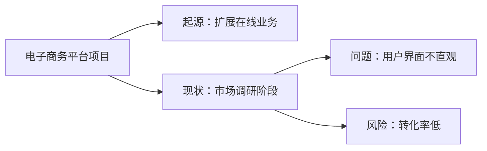
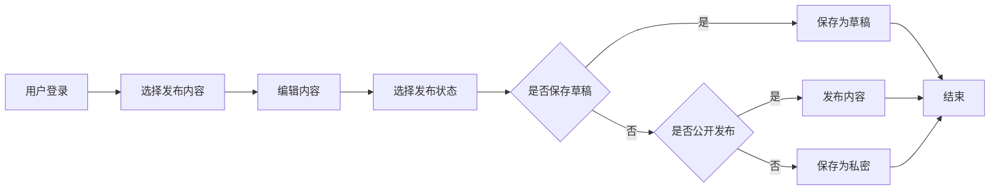
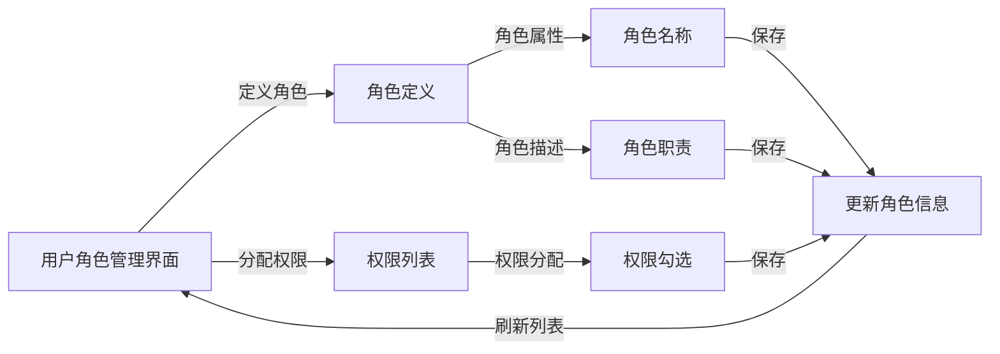
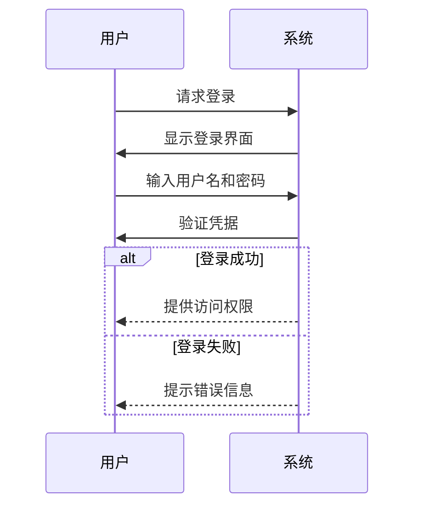
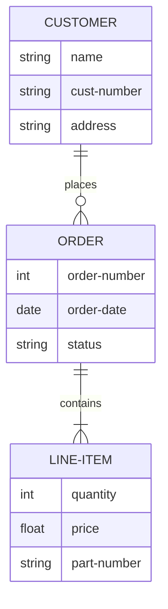

# 软件开发需求分析模板：完整指南与实践案例

[本文还有配套的精品资源，点击获取](https://download.csdn.net/download/m0_62143653/87417339)


简介：需求分析是软件开发的起始点，定义项目范围和目标。本资源包提供了一套标准化的需求分析模板，涵盖了项目背景、目标、功能与非功能需求等关键部分，并包括了用户角色、数据、接口、风险评估、需求优先级、变更管理以及验收标准。文档旨在指导项目团队系统化地记录和组织需求，确保开发围绕实际需求展开，同时促进团队与利益相关者之间的沟通与共识。


## 1. 软件开发项目需求分析概论

在软件开发的世界里，需求分析扮演着至关重要的角色。它是项目成功与否的关键因素，因为它确定了项目的基础和目标。需求分析不仅仅是对用户需求的理解，它还包括了对市场需求、技术可行性、以及未来可能的业务扩展的考量。只有在彻底理解了需求之后，开发者们才能设计出合适的软件解决方案来满足这些需求。

### 1.1 需求分析的定义

需求分析可以定义为一个过程，用来确认用户或利益相关者对软件产品的需求，并对这些需求进行详细记录。这个过程是一个反复迭代的过程，其目的是确保开发团队和利益相关者之间对需求的理解是一致的。

### 1.2 需求分析的重要性

要理解需求分析的重要性，我们需要认识到它在以下几个方面的作用：

* **明确目标**
  ：帮助项目团队明确项目的最终目标，确保每个人对最终产品的期望是一致的。
* **预防误解**
  ：通过明确需求，避免在项目开发过程中产生误解和不必要的返工。
* **减少风险**
  ：预先识别潜在问题，对风险进行评估和管理，降低项目失败的可能性。

需求分析不仅仅是一系列文档的编制，它更是一个沟通的过程，涉及到与客户的紧密合作，以确保开发的产品能够满足他们的真实需求。接下来的章节，我们将详细介绍需求分析的核心组成部分，以及如何编写一份详尽的需求分析文档。

## 2. 需求分析文档的核心组成

#### 2.1 需求分析的重要性和必要性

需求分析是软件开发过程中至关重要的步骤，它直接关系到项目的成功与否。需求分析的目的是为了明确项目的目标、范围、功能、性能等多方面的要求，从而确保开发的软件能够满足用户的实际需要。

##### 2.1.1 确保项目方向与目标一致

在项目启动阶段，需求分析帮助项目团队理解并确定项目的最终目标。这是通过与利益相关者进行沟通，明确项目的业务目标、用户目标以及技术目标来实现的。它能够确保开发团队和利益相关者之间对项目的方向和目标达成一致，从而减少资源浪费和项目失败的风险。

##### 2.1.2 预防和减少开发过程中的不确定性

需求分析通过详细的调研和记录，帮助项目团队预防和减少开发过程中的不确定性。它涵盖了对潜在问题的预测和风险评估，这有助于项目团队提前做好应对策略，避免在开发过程中遇到重大阻碍。

#### 2.2 需求分析文档的结构框架

需求分析文档是项目团队和利益相关者之间的沟通桥梁。一个良好的需求分析文档应该具有清晰的结构和明确的内容，它应当包括以下部分。

##### 2.2.1 文档结构的通用模板

一个标准的需求分析文档通常包含以下几个部分：

* **简介**
  ：介绍文档的目的、范围以及文档的阅读者。
* **项目背景**
  ：描述项目起源和当前状态，以及项目存在的问题和挑战。
* **项目目标**
  ：明确项目的短期和长期目标，提供可量化的指标。
* **功能需求**
  ：详细列出软件需要实现的功能，包括核心功能和附加功能。
* **非功能需求**
  ：描述性能、安全性、可用性等质量属性的需求。
* **用户和系统交互**
  ：阐述用户角色和用例，描述用户与系统的交互方式。
* **数据和接口需求**
  ：详细描述数据模型、数据流以及系统内外接口的需求。
* **高级处理**
  ：包括约束条件、假设、风险评估和变更管理等内容。

##### 2.2.2 各部分的具体内容和编写要点

每个部分都有其特定的编写要点，下面列出一些编写要点：

* **简介**
  ：简洁明了地说明文档的意图和重要性。
* **项目背景**
  ：提供历史背景，定义项目范围。
* **项目目标**
  ：具体化和量化目标，确保目标是可执行的。
* **功能需求**
  ：使用功能列表或功能点分析，确保所有功能被覆盖。
* **非功能需求**
  ：使用性能指标和标准，确保系统的可靠性和可用性。
* **用户和系统交互**
  ：绘制用例图和交互流程图，确保用户交互逻辑清晰。
* **数据和接口需求**
  ：建立数据流图和接口规格，确保数据和接口的一致性。
* **高级处理**
  ：详细描述假设条件，评估风险，制定应对策略。

需求分析文档的每一部分都需要仔细考虑和精心编写，这有助于项目团队对项目的每个方面都有深入的理解。接下来的章节，我们将深入探讨需求分析文档各个部分的详细内容和编写技巧。

## 3. 项目背景与目标的阐述

### 3.1 项目背景的详细描述

#### 3.1.1 项目的起源与现状

项目背景为需求分析阶段提供了丰富的上下文信息。项目的起源通常与企业战略目标、市场需求或技术创新紧密相关。例如，一家公司可能发现其产品线在某些市场细分中不够强大，或者面临一个新兴技术的竞争压力，这促使其启动一个新的软件项目。现状描述应包含当前项目所处的阶段，包括已有成果、存在的问题以及已识别的风险。以一个电子商务平台为例，项目起源可能是由于公司希望扩展在线业务，目前项目可能正处于市场调研阶段，面临的主要问题是用户界面不够直观，导致转化率低于预期。



#### 3.1.2 项目所面临的问题与挑战

分析项目背景时，深入挖掘存在的问题和挑战是至关重要的。它们不仅影响需求规格的确定，还可能影响项目的整体方向和范围。这些问题和挑战可能来自多个方面，比如技术限制、市场环境、法规遵循、组织能力等。例如，在上述电子商务平台案例中，除了用户界面直观性的问题，还可能面临支付安全的挑战、多语言支持的需求等。

### 3.2 项目目标的明确与设定

#### 3.2.1 短期和长期目标的区分

明确项目目标是需求分析中不可忽视的部分。短期目标通常是项目启动后在近期能够实现的成果，而长期目标则是项目成功实施后可以实现的战略愿景。以电子商务平台为例，短期目标可能是建立一个原型系统并进行初步用户测试，而长期目标可能是达到市场占有率的增加或建立品牌忠诚度。

```markdown
| 时间范围 | 目标类型 | 目标示例 |
| -------- | -------- | -------- |
| 短期     | 建立原型系统 | 开发并测试电子商务平台原型 |
| 长期     | 增加市场份额 | 达成5%的市场占有率 |

```

#### 3.2.2 目标的具体化和量化指标

为了确保目标具有可测量性，需求分析中定义的目标应该尽可能具体和可量化。这有助于在项目进行中进行跟踪和评估。继续以电子商务平台为例，具体化的短期目标可以是"开发包含5个主要功能的原型系统，并在目标用户群体中获得至少80%的正面反馈"；长期目标可以是"在一年内实现在线订单数量翻倍，且用户平均停留时间增加40%"。

```markdown
| 目标类型 | 具体描述 | 量化指标 |
| -------- | -------- | -------- |
| 短期     | 开发原型系统 | 包含5个主要功能 |
|          | 用户测试反馈 | 80%正面反馈 |
| 长期     | 增加在线订单 | 订单数量翻倍 |
|          | 提高用户停留时间 | 增加40% |

```

通过以上分析，我们可以看到，项目背景和目标的详细描述是构建需求分析文档的基石。它们不仅为项目提供清晰的出发点，同时也为衡量项目进展和成功提供了标准。在明确了这些内容后，需求分析可以更深入地覆盖功能与非功能需求，从而为软件开发的下一阶段打下坚实的基础。

## 4. 需求的详细划分与描述

### 4.1 功能需求的详尽梳理

#### 4.1.1 核心功能与附加功能的区分

在软件开发过程中，识别和区分核心功能与附加功能是至关重要的步骤。核心功能是产品或服务必须提供的功能，它们是产品存在的基础，满足用户的基本需求，同时也是产品竞争力的核心。核心功能通常包括：

* 用户账户管理：允许用户注册、登录、注销以及管理个人信息。
* 内容发布：用户可以上传、编辑、删除以及发布内容。
* 评论系统：用户可以对内容进行评论，增加互动性。

与核心功能相对应的是附加功能，它们为产品增添额外的价值，提高用户满意度，但不影响产品的基本运作。附加功能可能包括：

* 社交网络集成：允许用户将内容分享到第三方社交平台。
* 搜索优化：提供高级搜索功能和SEO增强以改善用户体验。
* 用户推荐系统：为用户推荐相关内容或产品。

#### 4.1.2 功能需求的实现细节与流程

梳理完核心与附加功能后，需要进一步规划它们的实现细节与流程。例如，在开发一个内容管理系统（CMS）时，以下是实现细节的考虑：

1. **用户账户管理流程**
   ：
2. 用户提交注册信息（如邮箱、用户名和密码）。
3. 系统验证邮箱格式并发送验证邮件到用户邮箱。
4. 用户点击验证链接激活账户。
5. 用户登录系统，系统提供一个友好的界面用于账户信息管理。
6. **内容发布流程**
   ：
7. 用户登录后，系统显示内容发布界面。
8. 用户通过富文本编辑器输入内容，并可插入媒体文件。
9. 用户选择发布状态（草稿、私密或公开）。
10. 用户提交发布请求，系统进行内容验证（如合法性、格式等）。
11. 系统保存内容并发布到指定平台。

对于每个功能，应使用流程图详细描述其操作步骤，确保开发团队对需求有共同的理解。以下是一个简化的mermaid流程图例子，用于说明内容发布的流程：



### 4.2 非功能需求的深入分析

#### 4.2.1 性能、安全性与可用性要求

在非功能需求分析中，性能、安全性和可用性是三个关键方面，它们直接影响到软件产品的质量与用户体验。

##### 性能要求

性能需求是关于系统在正常运行条件下如何响应和处理数据的需求。它们可能包括：

* 响应时间：系统对用户操作的响应时间应尽可能短。
* 吞吐量：系统应能够处理预定数量的事务或请求。
* 可伸缩性：系统应能够随着用户基数增长而进行水平或垂直扩展。

例如，对于一个在线电商网站，其性能要求可能包括：

* 页面加载时间不超过3秒。
* 每秒能够处理至少1000笔交易。
* 支持无限量的并发用户访问。

##### 安全性要求

安全性需求关注于保护系统不受未授权访问、数据泄露、破坏或其他恶意活动的影响。它可能包括：

* 认证机制：确保用户身份的安全验证。
* 加密协议：通过SSL/TLS等加密数据在传输过程中的安全。
* 防攻击措施：防止SQL注入、跨站脚本攻击（XSS）和跨站请求伪造（CSRF）。

安全策略应涵盖从用户登录到数据存储的各个方面，例如：

* 所有用户密码必须进行哈希处理并加盐存储。
* 仅允许通过HTTPS访问网站。
* 应用程序需要定期进行安全漏洞扫描和渗透测试。

##### 可用性要求

可用性关注于软件产品对最终用户的易用性。它包括：

* 易于理解的用户界面。
* 清晰的错误信息和有效的错误恢复机制。
* 快速有效的用户支持和文档。

例如，为保证系统可用性，可以实施如下措施：

* 提供简洁直观的用户界面设计。
* 对用户的操作提供即时反馈。
* 设计易于理解的帮助文档和FAQ。

#### 4.2.2 用户体验与界面设计的非功能指标

用户体验（UX）和界面设计是非功能需求分析中不可忽视的部分，因为它们决定了用户与产品交互的舒适度和效率。

##### 用户体验指标

用户体验指标应当根据目标用户群体的具体需求来定制，以下是一些通用指标：

* 直观性：用户是否能够凭借直觉进行操作。
* 一致性：产品中的界面元素和交互方式是否保持一致。
* 反馈：系统在用户操作后提供的反馈是否及时且有助于理解。
* 响应时间：系统在处理用户请求时的响应时间是否符合预期。

为达到这些指标，可能需要：

* 实施用户测试和焦点小组讨论，确保设计符合用户预期。
* 在设计过程中，遵循行业标准和最佳实践。

##### 界面设计指标

界面设计指标通常包括：

* 视觉设计：界面是否美观，是否使用一致的配色方案和字体。
* 导航：用户是否能够轻松找到他们所需的信息或功能。
* 适应性：界面是否能够适应不同大小的屏幕和设备。

确保设计指标的实现，可以采取以下步骤：

* 设计初期就考虑到响应式布局，确保界面在各种设备上都表现良好。
* 进行A/B测试，比较不同的设计方案并选择最佳方案。

在本节中，我们深入分析了软件开发过程中功能需求和非功能需求的划分与描述，包括它们的重要性、实现细节与流程，并且利用了Mermaid流程图和列表形式来详细阐述了这些需求。这些步骤和工具的运用能够帮助开发团队和利益相关者共同理解并跟踪项目的具体需求，为软件产品的成功奠定基础。

## 5. 用户与系统的交互设计

用户与系统的交互设计是软件开发中至关重要的一步，其涉及到用户界面和用户体验的各个层面。一个直观易用的交互设计能够大大提升用户的满意度，并且能够有效地引导用户完成任务，从而提高系统的使用效率。

### 5.1 用户角色的定义与分类

用户角色的定义与分类是交互设计中的第一步，它涉及到对用户的基本了解和角色划分。这一过程包括识别不同的用户群体、了解其需求、以及根据这些需求来划分角色。

#### 5.1.1 主要用户角色与次要用户角色的划分

在任何系统中，主要用户角色是最为核心和关键的用户群体。这些用户是系统的主要受益者，他们与系统的交互频率最高，对系统的业务目标影响最大。例如，银行系统中，主要用户角色可能是银行柜员和客户。次要用户角色则通常是那些与系统交互频率较低，或者对系统业务目标影响较小的用户群体，如系统管理员或者审计人员。

角色定义之后，需要为每个角色创建一个角色卡片（Persona Card），卡片上应包含角色的名称、图片、基本人口统计信息、主要职责、目标、以及与系统的互动方式等信息。这样做可以帮助设计者更加清晰地理解各个角色的需求，并且在后续设计过程中时刻将这些需求铭记于心。

#### 5.1.2 每个角色的具体职责和权限

职责是指角色在系统中所承担的任务和责任，而权限是指角色在系统中被授予的操作权限。良好的交互设计应当确保每个用户角色在其职责范围内能够有效地完成任务，并且拥有完成这些任务所需的相应权限。

例如，在一个内容管理系统（CMS）中，内容编辑可能需要发布文章的权限，而不需要管理用户账户的权限。而系统管理员则需要具备对所有功能进行设置和配置的权限。为了在系统中实现这样的职责和权限分配，通常需要创建角色权限管理模块，允许系统管理员为不同的用户角色分配不同的权限集。

#### 角色权限管理模块的设计



### 5.2 用例的创建与管理

用例（Use Case）是描述用户如何与系统交互的文本描述，它以用户的故事形式呈现，并且强调用户的需求和目标。创建和管理用例能够帮助我们理解各个用户角色与系统之间的交互流程，并最终实现一个功能全面且用户友好的系统。

#### 5.2.1 用例图的绘制与分析

用例图是一种用于描述系统功能和用户（即参与者）之间关系的图示。在用例图中，系统是一个包含所有功能的椭圆，参与者（用户角色）是用一个小人图标表示的，而用例则是椭圆内部的文本标签。

用例图不仅能够帮助设计者和开发人员清晰地看到系统的功能需求，而且也能够帮助项目干系人理解系统的功能范围。绘制用例图的过程可以帮助团队发现隐藏的需求和潜在的交互模式。

#### 5.2.2 用例的实现流程和场景模拟

用例的实现流程和场景模拟是把用例从理论层面转化为实际应用的关键步骤。每个用例都需要具体化的实现流程来指导开发团队进行编程工作。实现流程通常包括一系列的步骤描述，每个步骤都包含了用户如何与系统交互，以及系统如何响应这些交互。

场景模拟是通过讲故事的方式详细叙述用户在使用系统时可能遇到的不同情况。每一个场景都需要考虑不同的用户角色和不同的交互方式，以确保系统能够适应各种可能的使用情境。



场景模拟通常涉及到多个用例，因此在模拟时需要注意用例之间的依赖关系，确保场景的完整性。场景模拟不仅帮助团队验证需求的可实现性，而且也是测试用例生成的重要来源。

## 6. 数据与接口的需求分析

在软件开发过程中，数据与接口需求分析是确保系统高效运行和互操作性的关键环节。一个良好的需求分析不仅能帮助开发者明确系统需要处理的数据类型和数据流程，还能确保系统在与其他系统交互时的一致性和兼容性。

### 6.1 数据需求的详细规划

数据是软件系统的核心，对数据需求的规划直接关系到数据的完整性、一致性和安全性。需求分析阶段必须详细规划数据需求，以便为后续的数据库设计和实现提供坚实的基础。

#### 6.1.1 数据模型的设计与数据流图

在数据模型的设计阶段，需要采用一种结构化的方法来表示数据及其关系。实体-关系模型（ER模型）是数据建模的常用方法，它能够帮助我们清晰地表示实体间的联系。从ER模型出发，可以进一步转换为关系数据模型，这是大多数数据库系统所采用的模型。

数据流图（DFD）是表示数据流动和数据处理的图形化工具。DFD通过展示数据的输入、输出、存储和处理过程，帮助理解数据在系统中的流动方式。它强调了数据如何在系统组件之间移动，以及数据流的来源和去向。



如上所示，通过Mermaid语法创建了一个简单的ER图，描述了客户（CUSTOMER）、订单（ORDER）和订单项（LINE-ITEM）之间的关系。

#### 6.1.2 数据的存储、检索与更新需求

在数据需求规划中，必须详细定义数据存储、检索和更新的需求。这包括决定哪些数据需要存储，数据存储的格式，以及数据的检索需求。例如，数据是否需要支持复杂查询，数据更新的频率如何，是否需要并发处理等。

数据存储要求可能包括存储空间的大小，数据的备份和恢复策略，数据的安全性和完整性约束。数据检索需求可能涉及到对数据的查询速度和查询的复杂度，是否需要支持实时查询等。

数据更新需求则关注数据的一致性和同步。在分布式系统中，数据更新可能需要跨多个服务器进行，这要求采用事务管理机制来保证数据的原子性和持久性。

### 6.2 接口需求的规格化描述

接口需求的描述是确保系统模块间以及系统与外部环境间能够顺利通信的关键步骤。规格化描述需要清晰且不产生歧义，这通常需要定义接口的协议、消息格式以及接口行为。

#### 6.2.1 系统内部接口与外部接口的区分

系统内部接口指的通常是系统内部不同模块之间的通信接口，而外部接口则是指系统与外部系统、设备或服务之间的通信接口。区分这两类接口是至关重要的，因为它们有着不同的设计和实现要求。

* **系统内部接口**
  ：内部接口应该尽可能简洁高效，通常由系统内部定义的API集合构成。为了便于维护和扩展，内部接口应当遵循统一的命名和设计规范。
* **系统外部接口**
  ：外部接口则需要考虑到协议兼容性、数据格式转换、安全性和性能等因素。根据需要，外部接口可能需要使用Web服务、RESTful API、SOAP等技术实现。

#### 6.2.2 接口协议的标准和实现细节

接口协议的标准定义了接口通信的基本规则和规范。例如，一个Web服务接口可能会使用HTTP协议，遵循REST架构风格，并使用JSON格式交换数据。在定义接口时，除了协议标准外，还需要明确接口的具体实现细节，包括请求和响应的结构、数据类型、错误处理机制等。

```json
// 示例：RESTful API接口请求示例
POST /api/users HTTP/1.1
Host: ***
Content-Type: application/json
Accept: application/json

{
"name": "John Doe",
"email": "\*\*\*"
}

```

在接口协议的实现中，还需要考虑到接口的版本管理，这样可以在不影响现有用户的情况下，对接口进行升级和扩展。版本管理通常通过 URL 路径（如
`/v1/`
、
`/v2/`
等）或请求参数来实现。

总结上述内容，本章节详细探讨了数据与接口的需求分析，重点介绍了数据模型的设计、数据流图、数据存储与检索需求以及接口协议的规格化描述。为了确保软件系统的可维护性、可扩展性和互操作性，需求分析阶段的这一部分工作至关重要。下一章节我们将探讨需求分析文档的高级处理技巧。

## 7. 需求分析文档的高级处理

### 7.1 约束条件和假设的明确定义

在软件开发项目中，约束条件和假设是需求分析文档中不可或缺的部分，它们定义了项目的边界和条件，帮助团队理解项目的可行性和限制。

#### 7.1.1 技术与环境的限制因素

在技术方面，可能存在的限制因素包括但不限于技术栈的选择、第三方服务或库的可用性、硬件资源的限制等。例如，一个项目可能因为预算限制而无法使用高性能的服务器，或者因为特定平台的限制而无法使用某些技术。文档中应详细列出这些技术限制，并说明它们对项目可能产生的影响。

```markdown
### 技术限制因素示例

- 技术栈限制：项目需在现有的技术栈内完成开发，不考虑迁移到新的技术框架。
- 硬件资源限制：服务器的 CPU 和内存资源有限，可能影响软件性能。
- 第三方服务：依赖的第三方服务必须是开源或有稳定的免费版本可用。
  
```

在环境方面，环境限制通常指的是操作系统、网络条件、数据库等环境因素。这些条件直接影响开发和部署的决策。例如，如果目标用户群体主要使用移动设备，那么项目的开发环境需要支持移动设备的测试和适配。

#### 7.1.2 项目假设与潜在风险的识别

项目假设是指在进行需求分析时，基于当前信息和预期情况所做的合理推断。这些假设可能会影响项目的范围、进度和成本。例如，假设目标用户对新技术的接受程度高，因此可以使用较为前沿的技术进行开发。在文档中需要明确列出这些假设，并评估它们如果未成立可能带来的风险。

```markdown
### 项目假设与潜在风险示例

- 用户接受度假设：用户愿意尝试并适应新的用户界面和操作方式。
- 开发周期假设：假设在项目启动时依赖的外部库会保持稳定，无重大更新。
- 资源可用性假设：假设项目可以顺利获得预期的技术资源和支持。
  
```

这些假设和风险应当在项目的初期就进行识别，并在后续的项目管理过程中不断验证和调整。

### 7.2 风险评估与应对策略的制定

#### 7.2.1 风险因素的评估方法

风险评估是识别、分析和评价可能影响项目目标实现的不确定性因素的过程。一般采用定性和定量的评估方法，结合专家判断、历史数据分析、模拟技术等手段。

```markdown
### 风险评估方法示例

- 定性评估：采用如 SWOT（优势、劣势、机会和威胁）分析，团队讨论等方式。
- 定量评估：使用决策树、故障树分析、蒙特卡洛模拟等统计技术。
  
```

在文档中需要说明使用了哪些评估工具和方法，并提供评估过程的记录和分析结果。

#### 7.2.2 风险预防和应对措施的拟定

在识别了潜在风险之后，需要制定相应的预防措施和应对策略。这些措施应当具体、可执行，以便在风险出现时迅速响应。

```markdown
### 风险预防和应对措施示例

- 技术风险应对：建立代码审核机制，避免技术债务积累。
- 时间管理风险：定期评估项目进度，使用敏捷管理方法灵活调整计划。
- 人员变动风险：进行知识管理，确保关键信息不会因人员离职而丢失。
  
```

### 7.3 需求变更与验收标准的确立

#### 7.3.1 变更管理流程的规范化

需求变更是在项目开发过程中不可避免的。一个规范化的变更管理流程有助于控制变更对项目的影响，保持项目的稳定性和可预测性。

```markdown
### 变更管理流程示例

1. 变更请求：由项目干系人提出变更请求。
2. 影响分析：评估变更对项目范围、时间、成本和资源的影响。
3. 审批过程：变更请求需经过项目管理办公室（PMO）批准。
4. 实施变更：批准的变更将被纳入项目计划并执行。
5. 跟踪监控：变更实施过程将被跟踪，并在必要时进行调整。
   
```

#### 7.3.2 验收标准的具体设定和评估方法

验收标准是项目交付前必须达到的要求，它帮助项目干系人验证软件产品的质量是否满足预期。验收标准应该具体明确，可量化，能够为开发和测试提供明确的指导。

```markdown
### 验收标准示例

- 功能完整性：软件功能实现与需求规格说明一致。
- 性能指标：满足预定的性能标准，如响应时间和吞吐量。
- 用户体验：通过用户测试，确保软件符合预期的用户体验。
- 文档完整性：提供完整的用户手册、系统维护手册等文档。

```

验收标准应当在项目初期就设定，并在项目过程中根据情况变化进行调整。验收过程应当有明确的记录，确保可追溯性和透明性。

需求分析文档的高级处理是确保软件开发项目顺利进行的关键步骤。通过明确约束条件和假设、制定风险评估与应对策略、设定需求变更和验收标准，项目团队可以更好地控制项目风险，提高项目的成功率。

[本文还有配套的精品资源，点击获取](https://download.csdn.net/download/m0_62143653/87417339)


简介：需求分析是软件开发的起始点，定义项目范围和目标。本资源包提供了一套标准化的需求分析模板，涵盖了项目背景、目标、功能与非功能需求等关键部分，并包括了用户角色、数据、接口、风险评估、需求优先级、变更管理以及验收标准。文档旨在指导项目团队系统化地记录和组织需求，确保开发围绕实际需求展开，同时促进团队与利益相关者之间的沟通与共识。

[本文还有配套的精品资源，点击获取](https://download.csdn.net/download/m0_62143653/87417339)
