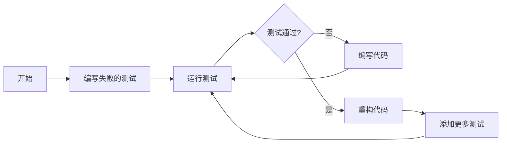

# 掌握PHPUnit：PHP单元测试框架实战教程

[本文还有配套的精品资源，点击获取](https://download.csdn.net/download/weixin_39840650/11326148)


简介：PHPUnit是PHP中广泛使用的单元测试框架，支持测试驱动开发(TDD)和行为驱动开发(BDD)方法，提供完整的API进行自动化测试。它能模拟外部依赖，并提供代码覆盖率分析功能。本教程涵盖了如何使用PHPUnit编写测试用例，进行断言验证，并通过命令行运行测试。开发者通过本教程能够掌握PHPUnit的使用，提高代码质量和开发效率。


## 1. PHPUnit框架介绍和安装

PHPUnit是PHP开发中最流行的单元测试框架，它遵循xUnit体系结构，被广泛用于测试、调试以及维护PHP代码。作为开发者，了解PHPUnit的工作原理和如何安装配置对提升代码质量和维护效率至关重要。

### 1.1 PHPUnit框架概述

PHPUnit提供了一套完整的测试机制，从简单的单元测试到复杂的集成测试，都可以通过PHPUnit来实现。它支持测试的自动化执行，能够确保代码在进行修改后，原有的功能不会受到影响。PHPUnit的测试结果能够输出到控制台、XML文件、甚至生成代码覆盖率报告，为代码质量的持续改进提供了有效工具。

### 1.2 PHPUnit的安装流程

安装PHPUnit可以采用多种方法，最简便的方式是通过Composer进行安装。首先确保系统中安装了Composer，然后通过命令行运行以下指令：

```bash
composer require --dev phpunit/phpunit ^9.0

```

这将会安装最新版本的PHPUnit到你的项目中。安装完成后，可以使用
`vendor/bin/phpunit`
来运行PHPUnit测试。此外，也可以通过全局安装的方式，使得PHPUnit可以在命令行任何位置被调用，这通过以下指令完成：

```bash
composer global require phpunit/phpunit ^9.0

```

之后，将
`~/.composer/vendor/bin`
目录添加到你的系统PATH中即可。

通过以上步骤，我们简单介绍了PHPUnit框架的基本概念，并演示了如何在PHP环境中安装PHPUnit。在后续章节中，我们将进一步深入了解如何编写测试用例和断言、掌握测试驱动开发(TDD)与行为驱动开发(BDD)的实践，以及如何利用PHPUnit进行更高级的测试操作。

## 2. 编写测试用例和断言

### 2.1 测试用例的基本结构

#### 2.1.1 测试类的创建和组织

在PHPUnit中，测试类通常是继承自PHPUnit\Framework\TestCase的类。每个测试方法都是以
`test`
为前缀的公共方法，这样PHPUnit就可以识别它们为测试用例。为了更好地组织测试用例，推荐使用命名约定，将相关的测试用例放在同一个类中。

让我们通过一个简单的例子来展示如何创建一个测试类。假设我们有一个计算器类，我们想测试它的加法功能。

```php
use PHPUnit\Framework\TestCase;

class CalculatorTest extends TestCase
{
    protected $calculator;

    protected function setUp(): void
    {
        $this->calculator = new Calculator();
    }

    public function testAdd()
    {
        $this->assertEquals(4, $this->calculator->add(2, 2));
    }
}

```

在上述代码中，我们创建了一个名为
`CalculatorTest`
的测试类，并通过
`setUp`
方法实例化了待测试的
`Calculator`
类。然后，我们定义了一个名为
`testAdd`
的方法，通过
`assertEquals`
断言来检查加法是否正确。

在组织测试类时，可以考虑以下建议：

* **单一职责原则**
  ：每个测试类只测试一个类或一组紧密相关的功能。
* **可读性**
  ：使用清晰的命名约定，使测试用例易于理解和维护。
* **隔离性**
  ：确保测试用例不互相影响，使用
  `setUp`
  和
  `tearDown`
  方法进行必要的初始化和清理工作。

#### 2.1.2 测试方法的编写规则

测试方法的编写应遵循以下规则：

* 测试方法必须是公共的（
  `public`
  ）。
* 测试方法名必须以
  `test`
  作为前缀， PHPUnit 才会自动将其识别为测试用例。
* 测试方法应该专注于测试单一功能或场景，以便于出问题时能够快速定位。
* 测试方法应该独立，不依赖于其他测试方法的执行结果。

下面是一个遵循上述规则的测试方法示例：

```php
public function testSubtract()
{
    $this->assertEquals(0, $this->calculator->subtract(2, 2));
}

```

在上面的示例中，我们添加了一个测试方法来验证减法操作。注意，这个测试方法只关注减法操作，而与加法测试是分离的。

### 2.2 断言的使用和分类

#### 2.2.1 基本断言方法的使用

PHPUnit 提供了大量的断言方法，帮助开发者确保代码按预期运行。以下是一些常用的断言方法：

* `assertEquals(expected, actual)`
  : 检查两个变量是否相等。
* `assertNotEquals(expected, actual)`
  : 检查两个变量是否不相等。
* `assertTrue(condition)`
  : 确保条件为真。
* `assertFalse(condition)`
  : 确保条件为假。
* `assertNull(variable)`
  : 确保变量为null。
* `assertNotNull(variable)`
  : 确保变量不为null。

让我们以一个测试空字符串处理的断言为例：

```php
public function testIsEmpty()
{
    $this->assertTrue($this->calculator->isEmpty(''));
    $this->assertFalse($this->calculator->isEmpty(' '));
}

```

在这个测试方法中，我们使用
`assertTrue`
和
`assertFalse`
断言来验证
`isEmpty`
方法的正确性。我们预期空字符串(
`''`
)应该返回
`true`
，而只包含空格的字符串(
`' '`
)应该返回
`false`
。

#### 2.2.2 特殊断言场景的处理

在某些特殊情况下，我们需要使用更复杂的断言方法：

* `assertContains($needle, $haystack)`
  : 检查数组或字符串中是否包含某个元素。
* `assertCount($expectedCount, $haystack)`
  : 检查数组或Countable对象的元素数量。
* `assertRegExp($pattern, $string)`
  : 使用正则表达式来验证字符串。

以下是一个使用
`assertContains`
断言的示例，测试一个数组是否包含特定元素：

```php
public function testArrayContains()
{
    $this->assertContains('apple', ['orange', 'apple', 'banana']);
}

```

这个例子验证了数组
`['orange', 'apple', 'banana']`
是否包含字符串
`'apple'`
。

每个断言方法在使用时都有特定的参数和预期的用法。通常，一个断言方法至少需要两个参数：预期的结果和实际的结果。编写测试用例时，遵循“先断言后实现”的原则，可以让我们写出更好的测试用例。

在实际工作中，应根据测试需求选择适当的断言方法。为使测试更加健壮，我们应尽量避免使用模糊的断言，如
`assertTrue`
和
`assertFalse`
，它们可能会隐藏潜在的问题。尽可能使用更具体的断言，如
`assertEquals`
和
`assertContains`
，这样即使测试失败，也能获得更清晰的错误信息。

为了确保测试用例的准确性和可靠性，不仅要考虑成功场景的断言，还要考虑失败场景下的断言。通过这种方法，可以更全面地测试代码的行为，并确保代码的鲁棒性。

## 3. 测试驱动开发(TDD)与行为驱动开发(BDD)基础

#### 3.1 测试驱动开发(TDD)的原理和实践

##### 3.1.1 TDD的生命周期和工作流程

测试驱动开发（TDD）是一种迭代软件开发过程，在这个过程中，开发者首先编写一个测试用例，然后编写代码使该测试通过，最后重构新写的代码。TDD的生命周期可以概括为：编写失败的测试 -> 运行测试并看到它失败 -> 编写足够的代码使测试通过 -> 运行所有测试并看到它们通过 -> 重构测试通过的代码 -> 重复该过程。

以下是TDD流程的示例，展示了如何遵循红绿重构（Red-Green-Refactor）原则：



##### 3.1.2 实际编码中TDD的应用案例

下面的例子展示了如何在PHP项目中使用TDD来实现一个简单的计算器类。首先，我们会创建一个失败的测试，然后编写代码通过测试，最后重构实现代码。

1. 创建一个失败的测试用例：

```php
class CalculatorTest extends PHPUnit\Framework\TestCase
{
    public function testAdditionReturnsSum()
    {
        $this->assertEquals(3, Calculator::add(1, 2)); // 期望失败的测试
    }
}

```

1. 运行测试，确保它失败（由于尚未实现
   `Calculator::add()`
   方法）。
2. 实现足够的代码使测试通过：

```php
class Calculator
{
    public static function add($a, $b)
    {
        return $a + $b; // 简单的加法逻辑
    }
}

```

1. 运行测试并确认它们通过。
2. 可选的重构步骤，以改进代码的质量而不改变其行为。

#### 3.2 行为驱动开发(BDD)的概念和价值

##### 3.2.1 BDD的关键术语和实践步骤

行为驱动开发（BDD）是一种敏捷软件开发的技术，它鼓励软件项目中的开发者、质量保证和非技术或商业参与者之间的协作。BDD涉及的关键词包括：特性（Feature）、场景（Scenario）、给定（Given）、当（When）、那么（Then）、和（And）等。

BDD实践步骤通常包括：

1. 确定特性需求和用户故事。
2. 从用户故事中提取行为。
3. 编写场景并以自然语言描述。
4. 为每个场景编写测试用例。

##### 3.2.2 BDD在项目中的应用实例分析

以一个简单的购物车特性为例，BDD工作流程可能是这样的：

```gherkin
特性: 购物车中的商品数量管理

  背景:
    给定 用户已经在购物车中添加了三个商品

  场景: 用户移除一个商品
    当 用户移除一个商品
    那么 购物车中应包含两个商品

  场景: 用户添加一个商品
    当 用户添加一个商品到购物车
    那么 购物车中应包含四个商品

```

上面的特性描述可以直接转换为PHP代码中与PHPUnit结合的测试用例，通过这个例子，可以清晰地看到BDD如何将业务需求直接转化为可执行的测试代码，从而确保软件行为符合用户的期望。

接下来的章节中，我们将深入探讨如何在PHPUnit中使用数据提供器和模拟对象来增强测试的灵活性和可靠性。

## 4. 使用数据提供器和模拟对象

测试用例的编写不仅仅涉及基本的断言，而且经常需要处理复杂的测试场景。PHPUnit提供了数据提供器（Data Providers）和模拟对象（Mock Objects）机制，用于提高测试的灵活性和准确性。

### 4.1 数据提供器的使用和优势

数据提供器允许测试方法接收不同数据集的测试案例，这意味着你可以在一个测试方法中执行多种测试案例，而无需为每种测试条件编写单独的测试方法。这不仅减少了代码重复，而且使得测试的维护变得更加容易。

#### 4.1.1 数据提供器的工作原理

数据提供器是通过在测试类中定义一个返回数据集的公共静态方法来实现的。PHPUnit会自动调用这个方法，并将返回的每个数组元素作为参数传递给测试方法。

```php
/**
 * @dataProvider additionProvider
 */
public function testAdd($a, $b, $expected)
{
    $this->assertEquals($expected, $a + $b);
}

public function additionProvider()
{
    return [
        [0, 0, 0],
        [1, 1, 2],
        [-1, 1, 0],
    ];
}

```

上述代码示例中，
`additionProvider`
方法提供了三组数据，测试方法
`testAdd`
将分别对每组数据执行加法操作，并验证结果是否与预期相匹配。

#### 4.1.2 编写高效的数据提供器实例

编写数据提供器时，要考虑效率和可读性。例如，当数据集很大时，可以考虑使用生成器函数来延迟生成数据，而不是将所有数据存储在数组中。

```php
public function dataProviderForTestStringTransformation()
{
    yield 'lowercase' => ['foobar', 'foobar'];
    yield 'uppercase' => ['foobar', 'FOOBAR'];
    yield 'reverse'   => ['foobar', 'raaboo'];
}

/**
 * @dataProvider dataProviderForTestStringTransformation
 */
public function testStringTransformation($input, $expected)
{
    // Assume a string transformation method exists
    $transformed = $this->stringTransformer->transform($input);
    $this->assertEquals($expected, $transformed);
}

```

在上面的代码中，
`dataProviderForTestStringTransformation`
使用了PHP的生成器语法。当 PHPUnit 需要数据时，它会从生成器中请求下一个值，这样就可以逐个处理每个数据集，而不是在内存中存储整个数据集。

### 4.2 模拟对象技术应用

模拟对象在单元测试中非常重要，尤其当你需要隔离测试单元，确保测试的独立性时。PHPUnit 允许你创建模拟对象，用来替代那些在测试中不容易控制的依赖对象。

#### 4.2.1 模拟对象的概念和重要性

模拟对象是行为验证和交互测试的一种方式，它允许你设置对象在特定条件下的行为和返回值。使用模拟对象，可以实现以下目标：

* 验证对象间的交互
* 隔离外部依赖
* 控制测试环境

#### 4.2.2 PHPUnit中模拟对象的创建和应用

PHPUnit 提供了
`MockObject`
类，用于创建模拟对象。使用
`createMock`
方法可以快速生成一个基本的模拟对象。

```php
$mock = $this->createMock(ExampleClass::class);
$mock
    ->expects($this->once())
    ->method('doSomething')
    ->with($this->equalTo('foo'))
    ->willReturn('bar');

// 在测试中使用模拟对象
$actualResult = $mock->doSomething('foo');
$this->assertEquals('bar', $actualResult);

```

在这个例子中，
`$mock`
是
`ExampleClass`
的一个模拟对象。我们设置了期望，即
`doSomething`
方法应该被调用一次，并且当传入 'foo' 作为参数时，它应该返回 'bar'。这样，我们就可以测试
`ExampleClass`
的方法而不用依赖其他外部条件或资源。

通过模拟对象和数据提供器，PHPUnit 提供了强大的工具，可以编写更加灵活和深入的测试案例。在实际的测试实践中，结合这两种技术可以极大地提升测试的质量和可靠性。

## 5. setUp和tearDown方法应用

#### 5.1 setUp和tearDown的原理与作用

##### 5.1.1 setUp方法执行时机和用途

在PHPUnit中，
`setUp`
方法是每个测试用例开始前会自动执行的一个特殊方法，它在每个测试方法运行之前被调用，用于进行测试前的初始化工作。它是一个很好的机会来设置测试环境，比如初始化测试数据、创建对象实例等。通过使用
`setUp`
方法，可以避免重复代码，使测试用例更加简洁和易于维护。

让我们来通过一个简单的例子说明
`setUp`
的用途：

```php
class UserTest extends PHPUnit\Framework\TestCase
{
    protected $user;

    protected function setUp(): void
    {
        $this->user = new User('***');
    }
    public function testUserIsEmail()
    {
        $this->assertEquals('***', $this->user->getEmail());
    }
    public function testUserIsAdult()
    {
        $this->user->setAge(21);
        $this->assertTrue($this->user->isAdult());
    }
}

```

在上面的代码中，
`setUp`
方法用于创建一个用户实例，该实例被每个测试方法共享。这样，我们就不需要在每个测试方法中重复创建用户实例的代码。

##### 5.1.2 tearDown方法的清理工作

与
`setUp`
相对应的是
`tearDown`
方法，它在每个测试方法结束后执行。
`tearDown`
用于清理测试过程中创建的临时数据或者恢复测试环境到初始状态。这一步骤对于确保后续测试用例的独立性至关重要。

举个
`tearDown`
应用的例子：

```php
class DatabaseTest extends PHPUnit\Framework\TestCase
{
    protected $dbConnection;

    protected function setUp(): void
    {
        $this->dbConnection = new DatabaseConnection('localhost', 'username', 'password');
    }
    protected function tearDown(): void
    {
        $this->dbConnection->disconnect();
    }
    public function testDatabaseConnect()
    {
        $this->assertTrue($this->dbConnection->isConnected());
    }
}

```

在这个例子中，
`setUp`
方法创建了一个数据库连接，而在
`tearDown`
中，我们断开连接以确保不会对其他测试用例产生影响。

#### 5.2 实例化和数据清理的优化策略

##### 5.2.1 setUpBeforeClass和tearDownAfterClass的使用

PHPUnit提供了一个更高级别的生命周期方法，
`setUpBeforeClass`
和
`tearDownAfterClass`
，这两个方法分别在测试类的全部测试开始前和结束后执行一次。这使得我们可以执行类级别的初始化或清理工作。

```php
class UserTest extends PHPUnit\Framework\TestCase
{
    public static function setUpBeforeClass(): void
    {
        // 这里可以执行类级别的初始化代码，比如数据库迁移
        self::migrateDatabase();
    }

    public static function tearDownAfterClass(): void
    {
        // 这里可以执行类级别的清理代码
        self::dropDatabase();
    }
    // 测试方法
}

```

##### 5.2.2 测试后数据状态的验证和维护

测试完成后，有时需要验证测试数据是否符合预期。这不仅包括测试结果的校验，也包括对测试数据状态的检查。使用
`setUpBeforeClass`
和
`tearDownAfterClass`
可以帮助确保测试数据在开始前是预期状态，并在测试后重置到该状态。

```php
class DatabaseTest extends PHPUnit\Framework\TestCase
{
    public static function setUpBeforeClass(): void
    {
        // 初始化测试数据库
        // ...
    }

    public static function tearDownAfterClass(): void
    {
        // 在测试结束后重置测试数据库
        // ...
    }
    // 测试方法
}

```

通过以上方法，我们可以构建一个干净的测试环境并保持测试的隔离性和可重复性，确保我们的测试结果准确无误。在下一章中，我们将探讨如何处理更复杂的外部资源依赖问题。

## 6. 测试外部资源依赖

在单元测试中，外部资源依赖是常见的一种场景，这些外部资源可能包括数据库、API、文件系统等。直接依赖这些外部资源会使得测试难以控制和重复执行。因此，学习如何识别和模拟外部依赖是PHPUnit测试实践中的重要技能。

### 6.1 外部资源依赖的识别与模拟

#### 6.1.1 识别外部资源依赖的方法

在编写测试用例时，首先要做的就是识别代码中可能依赖的外部资源。常见的外部依赖包括但不限于：

* 数据库
* 网络服务（如REST API）
* 文件系统操作
* 系统调用

识别这些依赖可以通过以下方法：

* **审查代码逻辑**
  ：查看代码中是否有创建外部连接、发送网络请求或文件操作的语句。
* **使用静态分析工具**
  ：通过静态代码分析工具（如phpstan或phpcs）扫描代码中可能的外部依赖调用。
* **运行时分析**
  ：运行测试并捕获依赖注入过程中的异常或错误信息，以识别未处理的外部依赖。

#### 6.1.2 模拟外部资源依赖的技术

一旦识别出了外部依赖，接下来就是模拟这些依赖以避免在测试中产生副作用。PHPUnit提供了多种模拟技术：

* **使用Mockery库**
  ：Mockery是一个流行的PHP模拟对象库，可以用来模拟依赖的外部对象。
* **使用PHPUnit内置模拟功能**
  ：从PHPUnit 6开始， PHPUnit提供了内置的模拟对象功能，可以直接模拟外部对象或类。
* **使用依赖注入**
  ：重构代码以便在单元测试中可以注入外部依赖的模拟实例，是避免外部依赖影响测试的终极方法。

```php
// 示例：使用PHPUnit内置模拟功能来模拟外部的HttpClient类
class ExampleTest extends \PHPUnit\Framework\TestCase
{
    public function testExternalService()
    {
        // 创建模拟对象
        $mockHttpClient = $this->createMock(HttpClient::class);

        // 配置模拟对象的行为
        $mockHttpClient->method('request')
            ->willReturn('Mocked response');

        // 在测试用例中使用模拟对象
        $service = new ExternalService($mockHttpClient);
        $this->assertEquals('Mocked response', $service->getData());
    }
}

```

在上述示例代码中，
`ExternalService`
类依赖于
`HttpClient`
类来获取数据，我们创建了一个模拟对象并指定了期望的行为，这样在测试中就不会实际发起网络请求。

### 6.2 测试外部API和数据库的策略

#### 6.2.1 测试外部API调用的场景

在测试外部API调用时，确保API服务可用性、响应时间和响应内容的正确性是关键。对于外部API的测试策略包括：

* **使用服务虚拟化**
  ：使用如WireMock或Mountebank这样的工具来模拟外部API的返回值。
* **使用mock对象**
  ：在测试中创建一个mock对象来模拟API的调用。
* **测试断路器的实现**
  ：为了防止由于外部API故障影响到整个应用，需要测试在API服务不可用时，断路器是否按预期工作。

#### 6.2.2 测试与数据库交互的单元测试案例

对于与数据库交互的代码单元测试，应该避免直接使用实际的数据库。一个常见的策略是使用内存中的数据库或为测试配置特定的数据库实例：

* **使用SQLite内存数据库**
  ：SQLite提供了一个轻量级的内存数据库，非常适合用来进行测试。
* **使用数据库迁移工具**
  ：如Laravel的Schema Builder或Phinx，它们可以帮助创建可重复的数据库模式迁移。
* **使用数据库测试助手**
  ：如Laravel的DatabaseTransactions trait，可以在测试完成后回滚数据库状态。

```php
// 示例：使用PHPUnit和Laravel的DatabaseTransactions trait进行数据库操作测试
class UserTest extends TestCase
{
    use DatabaseTransactions;

    public function testCreateUser()
    {
        $user = User::create(['name' => 'John Doe']);
        // 断言用户是否已创建，并且有正确的名字
        $this->assertDatabaseHas('users', ['name' => 'John Doe']);
        $this->assertEquals('John Doe', $user->name);
    }
}

```

在上述示例中，使用了Laravel的
`DatabaseTransactions`
trait来保证每次测试之后都会回滚数据库，保持测试环境的一致性。

通过使用这些策略和技巧，我们可以有效地管理单元测试中的外部依赖，确保测试的健壮性和可靠性。在下一章节，我们将探讨如何集成代码覆盖率分析工具来进一步提升测试的质量。

[本文还有配套的精品资源，点击获取](https://download.csdn.net/download/weixin_39840650/11326148)


简介：PHPUnit是PHP中广泛使用的单元测试框架，支持测试驱动开发(TDD)和行为驱动开发(BDD)方法，提供完整的API进行自动化测试。它能模拟外部依赖，并提供代码覆盖率分析功能。本教程涵盖了如何使用PHPUnit编写测试用例，进行断言验证，并通过命令行运行测试。开发者通过本教程能够掌握PHPUnit的使用，提高代码质量和开发效率。

[本文还有配套的精品资源，点击获取](https://download.csdn.net/download/weixin_39840650/11326148)
