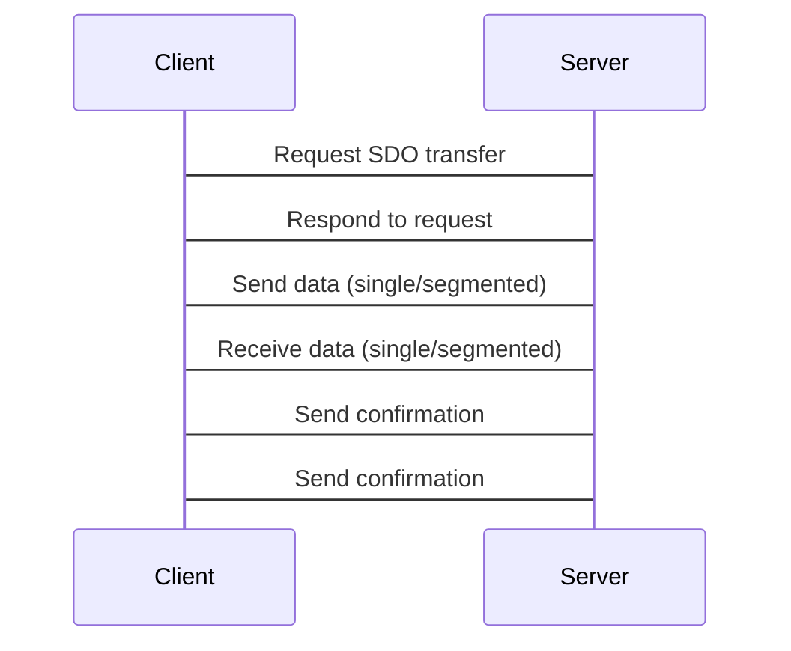

# CANOpen规范：工业自动化网络通信协议

[本文还有配套的精品资源，点击获取](https://download.csdn.net/download/jlctt/222945)


简介：CANOpen是一种基于CAN总线的通信协议，广泛应用于工业自动化、医疗设备和汽车电子系统。本规范详细介绍了CANOpen的架构、功能和应用，包括对象字典、NMT、SDO、PDO、PDO映射和通信参数等。掌握CANOpen规范对于构建高效、可靠的CAN网络至关重要，可确保不同厂商的设备无缝协作。

## 1. CANOpen概述

CANOpen是一种基于CAN总线的开放式网络协议，用于工业自动化和控制系统。它提供了一套标准化的对象模型、通信机制和服务，使不同制造商的设备能够在同一网络上进行通信和交互。CANOpen的优点包括：

* **开放性：**
  CANOpen是一个开放的协议，任何人都可以免费使用。
* **标准化：**
  CANOpen定义了一套标准化的对象模型、通信机制和服务，确保了不同制造商的设备之间的互操作性。
* **可靠性：**
  CAN总线是一种可靠的通信总线，具有错误检测和纠正机制，确保数据的可靠传输。

## 2.1 对象字典结构

#### 对象字典的组织结构

CANOpen对象字典是一个分层结构，由以下部分组成：

* **索引：**
  16位无符号整数，唯一标识对象字典中的每个条目。
* **子索引：**
  8位无符号整数，用于进一步细分对象字典条目。
* **数据类型：**
  定义对象字典条目中数据的类型，例如整数、浮点数或字符串。
* **访问权限：**
  规定对对象字典条目的访问级别，例如只读、读写或只写。
* **对象：**
  实际的数据值，存储在对象字典条目中。

#### 对象字典的层次结构

对象字典的层次结构如下：

* **设备类型：**
  标识设备的类型，例如伺服驱动器或传感器。
* **制造商特定对象：**
  由设备制造商定义的对象，用于特定设备功能。
* **通用对象：**
  由CANOpen规范定义的对象，用于所有CANOpen设备的通用功能。

通用对象进一步细分为以下类别：

* **通信对象：**
  用于配置和管理设备的通信参数。
* **设备对象：**
  用于描述设备的功能和状态。
* **制造商特定的对象：**
  用于实现设备特定的功能。

### 2.2 对象字典内容

#### 通信对象

通信对象用于配置和管理设备的通信参数，包括：

* **节点标识符（Node ID）：**
  唯一标识设备的16位无符号整数。
* **波特率：**
  设备使用的CAN总线波特率。
* **接收缓冲区大小：**
  设备接收缓冲区的最大大小。
* **传输缓冲区大小：**
  设备传输缓冲区的最大大小。

#### 设备对象

设备对象用于描述设备的功能和状态，包括：

* **设备类型：**
  标识设备的类型，例如伺服驱动器或传感器。
* **厂商标识符：**
  设备制造商的标识符。
* **产品代码：**
  设备的唯一产品代码。
* **硬件版本：**
  设备的硬件版本。
* **固件版本：**
  设备的固件版本。
* **设备状态：**
  设备的当前状态，例如运行或故障。

#### 制造商特定对象

制造商特定对象用于实现设备特定的功能，例如：

* **伺服驱动器的控制参数：**
  用于配置伺服驱动器的控制参数，例如位置、速度和加速度。
* **传感器的校准参数：**
  用于校准传感器的输出值。
* **显示器的亮度设置：**
  用于调整显示器的亮度。

### 2.3 对象字典操作

#### 读取对象字典条目

要读取对象字典条目，可以使用以下步骤：

1. 创建一个SDO请求报文，指定要读取的索引和子索引。
2. 将SDO请求报文发送到设备。
3. 等待设备响应，其中包含对象字典条目的值。

#### 写入对象字典条目

要写入对象字典条目，可以使用以下步骤：

1. 创建一个SDO请求报文，指定要写入的索引、子索引和新值。
2. 将SDO请求报文发送到设备。
3. 等待设备响应，确认写入操作是否成功。

#### 对象字典的应用

对象字典在CANOpen网络中具有广泛的应用，包括：

* **设备配置：**
  使用对象字典配置设备的通信参数和功能。
* **设备监控：**
  使用对象字典监控设备的状态和性能。
* **故障诊断：**
  使用对象字典诊断设备故障并确定故障原因。
* **设备更新：**
  使用对象字典更新设备的固件和软件。

## 3. NMT（网络管理服务）

### 3.1 NMT状态机

NMT（网络管理服务）是一种用于管理CANOpen网络中设备状态的协议。它定义了一个状态机，该状态机描述了设备在网络中的不同状态以及状态之间的转换。

NMT状态机有以下状态：

* **初始化状态（Init）：**
  设备刚上电或复位后进入此状态。在此状态下，设备不能与网络中的其他设备通信。
* **预操作状态（Pre-Operational）：**
  设备已初始化并已分配节点ID，但尚未进入网络。在此状态下，设备可以与网络中的其他设备通信，但不能发送或接收过程数据。
* **操作状态（Operational）：**
  设备已进入网络并可以发送和接收过程数据。
* **停止状态（Stopped）：**
  设备已停止发送和接收过程数据，但仍可以与网络中的其他设备通信。
* **错误状态（Error）：**
  设备已检测到错误，并已进入此状态。在此状态下，设备不能与网络中的其他设备通信。

状态之间的转换由NMT命令触发。

### 3.2 NMT命令

NMT命令用于控制NMT状态机。有以下NMT命令：

* **启动命令（Start）：**
  将设备从预操作状态切换到操作状态。
* **停止命令（Stop）：**
  将设备从操作状态切换到停止状态。
* **进入预操作状态命令（Enter Pre-Operational）：**
  将设备从操作状态或停止状态切换到预操作状态。
* **重置命令（Reset）：**
  将设备从任何状态切换到初始化状态。
* **错误控制命令（Error Control）：**
  用于控制设备在错误状态下的行为。

NMT命令通过CAN消息发送。CAN消息的ID为0x0000，数据域包含命令代码和参数。

### 3.3 NMT错误处理

NMT协议定义了多种错误处理机制。当设备检测到错误时，它将进入错误状态。错误类型可以通过CAN消息中的错误代码标识。

以下是一些常见的NMT错误代码：

* **0x01：**
  节点守护超时
* **0x02：**
  心跳超时
* **0x03：**
  同步失败
* **0x04：**
  对象字典错误
* **0x05：**
  SDO传输错误
* **0x06：**
  PDO传输错误

当设备进入错误状态时，它将停止发送和接收过程数据。设备可以通过接收错误控制命令来清除错误。

## 4. SDO（服务数据对象）

#### 4.1 SDO传输模式

SDO（服务数据对象）是一种用于在CANOpen网络中传输大块数据的机制。它允许客户端节点从服务器节点读取或写入对象字典中的数据。SDO传输有两种模式：

* **单次传输模式：**
  数据在一次传输中发送或接收。
* **分段传输模式：**
  数据被分成多个段，并在多个传输中发送或接收。

#### 4.2 SDO传输过程

SDO传输过程涉及以下步骤：

1. **请求初始化：**
   客户端节点向服务器节点发送一个SDO请求消息，指定要读取或写入的对象字典索引和子索引。
2. **响应初始化：**
   服务器节点响应请求，指示它是否接受请求。
3. **数据传输：**
   客户端节点和服务器节点交换数据块。在单次传输模式下，数据在一次传输中发送或接收。在分段传输模式下，数据被分成多个段，并在多个传输中发送或接收。
4. **传输完成：**
   传输完成后，客户端节点和服务器节点交换确认消息。

#### 4.3 SDO错误处理

SDO传输过程中可能发生以下错误：

* **超时：**
  传输超时。
* **CRC错误：**
  数据块的CRC校验失败。
* **对象字典索引或子索引无效：**
  请求的对象字典索引或子索引不存在。
* **读/写访问权限错误：**
  客户端节点没有读取或写入对象字典的权限。

当发生错误时，服务器节点将向客户端节点发送一个错误响应消息，指示错误类型。客户端节点可以根据错误类型采取适当的措施。

#### 代码示例

以下代码示例演示了如何使用SDO读取对象字典中的数据：

```c
// CANOpen库头文件
#include <canopen.h>

// 创建CANOpen对象
canopen_t canopen;

// 对象字典索引
const uint16_t index = 0x1000;

// 对象字典子索引
const uint8_t subindex = 0x00;

// 数据缓冲区
uint8_t data[100];

// 读取对象字典数据
int ret = canopen_sdo_read(&canopen, index, subindex, data, sizeof(data));

// 检查错误
if (ret != CANOPEN_OK) {
  // 处理错误
}

// 打印读取到的数据
printf("Data: %s\n", data);

```

#### 流程图

以下mermaid格式流程图描述了SDO传输过程：



## 5.1 PDO类型

PDO（过程数据对象）是CANOpen网络中用于传输周期性或事件驱动的过程数据的对象。PDO分为以下两种类型：

* **TxPDO（传输过程数据对象）：**
  从设备向网络中其他设备发送过程数据。
* **RxPDO（接收过程数据对象）：**
  从网络中其他设备接收过程数据。

### 5.2 PDO映射

PDO映射定义了过程数据与设备对象字典中的变量之间的关系。每个PDO可以映射多个变量，每个变量可以映射到多个PDO。PDO映射通过对象字典中的以下条目进行配置：

* **Index 1600h：**
  PDO映射参数
* **Index 1601h：**
  PDO映射对象

### 5.3 PDO通信参数

PDO通信参数定义了PDO的传输行为。这些参数包括：

* **传输类型：**
  PDO传输的类型，可以是同步传输或异步传输。
* **传输周期：**
  对于同步PDO，指定PDO传输的周期时间。
* **事件触发：**
  对于事件驱动的PDO，指定触发PDO传输的事件。
* **同步：**
  对于同步PDO，指定PDO传输的同步机制。

### 5.4 PDO事件触发

事件驱动的PDO在满足特定事件条件时传输过程数据。事件触发条件可以通过对象字典中的以下条目进行配置：

* **Index 1400h：**
  事件触发参数
* **Index 1401h：**
  事件触发对象

### 5.5 PDO通信类型

PDO通信类型定义了PDO传输的通信机制。PDO通信类型可以是：

* **CAN：**
  使用CAN总线传输PDO。
* **CAN FD：**
  使用CAN FD总线传输PDO。
* **EtherCAT：**
  使用EtherCAT网络传输PDO。

### 5.6 PDO同步

同步PDO在特定时间点传输过程数据。同步机制可以通过对象字典中的以下条目进行配置：

* **Index 1800h：**
  同步参数
* **Index 1801h：**
  同步对象

### 5.7 PDO错误处理

PDO传输过程中可能会发生错误。PDO错误处理机制可以通过对象字典中的以下条目进行配置：

* **Index 1001h：**
  错误控制参数
* **Index 1002h：**
  错误控制对象

[本文还有配套的精品资源，点击获取](https://download.csdn.net/download/jlctt/222945)


简介：CANOpen是一种基于CAN总线的通信协议，广泛应用于工业自动化、医疗设备和汽车电子系统。本规范详细介绍了CANOpen的架构、功能和应用，包括对象字典、NMT、SDO、PDO、PDO映射和通信参数等。掌握CANOpen规范对于构建高效、可靠的CAN网络至关重要，可确保不同厂商的设备无缝协作。

[本文还有配套的精品资源，点击获取](https://download.csdn.net/download/jlctt/222945)
