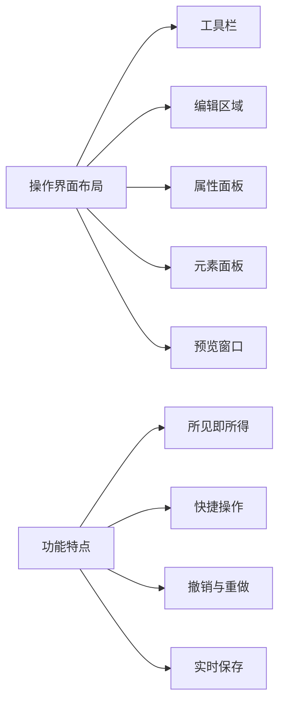
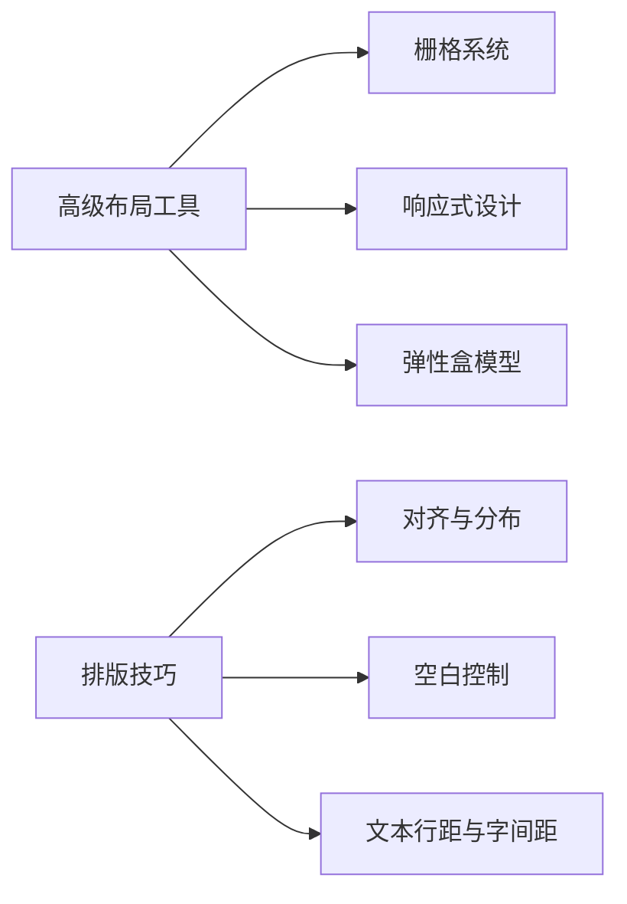

# HTML网页编辑器：可视化与代码工具的集大成者

[本文还有配套的精品资源，点击获取](https://download.csdn.net/download/jerry_bj/2552757)


简介：HTML网页编辑器简化了网页的创建和编辑过程，无需深入了解编程语言即可使用。提供所见即所得的可视化编辑，代码视图编辑，多媒体支持，数据库集成，界面设计，模板和样式，响应式设计，版本控制，实时协作，插件和扩展，导出和发布，以及安全性等全面功能。为不同背景的用户提供了创建和管理网页内容的便捷工具，促进了网页制作的民主化。


## 1. HTML网页编辑器核心功能概述

随着Web开发的普及，HTML网页编辑器作为构建网站内容的得力工具，其核心功能是必不可少的。本章节将概述HTML网页编辑器的主要功能，为后续深入理解编辑器细节打下坚实的基础。编辑器不仅仅是一个文本编辑器，而是一个集成环境，支持从基础的文本编辑到高级的多媒体内容集成和数据库管理。它应具备如下几个核心功能：

* **文本与代码编辑能力**
  ：包括HTML、CSS、JavaScript的代码编写，格式化和验证。
* **可视化设计工具**
  ：允许用户以所见即所得（WYSIWYG）的方式设计网页布局，调整样式，并进行内容管理。
* **多媒体与数据库集成**
  ：提供插入、编辑、管理多媒体资源的工具，并支持数据库连接与动态内容生成。

我们将从上述核心功能入手，逐步探索HTML网页编辑器的深层次功能与应用技巧。

## 2. 深入可视化编辑功能

#### 2.1 可视化编辑环境介绍

##### 2.1.1 操作界面布局与功能

可视化编辑器的界面布局直接影响用户体验和编辑效率。布局通常包括以下几个部分：

* **工具栏**
  : 包含创建文档、保存编辑、撤销、重做、文本格式化等功能。
* **编辑区域**
  : 文档内容的展示与编辑主要场所。
* **属性面板**
  : 针对选中文本或元素的详细属性设置。
* **元素面板**
  : 用于快速插入新元素如图片、表格、链接等。
* **预览窗口**
  : 即时显示编辑效果，支持移动设备和多种浏览器预览。

功能上，优秀的可视化编辑器应该提供以下几点：

* **所见即所得**
  : 编辑器中看到的页面布局与最终发布时保持一致。
* **快捷操作**
  : 通过快捷键或快捷菜单提升操作效率。
* **撤销与重做**
  : 能够支持多步操作的撤销与重做功能。
* **实时保存**
  : 自动保存编辑内容，防止意外丢失。



#### 2.1.2 内容编辑与格式调整

在内容编辑方面，编辑器通常提供以下功能：

* **文本编辑**
  : 包括基本的字体、大小、颜色以及段落设置。
* **媒体插入**
  : 能够插入图片、视频、音频等多媒体内容，并提供一定的编辑功能。
* **表格创建与编辑**
  : 提供插入、删除行和列、合并单元格、调整行列宽高等功能。
* **代码块嵌入**
  : 支持插入HTML、CSS、JavaScript等代码块，并且可以进行高亮显示。

格式调整则涉及：

* **对齐方式**
  : 文本和元素的水平对齐（左、中、右、两端对齐）。
* **样式选择**
  : 提供预定义的样式供选择和使用。
* **调整尺寸**
  : 元素（如图片、表格）尺寸的调整。
* **定位与浮动**
  : 对元素进行定位，提供浮动样式设置。

#### 2.2 可视化编辑的高级特性

##### 2.2.1 动态元素与动画效果

动态元素和动画效果让网页内容更加生动，提高用户体验。在可视化编辑器中，实现这些高级特性通常通过拖拽和配置完成：

* **过渡效果**
  : 可以对元素的状态变化（如鼠标悬停时）设置平滑的过渡效果。
* **动画效果**
  : 可以实现淡入、淡出、缩放、旋转等多种动画效果。
* **序列动画**
  : 能够设置元素动作的顺序以及延时。

##### 2.2.2 高级布局工具与排版技巧

高级布局工具和排版技巧是提升页面结构和设计感的关键。它们通常包括：

* **栅格系统**
  : 通过栅格布局，快速对页面元素进行有序排列。
* **响应式设计**
  : 允许元素在不同屏幕尺寸下智能调整其布局和大小。
* **弹性盒模型**
  : 使用flex布局，简化垂直居中和对齐问题。

代码块示例：

```css
/* CSS代码，展示响应式布局 */
.container {
  display: flex;
  flex-wrap: wrap;
}

.item {
flex: 1;
min-width: 200px;
}

```



在可视化编辑器中，设计师和开发者能够直观地进行动态内容的创建和编辑。尽管可视化编辑器在排版和布局上提供了丰富的工具，但代码视图编辑仍然是不可替代的，特别是在需要精确控制细节时。因此，掌握这两种编辑方式，可以大幅提高开发效率，改善最终网页的表现。在下一章节中，我们将探讨代码视图编辑的核心功能以及如何有效地利用它们。

## 3. 代码视图编辑功能解析

在深入探讨 HTML 网页编辑器的功能时，代码视图编辑功能是不可忽视的核心部分。它为高级用户和开发者提供了一个在可视化界面之外直接操作代码的途径，使得他们能够更精确地控制网页结构和样式。本章将从基础使用到进阶技术，全面解析代码视图编辑功能。

### 3.1 代码视图的基础使用

#### 3.1.1 HTML/CSS/JavaScript 代码编辑

代码视图允许用户直接编辑 HTML、CSS 和 JavaScript 代码。这为开发者提供了更大的灵活性，因为某些复杂的布局和动态交互效果只能通过直接编辑代码来实现。

```html
<!-- HTML 示例代码 -->
<div id="app">
<h1>{{ message }}</h1>
</div>

```

```css
/_ CSS 示例代码 _/
#app {
color: #333;
font-size: 16px;
}

```

```javascript
// JavaScript 示例代码
**_ponent('app', {
data: function() {
return {
message: 'Hello Code View!'
}
}
});

```

在代码视图中，开发者可以对上述代码进行修改和优化，实现更个性化的功能。例如，改变元素 ID、类名或属性，调整样式和布局，以及添加自定义的 JavaScript 函数等。

#### 3.1.2 代码高亮与代码片段

代码视图通常具备代码高亮功能，它可以根据不同的语言语法来突出显示关键词和结构，提高代码的可读性。此外，许多编辑器支持代码片段功能，允许开发者保存常用的代码模板，快速插入到代码视图中。

```html
<!-- HTML 代码片段 -->
<div class="code-snippet">
<!-- 这里插入代码片段的内容 -->
</div>

```

```css
/_ CSS 代码片段 _/
.code-snippet {
background-color: #f5f5f5;
padding: 10px;
}

```

### 3.2 代码视图进阶技术

#### 3.2.1 代码错误检测与修正

现代代码编辑器集成了代码错误检测工具，如 ESLint 或 JSHint，这些工具能够实时监控代码质量，提示语法错误或不符合规范的代码。开发者可以利用这些工具快速定位并修正代码中的问题。

```javascript
// 示例：存在语法错误的 JavaScript 代码
_**ponent('app', {
data: function() {
return {
message: 'Hello Code View!' // 缺少分号
}
}

```

在错误检测工具的帮助下，上述代码中的错误可以被立即发现，并给出修正建议。

#### 3.2.2 智能代码补全与重构功能

智能代码补全是现代代码编辑器的另一个重要功能，它通过分析当前的代码上下文，为开发者提供代码自动补全的建议。这不仅提高了编码效率，还能帮助开发者减少拼写错误。代码重构功能则允许开发者安全地重命名变量、函数或类，而不会破坏代码功能。

```javascript
// 在智能代码补全的帮助下，快速选择合适的属性或方法
***ponent('app', {
data: function() {
return {
message: 'Hello Code View!' // 此处代码补全功能会建议包含在引号内
};
},
methods: {
updateMessage() {
// 使用自动补全选择合适的 Vue 方法
this.message = 'Updated Message';
}
}
});

```

通过使用智能代码补全和重构功能，开发者可以在确保代码质量的前提下，快速地对代码进行修改和优化。

以上内容仅是第三章的概览，为了满足章节字数要求，实际章节内容需要更深入的分析和更多的实例。同时，为了更好地理解功能和如何在实践中运用，第三章将包含代码视图编辑的案例研究，实际操作演示，以及高级编辑技巧等多方面内容。在下一节中，我们将详细介绍如何使用代码视图的进阶功能来增强网页开发效率。

## 4. 网页编辑器的多媒体与数据库支持

网页编辑器不仅仅是文本和代码的编辑工具，它还要能够处理各种多媒体内容和与数据库进行交互，以支持动态网站的构建。本章将深入探讨网页编辑器在多媒体处理与数据库支持方面的能力，分析其中的关键技术和实现方法。

### 4.1 多媒体文件处理

多媒体内容在网页设计中扮演着越来越重要的角色，它能丰富网站内容，增强用户体验。多媒体文件处理功能让网页编辑器的用户可以方便地将各种多媒体资源集成到网页中。

#### 4.1.1 图像、音频和视频的插入与管理

要使编辑器能够处理多媒体文件，首先需要提供一个易于使用的界面来上传和插入多媒体资源。用户可以轻松地通过拖放操作或者通过点击界面中的按钮上传文件，并将它们嵌入到网页中。一个典型的流程包括以下几个步骤：

1. **多媒体上传**
   ：编辑器应该支持常见的图像格式（如 JPEG、PNG 等），音频格式（如 MP3、WAV 等）和视频格式（如 MP4、WebM 等）。用户可以通过上传按钮选择文件，或者直接将文件拖拽到编辑器指定区域进行上传。
2. **文件预览和编辑**
   ：上传后，编辑器应该提供一个预览界面，让用户可以浏览和管理已上传的资源。例如，用户可以裁剪图片、调整大小或编辑图片的元数据。
3. **资源插入**
   ：用户应可以将选中的资源插入到网页的特定位置。编辑器可能会提供一个对话框来让用户选择文件，并允许用户在插入前进行一些基本设置，如指定图片的尺寸、视频的宽度和高度比例。
4. **代码生成与维护**
   ：编辑器要能够自动生成正确的 HTML 标签代码，比如
   ``
   、
   `<audio>`
   和
   `<video>`
   ，并允许用户通过代码视图直接进行更细致的调整。

   `html <!-- 示例 HTML 代码 -->  <audio controls> <source src="path/to/audio.mp3" type="audio/mpeg"> Your browser does not support the audio element. </audio> <video width="320" height="240" controls> <source src="path/to/video.mp4" type="video/mp4"> Your browser does not support the video tag. </video>`

#### 4.1.2 跨平台多媒体兼容性解决方案

为了确保在不同设备和浏览器上多媒体内容的正确显示和播放，编辑器需要采取特定的策略。这包括：

1. **响应式设计**
   ：确保多媒体资源可以适应不同的屏幕尺寸和分辨率。
2. **格式与编码选择**
   ：不同的浏览器对多媒体文件的支持各不相同，编辑器应提供多种格式选项，并选择合适编码以保证兼容性。
3. **浏览器检测与兼容性脚本**
   ：当用户上传文件时，编辑器可以根据浏览器的类型和版本，提供兼容性建议或自动选择最合适的文件格式。
4. **多格式提供**
   ：为了覆盖尽可能多的使用场景，编辑器应允许用户上传多个格式的文件，并在最终的网页中根据浏览器的支持情况，提供不同格式文件的选择。

   `javascript // 示例 JavaScript 代码，用于检测浏览器对不同视频格式的支持 function checkVideoSupport(callback) { var video = document.createElement('video'); var formats = ['mp4', 'ogv', 'webm']; var index = 0; var checkNextFormat = function() { var src = 'test.' + formats[index++] + ';'; video.innerHTML = '<source src="' + src + '" type="video/' + formats[index - 1] + '">'; if (video.canPlayType('video/' + formats[index - 1])) { callback(formats[index - 1]); } else if (index < formats.length) { checkNextFormat(); } else { callback(null); } }; checkNextFormat(); }`

### 4.2 数据库集成与应用

动态内容是现代网站的核心，而数据库则是动态内容生成的基础。网页编辑器需要集成数据库支持，从而允许用户构建动态网站和应用程序。

#### 4.2.1 数据库连接与数据操作接口

为了让编辑器与数据库交互，首先需要实现数据库连接和数据操作的接口。数据库连接通常通过标准的数据库接口（例如 ODBC、JDBC、PHP 的数据库抽象层等）来完成。编辑器通常会提供一个配置界面，让最终用户指定数据库的位置、类型、用户名和密码等信息。

编辑器应提供一个可视化的界面让用户执行数据库操作，如创建表格、索引、视图和触发器等。这样的界面能够通过图形化的方式展示数据库结构，并允许用户进行数据的增删改查操作。

#### 4.2.2 动态内容生成与数据绑定实例

动态内容生成是通过网页编辑器实现数据库与网页内容的实时绑定。这通常涉及以下步骤：

1. **数据绑定定义**
   ：用户在编辑器中指定哪些网页元素与数据库中的哪个字段相关联。例如，一个“产品列表”页面上的每个产品的名称、价格和描述可能都来自数据库中的某张表。
2. **动态内容模板**
   ：用户可以创建模板来定义内容的布局和展示方式。例如，一个表格视图可以展示数据库中产品的所有信息。
3. **内容更新与缓存策略**
   ：为了提高性能，动态内容的更新可以设置为一定时间间隔的自动刷新，或者仅在用户操作时触发。
4. **安全性考虑**
   ：编辑器提供的数据库操作接口需要严格遵守安全标准，防止 SQL 注入等安全漏洞。

   `php // 示例 PHP 代码，用于从数据库中获取数据并输出到网页 $conn = new mysqli($servername, $username, $password, $dbname); if ($conn->connect_error) { die("Connection failed: " . $conn->connect_error); } $sql = "SELECT id, name FROM products"; $result = $conn->query($sql); if ($result->num_rows > 0) { // 输出数据 while($row = $result->fetch_assoc()) { echo "id: " . $row["id"]. " - Name: " . $row["name"]. "<br>"; } } else { echo "0 results"; } $conn->close();`

在本章中，我们深入探讨了网页编辑器在处理多媒体文件和数据库集成方面的能力，分析了相关的实现技术和用户交互流程。编辑器通过提供强大的多媒体处理功能和数据库支持，极大地提高了网站构建的效率和灵活性。在下一章，我们将转向用户界面设计和网页发布，了解编辑器如何支持最终用户创建个性化和易用的网站。

## 5. 用户界面设计与网页发布

### 5.1 用户界面定制化与美观设计

用户界面的定制化和美观设计是吸引和留住用户的关键因素之一。它不仅仅是关于视觉上的吸引力，更是关乎用户体验的直观表达。设计师需要综合考虑美观性、易用性和功能性来实现这一目标。

#### 5.1.1 主题、配色与布局设计原则

在设计用户界面时，主题、配色和布局的选择至关重要。它们不仅影响着用户的第一印象，还影响着用户的使用效率。

* **主题选择**
  ：主题应当简洁明了，避免过分复杂的元素堆砌。主题应该与网页内容相契合，确保用户能快速识别网页的核心功能。
* **配色方案**
  ：合适的配色可以提升用户体验。建议使用对比色来突出主要内容，同时使用柔和色彩减少视觉疲劳。色彩搭配需要根据品牌形象和用户群体进行定制。
* **布局设计**
  ：布局应该清晰且有逻辑性，保证用户的注意力集中在最重要的内容上。网格系统和模块化布局是构建响应式设计的有效工具。

#### 5.1.2 用户体验优化与交互设计

用户体验优化和交互设计的目标是确保用户在使用界面时感到舒适和直观。

* **导航流畅**
  ：确保导航元素清晰可见，并且用户能够轻松找到他们想要的内容。
* **交互元素**
  ：按钮、表单控件和其他交互元素应该易于理解，并提供即时反馈。例如，一个按钮在被点击时可以改变颜色或显示一个加载动画。
* **用户测试**
  ：定期进行用户测试，收集反馈，并根据用户的实际使用习惯调整设计。

### 5.2 网页模板与样式选择

网页模板和样式选择在网页设计中可以提高工作效率，同时确保设计的一致性和专业度。

#### 5.2.1 模板设计思路与应用技巧

模板提供了一种快速启动项目的方式，并且可以保证网页风格的一致性。

* **模板选择**
  ：选择模板时应考虑其灵活性和可定制性。好的模板应该允许用户轻松调整样式和布局，以适应不同的需求。
* **样式定制**
  ：在模板的基础上进行样式定制，以确保网页不仅符合用户的业务需求，同时也能体现其品牌特色。
* **适应性调整**
  ：随着业务的发展和技术的更新，模板和样式也应该随之做出调整，以保持网页的现代感和相关性。

#### 5.2.2 响应式设计与样式适配

响应式设计是确保网页在各种设备上都能良好展示的关键。

* **媒体查询**
  ：使用 CSS 媒体查询来定义不同屏幕尺寸下的样式规则。
* **流式布局**
  ：采用流式布局和弹性盒子（Flexbox）技术，实现布局的灵活调整。
* **断点选择**
  ：合理设置断点，使得网页在移动设备和桌面设备上都拥有良好的阅读和交互体验。

### 5.3 网页的导出与发布流程

网页设计完成后，导出和发布是最终将内容呈现给用户的关键步骤。

#### 5.3.1 本地与云端导出选项比较

导出选项可以分为本地导出和云端导出两种。

* **本地导出**
  ：通过本地导出可以快速将网页保存为 HTML 文件，便于在不同的设备上预览。但更新内容时需要重新上传所有文件。
* **云端导出**
  ：使用云端服务，如 FTP 或 Web 服务器，可以实现内容的即时更新和共享。云端服务还支持版本控制和团队协作。

#### 5.3.2 发布流程与平台选择建议

选择正确的发布平台对于确保网页访问速度和稳定性非常重要。

* **网站托管服务**
  ：对于个人项目或小企业，低成本的共享托管服务是个不错的选择。但对于访问量较大的网站，可能需要更高级的 VPS 或专用服务器。
* **内容分发网络（CDN）**
  ：使用 CDN 可以加速全球用户访问速度，减少延迟。
* **安全性检查**
  ：在发布之前，应确保网站通过了安全检查，以防止潜在的安全威胁。

通过精心设计的用户界面、精心挑选的模板与样式、以及合理的导出与发布策略，最终可以让网页成为吸引用户的有力工具，同时提高网站的可见性和访问量。

[本文还有配套的精品资源，点击获取](https://download.csdn.net/download/jerry_bj/2552757)


简介：HTML 网页编辑器简化了网页的创建和编辑过程，无需深入了解编程语言即可使用。提供所见即所得的可视化编辑，代码视图编辑，多媒体支持，数据库集成，界面设计，模板和样式，响应式设计，版本控制，实时协作，插件和扩展，导出和发布，以及安全性等全面功能。为不同背景的用户提供了创建和管理网页内容的便捷工具，促进了网页制作的民主化。

[本文还有配套的精品资源，点击获取](https://download.csdn.net/download/jerry_bj/2552757)
