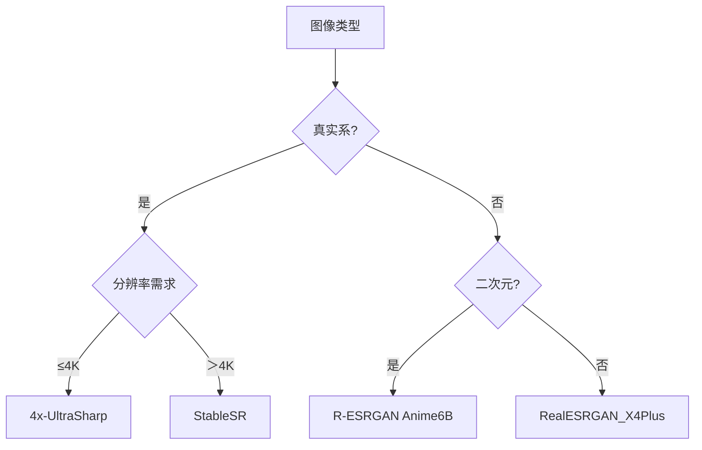

# Stable Diffusion模型高清算法模型类详解

## Stable Diffusion模型高清算法模型类详细对比表

| 模型名称 | 核心原理 | 适用场景 | 参数建议 | 显存消耗 | 细节增强度 | 优缺点 |
| --- | --- | --- | --- | --- | --- | --- |
| 4x-UltraSharp | 残差密集块(RDB)结构优化纹理生成 | 真实人像/建筑摄影 | 重绘幅度0.3-0.4，分块尺寸768px | ★★ | ★★★☆ | 皮肤纹理细腻，但高对比场景易出现伪影 |
| R-ESRGAN 4x+ Anime6B | 对抗网络针对二次元优化色阶过渡 | 动漫/插画/游戏原画 | 锐化强度0.4-0.6，色彩保护阈值0.7 | ★ | ★★☆ | 发丝线条锐利，但真实系图像易产生塑料感 |
| StableSR | 谱归一化约束+特征保留损失函数 | 博物馆级修复/学术研究 | 迭代次数≥150，学习率1e-4 | ★★★☆ | ★★★★★ | 支持16倍无损放大，但显存需求高、耗时较长 |
| RealESRGAN_X4Plus | 改进的残差注意力机制 | 通用场景/老旧照片修复 | 降噪强度0.2-0.3，增强模式选"平衡" | ★☆ | ★★★ | 综合性能均衡，但高频细节易过曝 |
| SwinIR_4K | 基于Swin Transformer的特征重建 | 文字/几何图形修复 | 锐度调节0.5-0.7，边缘保护模式开启 | ★★ | ★★★★ | 文字边缘清晰，但生成速度较慢 |
| BSRGAN | 盲超分辨网络适应未知退化模式 | 模糊/低质量图像复原 | 退化模式选"混合噪声"，增强强度0.4 | ★ | ★★☆ | 抗噪能力强，但细节生成偏保守 |

**关键参数说明**
：

* **分块尺寸**
  ：

  + ≤768px：适合4K级输出（显存消耗平衡）
  + 1024px：8K级输出需配合Tiled VAE使用
* **锐化强度**
  ：

  + 二次元：0.4-0.6可强化线条（如发丝/服装褶皱）
  + 真实系：＞0.5易产生锯齿效应
* **降噪强度**
  ：

  + 老旧照片：0.3-0.4保留历史质感
  + 现代图像：0.2-0.3避免过度平滑

**技术原理对比**
：

| 技术特性 | 4x-UltraSharp | R-ESRGAN Anime6B | StableSR |
| --- | --- | --- | --- |
| 网络结构 | 残差密集块堆叠 | 对抗生成网络 | 谱归一化U-net |
| 损失函数 | L1+感知损失 | Wasserstein损失 | 混合感知/对抗损失 |
| 特征融合方式 | 密集跳跃连接 | 通道注意力机制 | 多尺度特征金字塔 |
| 最大放大倍数 | 4x | 4x | 16x |
| 典型处理速度（4K→8K） | 45秒 | 32秒 | 8分钟 |

**选型决策树**
：

