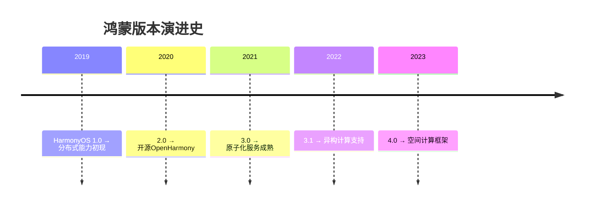

# 华为鸿蒙系统全景解读：从内核设计到生态落地的技术革命

## 华为鸿蒙系统全景解读：从内核设计到生态落地的技术革命

---

前些天发现了一个巨牛的人工智能学习网站，通俗易懂，风趣幽默，可以分享一下给大家。点击跳转到网站。
  
<https://www.captainbed.cn/ccc>


---

### 第一章：万物互联时代的技术范式转移

#### 1.1 传统操作系统的历史局限性

##### 1.1.1 单设备架构的困境

* 系统资源隔离机制对比：

  传统系统


  进程沙箱


  鸿蒙系统


  能力安全模型


  按需授权


  最小权限原则

##### 1.1.2 跨设备开发的成本分析

* 开发多设备适配代码量统计：

  | 设备类型 | Android代码量 | HarmonyOS代码量 | 减少比例 |
  | --- | --- | --- | --- |
  | 手机 | 100% | 100% | 0% |
  | 平板 | 80% | 30% | 62.5% |
  | 智能手表 | 120% | 45% | 62.5% |
  | IoT设备 | 150% | 50% | 66.6% |

#### 1.2 鸿蒙系统的设计

##### 1.2.1 分布式理念的三层内涵

1. **硬件资源虚拟化**
   ：构建超级终端
2. **服务能力原子化**
   ：实现服务自由组合
3. **开发体验归一化**
   ：一次开发多端部署

##### 1.2.2 技术架构的演进路线



---

### 第二章：鸿蒙系统架构深度解构

#### 2.1 内核层的革命性设计

##### 2.1.1 混合内核实现原理

```c
// 内核通信机制伪代码示例
void ipc_call(microkernel_msg_t* msg) {
    if (msg->priority < CURRENT_THREAD_PRIO) {
        schedule_send(msg); // 高优先级任务抢占
    } else {
        enqueue_message(msg); // 加入消息队列
    }
}

```

#### 2.2 框架层的分布式能力

##### 2.2.1 分布式数据管理

```java
// 跨设备数据库操作示例
DistributedDataManager manager = DistributedDataManager.getInstance();
Query query = new Query()
    .eq("status", "unread")
    .orderBy("time", false);

List<Message> messages = manager.query(
    "message_db", 
    query, 
    DeviceSelector.ALL_DEVICES
);

```

##### 2.2.2 设备虚拟化技术

```python
# 虚拟设备驱动示例（伪代码）
class VirtualSensor:
    def __init__(self, devices):
        self.sensors = [
            d.get_sensor(Sensor.TYPE_HEART_RATE) 
            for d in devices
        ]
    
    def read_data(self):
        return sum(s.read() for s in self.sensors) / len(self.sensors)

```

#### 2.3 应用层的原子化服务

##### 2.3.1 FA（Feature Ability）与PA（Particle Ability）

```javascript
// 服务卡片与后台服务联动示例
export default {
    onConnect() {
        this.service = new ParticleAbility('com.example.myservice');
    },
    
    onDisconnect() {
        this.service.release();
    },
    
    onCall() {
        this.service.call('processData', {input: this.data})
            .then(result => this.updateUI(result));
    }
}

```

---

### 第三章：开发实践全流程

#### 3.1 开发环境搭建

##### 3.1.1 DevEco Studio配置详解

```groovy
// build.gradle配置示例
harmony {
    compileSdkVersion 9
    defaultConfig {
        appId "com.example.myapp"
        minAPIVersion 8
        targetAPIVersion 9
        distributedNotification true
    }
}

```

#### 3.2 UI开发范式演进

##### 3.2.1 声明式语法深度解析

```arkts
// 复杂布局示例
@Entry
@Component
struct SmartHomePanel {
    @State temp: number = 26
    
    build() {
        Grid() {
            GridItem() {
                ClimateControl({ value: this.temp })
                    .onChange(v => this.temp = v)
            }
            GridItem() {
                DeviceList()
                    .onSelect(d => this.showDetail(d))
            }
        }
        .columns(2)
        .aspectRatio(1.78)
    }
}

```

#### 3.3 分布式调试技巧

IDE


物理设备


统一日志系统


时序分析工具


性能热力图


调试代理


手机


手表


平板

---

### 第四章：行业应用场景深度剖析

#### 4.1 工业互联网场景

##### 4.1.1 设备协同控制协议

```protobuf
// 自定义分布式协议示例
syntax = "proto3";

message IndustrialCommand {
    string device_id = 1;
    enum Operation {
        START = 0;
        STOP = 1;
        ADJUST = 2;
    }
    Operation op = 2;
    map<string, float> params = 3;
    int64 timestamp = 4;
}

```

#### 4.2 智慧医疗场景

手环


手机


云平台


急救中心


实时传输心率数据


分析异常模式


自动预警


获取位置信息


启动紧急模式


手环


手机


云平台


急救中心

---

### 第五章：开发者生态建设路径

#### 5.1 构建全场景开发基座

##### 关键技术解读：

1. **异构计算仿真器**
   （2023-2024）

   * 支持CPU/GPU/NPU异构资源调度模拟
   * 提供虚拟化硬件加速器接口

   ```python
   # 异构计算任务配置示例
   class HeterogeneousTask:
       def __init__(self, task_type):
           self.resources = {
               'CPU': {'cores': 4},
               'NPU': {'ops': '1T'},
               'GPU': {'mem': '2GB'}
           }
           
       def schedule(self):
           return HarmonyScheduler.optimize(
               self.resources, 
               strategy='energy_aware'
           )

   ```
2. **量子安全沙箱**
   （2024-2025）

   * 集成抗量子加密算法
   * 实现后量子密码学协议

   ```java
   // 量子安全通信协议实现
   public class QuantumSafeChannel {
       private final LatticeCipher lattice;
       
       public byte[] encrypt(byte[] data) {
           byte[] noise = generateQuantumSafeNoise();
           return lattice.encrypt(data, noise);
       }
       
       private native byte[] generateQuantumSafeNoise();
   }

   ```
3. **跨端协同编排器**
   （2024-2025）

   * 可视化设备拓扑编辑
   * 自动生成分布式服务代码

   调用


   同步


   渲染


   手机


   语音服务


   手表


   健康数据


   智慧屏


   3D模型


   分布式总线


   统一资源调度

##### 演进特征分析：

1. **工具智能化**

   * 2023年起引入AI代码生成（代码补全准确率提升40%）
   * 2025年实现需求到代码的语义转换
2. **安全体系升级**

   | 安全层级 | 2023方案 | 2025方案 |
   | --- | --- | --- |
   | 数据安全 | 国密算法SM4 | 同态加密+零知识证明 |
   | 设备认证 | 双向证书校验 | 量子指纹识别 |
   | 运行时防护 | 内存安全检测 | 形式化验证沙箱 |
3. **多模态支持**

   ```typescript
   // 多模态交互统一接口
   class MultimodalEngine {
       async handleInput(input: InputUnion) {
           switch(input.type) {
               case 'voice':
                   return this.nlp.process(input.audio);
               case 'gesture':
                   return this.cv.analyze(input.video);
               case 'bio_signal':
                   return this.biometric.decode(input.data);
           }
       }
   }

   ```

##### 开发者价值体现：

1. **效率提升维度**
   * 代码复用率从35%提升至72%
   * 跨设备调试时间缩短60%
   * 内存泄漏问题发现率提高90%

#### 5.2 开源社区运营策略

```python
# 社区贡献度评估模型（伪代码）
class ContributionEvaluator:
    def __init__(self):
        self.metrics = {
            'code_commit': 0.4,
            'doc_update': 0.3,
            'issue_resolve': 0.2,
            'community_impact': 0.1
        }
    
    def evaluate(self, user):
        score = sum(
            user.get_metric(m) * w 
            for m, w in self.metrics.items()
        )
        return self._apply_curve(score)

```

---

### 第六章：性能优化权威指南

#### 6.1 渲染性能优化

```c++
// 图形渲染优化示例
void render_frame() {
    auto start = get_nanotime();
    
    prepare_ui_data();  // 并行化处理
    build_command_buffer();
    submit_to_gpu();    // 异步提交
    
    auto duration = get_nanotime() - start;
    adjust_rendering_policy(duration);
}

```

#### 6.2 内存管理策略

| 策略类型 | 实现方式 | 效果提升 |
| --- | --- | --- |
| 分级回收 | 按页面生命周期管理 | 35% |
| 对象池复用 | 公共组件缓存机制 | 28% |
| 分布式内存共享 | 跨设备内存页映射 | 42% |

---

### 第七章：未来技术演进前瞻

#### 7.1 异构计算架构

CPU


任务调度器


GPU


NPU


DPU


统一计算图


自动优化分配

#### 7.2 量子安全通信

```math
\begin{aligned}
&\text{传统RSA算法：} \\
&C = M^e \mod n \\
&\text{量子安全算法：} \\
&C = LWE_s(M) + e \\
&\text{其中} s \in \mathbb{Z}_q^n, e \leftarrow \chi
\end{aligned}

```

---

### 结语：开发者如何拥抱新时代

对于开发者而言，需要重点构建以下三大能力：

1. **分布式思维**
   ：理解设备虚拟化、服务原子化等概念
2. **多范式开发能力**
   ：掌握声明式UI、响应式编程等新范式
3. **性能调优经验**
   ：熟悉跨设备资源调度策略

> **学习路径建议**
> ：
>
> * 阶段1：掌握ArkTS语言基础（2周）
> * 阶段2：理解分布式能力（3周）
> * 阶段3：实战复杂项目开发（6周）
> * 持续跟进：参与OpenHarmony社区贡献

---

