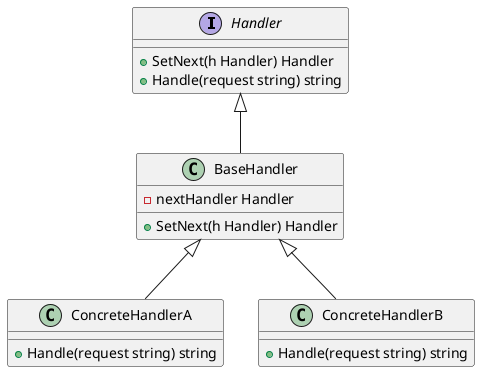

# Golang学习笔记\_43——责任链模式

[Golang学习笔记\_40——模版方法模式](https://blog.csdn.net/LuckyLay/article/details/145908139)
  
[Golang学习笔记\_41——观察者模式](https://blog.csdn.net/LuckyLay/article/details/145992873)
  
[Golang学习笔记\_42——迭代器模式](https://blog.csdn.net/LuckyLay/article/details/145993904)

---

---

### 一、核心概念

#### 1. 定义

**责任链模式**
是一种
**行为型设计模式**
，允许将请求沿着处理链传递，直到有对象处理它。其核心特点包括：
  
•
**解耦请求与处理**
：发送者无需知道具体处理者
  
•
**动态链式处理**
：可动态调整处理链顺序和组成
  
•
**职责单一性**
：每个处理者专注特定类型请求

#### 2. 解决的问题

•
**复杂条件分支**
：避免大量if-else判断语句
  
•
**请求处理流程扩展**
：新增处理节点不影响现有逻辑
  
•
**分布式责任**
：多层级审批/验证场景

#### 3. 核心角色

| 角色 | 作用 |
| --- | --- |
| Handler | 定义处理请求的接口，包含设置下家的方法 |
| ConcreteHandler | 具体处理逻辑实现，决定处理或传递请求 |
| Client | 组装责任链并触发首个处理者 |

#### 4. 类图




### 二、特点分析

**优点**

1. **解耦性强**
   ：请求发起方与处理方解耦
2. **开闭原则**
   ：新增处理节点不影响现有代码
3. **灵活组合**
   ：可动态调整处理链结构

**缺点**

1. **性能损耗**
   ：长链路导致请求处理延迟
2. **调试困难**
   ：请求可能未被处理且无反馈
3. **循环风险**
   ：错误配置导致无限循环

### 三、适用场景

#### 1. 多级审批流程

```go
// 采购审批实现示例
type PurchaseRequest struct {
    Amount float64
    Purpose string
}

type Approver interface {
    SetNext(Approver)
    ProcessRequest(PurchaseRequest) bool
}

type Manager struct {
    next Approver
}

func (m *Manager) SetNext(next Approver) {
    m.next = next
}

func (m *Manager) ProcessRequest(req PurchaseRequest) bool {
    if req.Amount <= 5000 {
        fmt.Println("经理审批通过")
        return true
    }
    if m.next != nil {
        return m.next.ProcessRequest(req)
    }
    return false
}

```

#### 2. 用户身份验证

```go
// 多因素认证链
type AuthHandler interface {
    SetNext(AuthHandler)
    Handle(*User) bool
}

type PasswordHandler struct {
    next AuthHandler
}

func (p *PasswordHandler) SetNext(h AuthHandler) {
    p.next = h
}

func (p *PasswordHandler) Handle(u *User) bool {
    if !verifyPassword(u) {
        return false
    }
    if p.next != nil {
        return p.next.Handle(u)
    }
    return true
}

```

#### 3. 日志处理系统

```go
// 多级日志处理器
type LogLevel int

const (
    DEBUG LogLevel = iota
    INFO
    ERROR
)

type Logger interface {
    SetNext(Logger)
    Log(string, LogLevel)
}

type EmailLogger struct {
    level  LogLevel
    next   Logger
}

func (e *EmailLogger) Log(msg string, l LogLevel) {
    if l >= e.level {
        fmt.Printf("发送邮件日志: %s\n", msg)
    }
    if e.next != nil {
        e.next.Log(msg, l)
    }
}

```

### 四、Go语言实现示例

#### 完整实现代码

```go
package chainofresponsibility

import "fmt"

type Handler interface {
	SetNext(Handler) Handler
	Handle(string) string
}

type BaseHandler struct {
	next Handler
}

func (b *BaseHandler) SetNext(h Handler) Handler {
	b.next = h
	return h
}

func (b *BaseHandler) Handle(s string) string {
	if b.next != nil {
		return b.next.Handle(s)
	}
	return ""
}

type AuthHandler struct {
	BaseHandler
}

func (a *AuthHandler) Handle(req string) string {
	if req == "auth" {
		fmt.Println("执行身份验证")
		return "AUTH_SUCCESS"
	}
	return a.BaseHandler.Handle(req)
}

type LoggingHandler struct {
	BaseHandler
}

func (l *LoggingHandler) Handle(req string) string {
	fmt.Printf("记录请求日志: %s\n", req)
	return l.BaseHandler.Handle(req)
}

// 客户端使用示例
func ExampleChain() {
	handlers := &AuthHandler{}
	handlers.SetNext(&LoggingHandler{})

	fmt.Println(handlers.Handle("auth"))
	fmt.Println(handlers.Handle("data"))
}

```

#### 执行结果

```text
=== RUN   TestExampleChain
执行身份验证
AUTH_SUCCESS
记录请求日志: data

--- PASS: TestExampleChain (0.00s)
PASS

```

### 五、高级应用

#### 1. 动态链路配置

```go
type ChainBuilder struct {
    head Handler
    tail Handler
}

func (c *ChainBuilder) AddHandler(h Handler) {
    if c.head == nil {
        c.head = h
        c.tail = h
        return
    }
    c.tail.SetNext(h)
    c.tail = h
}

func (c *ChainBuilder) Execute(req string) {
    if c.head != nil {
        c.head.Handle(req)
    }
}

```

#### 2. 熔断机制

```go
type CircuitBreakerHandler struct {
    BaseHandler
    failureCount int
    threshold    int
}

func (c *CircuitBreakerHandler) Handle(req string) string {
    if c.failureCount >= c.threshold {
        fmt.Println("熔断器已触发")
        return ""
    }
    result := c.BaseHandler.Handle(req)
    if result == "ERROR" {
        c.failureCount++
    }
    return result
}

```

### 六、与其他模式对比

| 模式 | 核心区别 | 典型场景 |
| --- | --- | --- |
| **命令模式** | 请求封装 vs 请求传递 | 撤销操作管理 |
| **策略模式** | 算法选择 vs 处理流程控制 | 支付方式选择 |
| **装饰器模式** | 功能叠加 vs 责任传递 | 动态添加功能 |

### 七、实现建议

1. **链路终止控制**
   ：增加处理成功标志位
2. **优先级控制**
   ：实现带权重的处理节点
3. **异步处理**
   ：结合goroutine实现并行处理链
4. **监控埋点**
   ：记录各节点处理耗时和状态

### 八、典型应用

1. **中间件管道**
   ：Gin框架的中间件链
2. **风控系统**
   ：多规则顺序校验
3. **订单处理**
   ：库存检查→支付→物流的链式处理
4. **API网关**
   ：认证→限流→日志记录的处理流程

通过责任链模式，可以有效处理需要多层级决策的业务场景。在Go语言中，利用接口和结构体组合的特性，可以构建灵活可扩展的处理链路。建议在以下场景优先考虑：

1. 存在多个可能处理请求的对象
2. 需要动态指定处理流程
3. 处理流程需要灵活变更
4. 需要解耦请求发送者和接收者