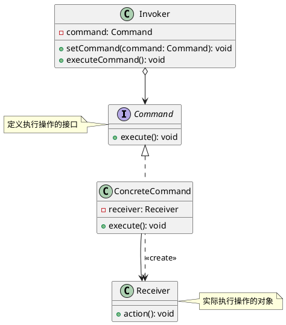

# Golang学习笔记_44——命令模式

[Golang学习笔记_41——观察者模式](https://blog.csdn.net/LuckyLay/article/details/145992873)
  
[Golang学习笔记_42——迭代器模式](https://blog.csdn.net/LuckyLay/article/details/145993904)
  
[Golang学习笔记_43——责任链模式](https://blog.csdn.net/LuckyLay/article/details/146062560)

---

---

### 一、核心概念

#### 1. 定义

**命令模式**
是一种
**行为型设计模式**
，通过将请求封装为独立对象实现调用者与执行者的解耦，支持请求的队列化、撤销重做和事务管理。其核心特点包括：
  
•
**请求对象化**
：将操作抽象为可传递的命令对象
  
•
**解耦调用链**
：调用者无需了解具体执行细节
  
•
**操作可编排**
：支持命令的组合与顺序控制

#### 2. 解决的问题

•
**系统紧耦合**
：消除行为请求者与实现者的直接依赖
  
•
**操作不可逆**
：缺乏标准化的撤销/重做机制
  
•
**事务原子性**
：多步骤操作无法保证整体执行

#### 3. 核心角色

| 角色 | 作用 |
| --- | --- |
| Command | 定义执行操作的统一接口（Execute/Undo） |
| ConcreteCommand | 实现具体命令逻辑，绑定接收者对象 |
| Invoker | 触发命令执行，支持命令存储与调度 |
| Receiver | 实际执行业务操作的对象 |
| Client | 组装命令对象与接收者的关系 |

#### 4. 类图




### 二、特点分析

**优点**

1. **解耦架构**
   ：彻底分离请求发起方与执行方
2. **可扩展性**
   ：新增命令不影响现有系统
3. **事务支持**
   ：支持多命令原子操作与回滚

**缺点**

1. **类膨胀**
   ：每个命令需独立类实现
2. **执行开销**
   ：间接调用带来性能损耗
3. **复杂度**
   ：需处理命令生命周期管理

### 三、适用场景

#### 1. 事务管理系统

```go
// 转账命令示例
type TransferCommand struct {
    from   *Account
    to     *Account
    amount int
}

func (t *TransferCommand) Execute() {
    t.from.Debit(t.amount)
    t.to.Credit(t.amount)
}

func (t *TransferCommand) Undo() {
    t.from.Credit(t.amount)
    t.to.Debit(t.amount)
}

```

（实现资金划转与回滚，参考的撤销实现）

#### 2. 多媒体遥控器

```go
type TVPowerCommand struct {
    tv *Television
}

func (c *TVPowerCommand) Execute() {
    if c.tv.IsOn {
        c.tv.TurnOff()
    } else {
        c.tv.TurnOn()
    }
}

```

#### 3. 操作审计系统

```go
type AuditLog struct {
    commands []Command
}

func (a *AuditLog) Record(cmd Command) {
    a.commands = append(a.commands, cmd)
    cmd.Execute()
}

```

### 四、Go语言实现示例


**完整实现代码**

```go
package command_demo

import "fmt"

// Command 接口
type Command interface {
	Execute()
}

// Receiver 实现
type StockTrade struct{}

func (s *StockTrade) Buy() {
	fmt.Println("买入股票")
}

func (s *StockTrade) Sell() {
	fmt.Println("卖出股票")
}

// ConcreteCommand 具体命令
type BuyStock struct {
	stock *StockTrade
}

func (b *BuyStock) Execute() {
	b.stock.Buy()
}

type SellStock struct {
	stock *StockTrade
}

func (s *SellStock) Execute() {
	s.stock.Sell()
}

// Invoker 调用者
type Broker struct {
	orders []Command
}

func (b *Broker) TakeOrder(cmd Command) {
	b.orders = append(b.orders, cmd)
}

func (b *Broker) PlaceOrders() {
	for _, cmd := range b.orders {
		cmd.Execute()
	}
	b.orders = nil
}

// 客户端代码
func Example() {
	stock := &StockTrade{}
	buy := &BuyStock{stock: stock}
	sell := &SellStock{stock: stock}

	broker := &Broker{}
	broker.TakeOrder(buy)
	broker.TakeOrder(sell)

	broker.PlaceOrders()
}

```

**执行结果**

```text
=== RUN   TestExample
买入股票
卖出股票
--- PASS: TestExample (0.00s)
PASS

```

### 五、高级应用

#### 1. 宏命令系统

```go
type MacroCommand struct {
	commands []Command
}

func (m *MacroCommand) Execute() {
	for _, cmd := range m.commands {
		cmd.Execute()
	}
}

// 使用示例
macro := &MacroCommand{
	commands: []Command{
		&SaveCommand{},
		&CompileCommand{},
		&DeployCommand{},
	},
}
macro.Execute()

```

#### 2. 异步命令队列

```go
type AsyncInvoker struct {
	queue chan Command
}

func (a *AsyncInvoker) Start() {
	go func() {
		for cmd := range a.queue {
			cmd.Execute()
		}
	}()
}

func (a *AsyncInvoker) Add(cmd Command) {
	a.queue <- cmd
}

```

### 六、与其他模式对比

| 模式 | 核心区别 | 典型应用场景 |
| --- | --- | --- |
| **策略模式** | 算法选择 vs 操作封装 | 支付方式选择 |
| **职责链模式** | 请求传递 vs 命令执行 | 审批流程处理 |
| **备忘录模式** | 状态存储 vs 操作记录 | 编辑器撤销功能 |

### 七、实现建议

1. **轻量化设计**
   ：使用闭包简化简单命令

   ```go
   func NewLightCmd(light *Light) Command {
       return CommandFunc(light.Toggle)
   }

   ```
2. **生命周期管理**
   ：实现
   `Release()`
   方法释放资源
3. **批量操作**
   ：采用组合模式实现命令集合操作
4. **错误处理**
   ：增加
   `Validate()`
   预处理方法

### 八、典型应用

1. **文本编辑器**
   ：实现编辑操作撤销栈
2. **智能家居**
   ：物联网设备控制中心
3. **金融交易**
   ：多步骤交易事务管理
4. **游戏开发**
   ：玩家操作回放系统

通过命令模式，可以将分布式系统的操作请求转化为可序列化对象，实现跨网络的操作重放与审计。在Go语言中，结合channel特性可构建高性能命令管道，适用于实时交易系统等场景。建议对高频操作命令采用对象池优化，避免重复创建开销。