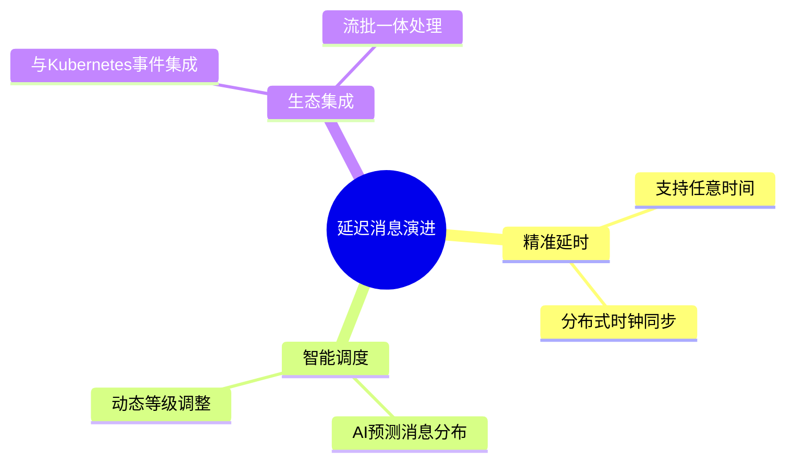

# RocketMQ延迟消息深度解析：原理、实践与性能调优

## RocketMQ延迟消息深度解析：原理、实践与性能调优

---

> 编程相关书籍分享：
> <https://blog.csdn.net/weixin_47763579/article/details/145855793>
>   
> DeepSeek使用技巧pdf资料分享：
> <https://blog.csdn.net/weixin_47763579/article/details/145884039>

---

### 一、延迟消息的本质与设计哲学

#### 1. 分布式定时触发器

延迟消息是RocketMQ实现的
**基于消息中间件的分布式定时任务系统**
，其核心价值在于：

定时任务场景


解耦业务系统


高可靠存储


精准时间触发

##### 与传统方案对比优势：

| 方案 | 可靠性 | 扩展性 | 精度 | 维护成本 |
| --- | --- | --- | --- | --- |
| 数据库轮询 | 中 | 差 | 秒级 | 高 |
| 本地定时器 | 低 | 差 | 毫秒级 | 低 |
| RocketMQ延迟消息 | 高 | 优秀 | 秒级 | 低 |

---

### 二、延迟消息核心实现机制

#### 1. 分层存储架构

定时服务


Broker存储层


异步构建


特殊处理


到期投递


到期投递


到期投递


定时扫描线程


延迟等级1队列


延迟等级2队列


...


ConsumeQueue


CommitLog


SCHEDULE\_TOPIC


目标Topic

##### 关键实现细节：

* **SCHEDULE\_TOPIC**
  ：内部Topic，存储所有延迟消息
* **多级时间轮算法**
  ：基于延迟等级实现高效扫描
* **二级CommitLog**
  ：原始消息存储后标记为不可见

---

#### 2. 消息生命周期全流程

Producer


Broker


ScheduleService


Consumer


发送延迟消息(level=3)


1. 写入CommitLog


2. 转存SCHEDULE\_TOPIC\_3


返回ACK


3. 检查到期消息


返回待投递消息


4. 重新投递到目标Topic


loop


[定时扫描]

5. 拉取消费消息


Producer


Broker


ScheduleService


Consumer

---

### 三、延迟等级深度优化

#### 1. 时间梯度设计原则

```mermaid
gantt
    title RocketMQ延迟等级时间分布
    dateFormat  X
    axisFormat %s秒
    
    section 短期延迟
    等级1 : 0, 1
    等级2 : 1, 5
    等级3 : 5, 10
    等级4 : 10, 30
    
    section 中期延迟
    等级5 : 30, 60
    等级6 : 60, 120
    等级7 : 120, 180
    
    section 长期延迟
    等级8 : 180, 300
    ...
    等级18 : 7200, 7200

```

##### 设计考量：

* **指数退避**
  ：满足常见业务场景
* **存储效率**
  ：固定等级减少元数据开销
* **扫描性能**
  ：减少时间轮复杂度

---

#### 2. 自定义延迟等级配置

```properties
# broker.conf
messageDelayLevel=1s 5s 10s 30s 1m 2m 3m 4m 5m 6m 7m 8m 9m 10m 20m 30m 1h 2h

```

##### 调整注意事项：

1. 需要集群所有Broker统一配置
2. 修改后需重启生效
3. 等级数量不超过原始18级

---

### 四、生产环境最佳实践

#### 1. 使用规范

小批量


大规模


高精度


宽松


延迟消息使用


消息量级


直接设置level


业务层分级+随机抖动


时间精度


结合本地定时器


合理选择等级

##### 代码增强示例：

```java
// 添加随机抖动（±10s）
int baseLevel = 3; // 10s
Random rand = new Random();
int jitter = rand.nextInt(20) - 10; // -10~+10
int actualLevel = Math.max(1, Math.min(18, baseLevel + (jitter > 0 ? 1 : 0)));
message.setDelayTimeLevel(actualLevel);

```

#### 2. 性能优化策略

40%

35%

15%

10%

延迟消息瓶颈分布


存储IO


定时扫描


网络带宽


序列化

##### 优化手段：

* **批量消息同等级处理**
* **开启transientStorePoolEnable**
* **调整刷盘策略为ASYNC\_FLUSH**

---

### 五、典型问题与解决方案

#### 1. 消息堆积场景

发现堆积


原因定位


同时间点消息过多


消费者处理慢


存储性能瓶颈


分散延迟时间


提升消费能力


集群扩容

#### 2. 消息提前投递分析

Broker


ScheduleService


Clock


获取系统时间


返回当前时间


请求到期消息


可能出现时钟回拨

返回消息


提前投递


Broker


ScheduleService


Clock

##### 解决方案：

* 部署NTP时间同步服务
* 配置Broker时钟源监控
* 设置最大时钟偏移阈值

---

### 六、监控与告警体系

#### 1. 关键监控指标

35%

30%

20%

15%

延迟消息监控重点


ScheduleTopic堆积量


投递延迟时间


失败重试次数


时钟偏移量

#### 2. 推荐告警规则

```yaml
rules:
  - alert: ScheduleTopicBacklog
    expr: rocketmq_schedule_topic_backlog > 100000
    for: 5m
    labels:
      severity: critical
    annotations:
      summary: "延迟消息堆积告警"
      
  - alert: DeliveryLatencyHigh
    expr: rocketmq_delivery_latency_99th > 5000
    for: 10m
    labels:
      severity: warning

```

---

### 七、未来演进方向

#### 1. 架构优化趋势



#### 2. 云原生适配

* 弹性伸缩ScheduleService
* 基于CRD的资源定义
* Serverless化定时服务

---

**生产检查清单**
：

* 验证延迟等级配置一致性
* 部署NTP时间同步服务
* 设置ScheduleTopic监控
* 压力测试批量消息场景
* 制定消息积压应急预案

通过本文的深度解析，开发者可全面掌握RocketMQ延迟消息的实现精髓。建议结合
[分布式系统时间管理](https://time.geekbang.org/column/article/212046)
进行扩展学习，并在预发环境模拟时钟回拨等异常场景。记住：
**可靠的延迟消息服务是构建复杂业务时序的基础设施**
。