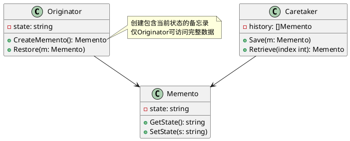

# Golang学习笔记\_45——备忘录模式

[Golang学习笔记\_42——迭代器模式](https://blog.csdn.net/LuckyLay/article/details/145993904)
  
[Golang学习笔记\_43——责任链模式](https://blog.csdn.net/LuckyLay/article/details/146062560)
  
[Golang学习笔记\_44——命令模式](https://blog.csdn.net/LuckyLay/article/details/146063032)

---

---

### 一、核心概念

#### 1. 定义

**备忘录模式**
是一种
**行为型设计模式**
，通过在不破坏对象封装性的前提下捕获和存储对象内部状态，实现状态的可追溯恢复机制。其核心特点包括：
  
•
**状态封装**
：将对象状态隔离在专用备忘录对象中
  
•
**历史回溯**
：支持任意时间点的状态版本恢复
  
•
**权限隔离**
：状态存储与恢复操作限定在特定对象间

#### 2. 解决的问题

•
**状态不可逆**
：缺乏标准化的撤销/恢复机制
  
•
**数据暴露风险**
：直接访问对象内部状态破坏封装性
  
•
**版本管理复杂**
：多版本状态存储与检索困难

#### 3. 核心角色

| 角色 | 作用 |
| --- | --- |
| Originator | 创建并管理备忘录的生命周期，维护内部状态 |
| Memento | 存储Originator内部状态的安全容器 |
| Caretaker | 备忘录的存储管理者，维护历史状态记录栈 |

#### 4. 类图




### 二、特点分析

**优点**

1. **封装保护**
   ：严格限制状态访问权限
2. **简化恢复**
   ：标准化状态回滚操作流程
3. **版本控制**
   ：支持多时间点状态快照管理

**缺点**

1. **内存消耗**
   ：大对象频繁快照导致资源占用
2. **性能损耗**
   ：深拷贝复杂对象时效率下降
3. **版本冲突**
   ：多版本管理可能引发状态不一致

### 三、适用场景

#### 1. 文档编辑器

```go
type EditorMemento struct {
    content string
}

type TextEditor struct {
    content string
}

func (e *TextEditor) Save() *EditorMemento {
    return &EditorMemento{content: e.content}
}

func (e *TextEditor) Restore(m *EditorMemento) {
    e.content = m.content
}

```

#### 2. 游戏存档系统

```go
type GameSave struct {
    level   int
    weapons []string
}

type PlayerState struct {
    current *GameSave
}

func (p *PlayerState) QuickSave() *GameSave {
    return &GameSave{
        level:   p.current.level,
        weapons: append([]string{}, p.current.weapons...),
    }
}

```

#### 3. 配置管理系统

```go
type ConfigSnapshot struct {
    version string
    config  map[string]interface{}
}

func RollbackConfig(snapshots []*ConfigSnapshot, targetVer string) error {
    // 实现版本检索与配置回滚
}

```

### 四、Go语言实现示例


  
**完整实现代码**

```go
package memento_demo

import "fmt"

// Memento 备忘录
type EditorMemento struct {
	content string
}

func (m *EditorMemento) Content() string {
	return m.content
}

// Originator 原发器
type TextEditor struct {
	content string
}

func (e *TextEditor) Write(input string) {
	e.content += input
}

func (e *TextEditor) Save() *EditorMemento {
	return &EditorMemento{content: e.content}
}

func (e *TextEditor) Restore(m *EditorMemento) {
	e.content = m.Content()
}

// Caretaker 管理者
type HistoryKeeper struct {
	saves []*EditorMemento
}

func (h *HistoryKeeper) Push(m *EditorMemento) {
	h.saves = append(h.saves, m)
}

func (h *HistoryKeeper) Pop() *EditorMemento {
	if len(h.saves) == 0 {
		return nil
	}
	last := h.saves[len(h.saves)-1]
	h.saves = h.saves[:len(h.saves)-1]
	return last
}

// 客户端使用示例
func ExampleUsage() {
	editor := &TextEditor{}
	history := &HistoryKeeper{}

	// 编辑操作
	editor.Write("Hello")
	history.Push(editor.Save())

	editor.Write(" World")
	fmt.Println("Current:", editor.content)

	// 撤销操作
	if m := history.Pop(); m != nil {
		editor.Restore(m)
	}
	fmt.Println("After Undo:", editor.content)
}

```

**执行结果**

```text
=== RUN   TestExampleUsage
Current: Hello World
After Undo: Hello
--- PASS: TestExampleUsage (0.00s)
PASS


```

### 五、高级应用

#### 1. 增量快照系统

```go
type DeltaMemento struct {
    timestamp time.Time
    delta     []byte
}

func CreateDeltaSnapshot(prev, current *DocumentState) *DeltaMemento {
    // 计算差异生成增量快照
}

```

#### 2. 分布式状态同步

```go
type StateSyncService struct {
    snapshots map[string]*NodeState
}

func (s *StateSyncService) RollbackCluster(targetVer int) {
    // 集群级状态回滚实现
}

```

### 六、与其他模式对比

| 模式 | 核心区别 | 典型应用场景 |
| --- | --- | --- |
| **命令模式** | 操作封装 vs 状态存储 | 事务回滚系统 |
| **原型模式** | 对象克隆 vs 状态保存 | 复杂对象复制 |
| **状态模式** | 状态转移 vs 状态存档 | 工作流引擎 |

### 七、实现建议

1. **状态序列化**
   ：使用JSON/gob实现快照持久化

   ```go
   func (m *Memento) Serialize() ([]byte, error) {
       return json.Marshal(m)
   }

   ```
2. **内存优化**
   ：采用写时复制技术减少内存占用
3. **版本压缩**
   ：定期合并历史快照减少存储量
4. **访问控制**
   ：严格限制Memento的字段可见性

### 八、典型应用

1. **IDE开发环境**
   ：代码修改历史追溯
2. **区块链系统**
   ：区块状态回滚机制
3. **机器学习**
   ：模型训练检查点
4. **CI/CD管道**
   ：部署失败快速回退

通过备忘录模式，可以构建具备完善历史管理能力的系统架构。在Go语言中，建议：

* 使用结构体嵌套实现宽接口/窄接口
* 结合channel实现异步快照存储
* 使用sync.Pool优化频繁创建的备忘录对象