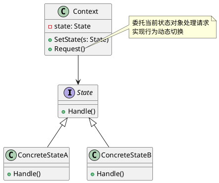

# Golang学习笔记_46——状态模式

[Golang学习笔记_43——责任链模式](https://blog.csdn.net/LuckyLay/article/details/146062560)
  
[Golang学习笔记_44——命令模式](https://blog.csdn.net/LuckyLay/article/details/146063032)
  
[Golang学习笔记_45——备忘录模式](https://blog.csdn.net/LuckyLay/article/details/146096029)

---

---

### 一、核心概念

#### 1. 定义

**状态模式**
是一种
**行为型设计模式**
，允许对象在其内部状态改变时改变自身行为，使对象表现如同改变了其类。其核心特点包括：
  
•
**状态抽象化**
：将状态抽象为独立对象
  
•
**行为动态化**
：运行时根据状态自动切换行为
  
•
**条件解耦**
：消除复杂的条件判断语句

#### 2. 解决的问题

•
**行为耦合**
：对象行为与状态转换逻辑高度耦合
  
•
**维护困难**
：大量条件分支导致代码难以维护
  
•
**扩展受限**
：新增状态需修改现有条件判断结构

#### 3. 核心角色

| 角色 | 作用 |
| --- | --- |
| Context | 维护当前状态对象，定义客户端接口 |
| State | 定义状态行为的抽象接口 |
| ConcreteState | 实现特定状态下的具体行为逻辑 |

#### 4. 类图




### 二、特点分析

**优点**

1. **消除条件判断**
   ：通过多态代替条件分支
2. **提升扩展性**
   ：新增状态不影响现有逻辑
3. **职责清晰化**
   ：每个状态类专注自身行为

**缺点**

1. **类膨胀风险**
   ：状态数量较多时类数量激增
2. **转换复杂度**
   ：状态间转换逻辑可能变得复杂
3. **内存开销**
   ：需维护多个状态对象实例

### 三、适用场景

#### 1. 电梯控制系统

```go
type ElevatorState interface {
    OpenDoor()
    CloseDoor()
    Run()
    Stop()
}

type StopState struct{}

func (s *StopState) OpenDoor() {
    fmt.Println("开门中...")
}

func (s *StopState) CloseDoor() {
    fmt.Println("门已关闭")
}

func (s *StopState) Run() {
    fmt.Println("启动运行")
}

func (s *StopState) Stop() {
    fmt.Println("已处于停止状态")
}

```

#### 2. 订单状态管理

```go
type OrderStatus interface {
    Confirm()
    Cancel()
    Ship()
}

type PaidStatus struct{}

func (s *PaidStatus) Confirm() {
    fmt.Println("订单已支付，无需重复确认")
}

func (s *PaidStatus) Cancel() {
    fmt.Println("发起退款流程")
}

func (s *PaidStatus) Ship() {
    fmt.Println("开始发货处理")
}

```

#### 3. 游戏角色状态

```go
type CharacterState interface {
    Move()
    Attack()
    Defend()
}

type NormalState struct{}

func (s *NormalState) Move() {
    fmt.Println("正常移动速度")
}

func (s *NormalState) Attack() {
    fmt.Println("普通攻击力")
}

func (s *NormalState) Defend() {
    fmt.Println("标准防御姿势")
}

```

### 四、Go语言实现示例


#### 完整实现代码

```go
package state_demo

import "fmt"

// State 接口
type TrafficLightState interface {
	Change(light *TrafficLight)
}

// 具体状态实现
type RedState struct{}

func (s *RedState) Change(light *TrafficLight) {
	fmt.Println("红灯亮30秒")
	light.SetState(&GreenState{})
}

type GreenState struct{}

func (s *GreenState) Change(light *TrafficLight) {
	fmt.Println("绿灯亮45秒")
	light.SetState(&YellowState{})
}

type YellowState struct{}

func (s *YellowState) Change(light *TrafficLight) {
	fmt.Println("黄灯亮5秒")
	light.SetState(&RedState{})
}

// Context 实现
type TrafficLight struct {
	state TrafficLightState
}

func (t *TrafficLight) SetState(s TrafficLightState) {
	t.state = s
}

func (t *TrafficLight) PerformChange() {
	t.state.Change(t)
}

// 客户端使用示例
func ExampleUsage() {
	light := &TrafficLight{state: &RedState{}}

	light.PerformChange() // 红灯 -> 绿灯
	light.PerformChange() // 绿灯 -> 黄灯
	light.PerformChange() // 黄灯 -> 红灯
}

```

#### 执行结果

```text
=== RUN   TestExampleUsage
红灯亮30秒
绿灯亮45秒
黄灯亮5秒
--- PASS: TestExampleUsage (0.00s)
PASS

```

### 五、高级应用

#### 1. 状态机引擎

```go
type StateMachine struct {
	current State
	states  map[string]State
}

func (sm *StateMachine) Transition(name string) {
	if next, exists := sm.states[name]; exists {
		sm.current.Exit()
		sm.current = next
		sm.current.Enter()
	}
}

func (sm *StateMachine) AddState(name string, state State) {
	sm.states[name] = state
}

```

#### 2. 分布式状态管理

```go
type ClusterState struct {
	nodes map[string]State
	lock  sync.RWMutex
}

func (cs *ClusterState) Sync(nodeID string, state State) {
	cs.lock.Lock()
	defer cs.lock.Unlock()
	cs.nodes[nodeID] = state
}

func (cs *ClusterState) Consensus() State {
	// 实现分布式状态共识算法
}

```

### 六、与其他模式对比

| 模式 | 核心区别 | 典型应用场景 |
| --- | --- | --- |
| **策略模式** | 主动选择算法 vs 被动状态转换 | 支付方式选择 |
| **职责链模式** | 请求传递链 vs 状态转换链 | 审批流程处理 |
| **备忘录模式** | 状态存储 vs 行为变更 | 编辑器撤销功能 |

### 七、实现建议

1. **接口设计优化**

```go
type State interface {
	Enter()
	Exit()
	Update() State
}

```

2. **状态共享机制**

```go
var (
	runningState = &RunningState{}
	stoppedState = &StoppedState{}
)

```

3. **转换规则封装**

```go
type TransitionRule struct {
	From  State
	Event string
	To    State
}

```

4. **状态持久化**

```go
func (s *State) MarshalJSON() ([]byte, error) {
	return json.Marshal(struct {
		Type string `json:"type"`
	}{
		Type: reflect.TypeOf(s).Name(),
	})
}

```

### 八、典型应用

1. **工业控制系统**
   ：设备运行状态管理
2. **交易引擎**
   ：订单生命周期管理
3. **AI决策系统**
   ：智能体行为状态切换
4. **网络协议栈**
   ：连接状态管理（TCP状态机）

通过状态模式，可构建出具备清晰状态转换逻辑的业务系统。在Go语言中建议：

* 使用接口组合实现状态层次结构
* 结合channel实现异步状态转换
* 利用sync.Pool优化高频状态对象
* 采用代码生成技术自动构建状态机