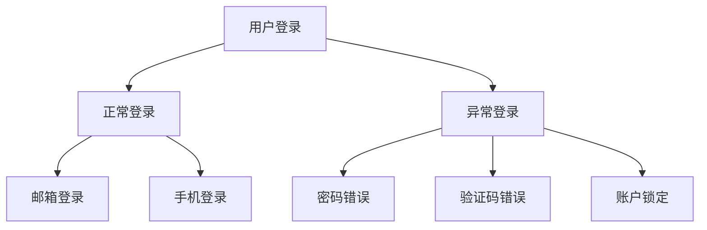

# Deepseek如何写测试用例
# 用DeepSeek实现智能测试用例设计的全流程指南（附实战模板）
## 一、需求解析阶段（DeepSeek核心应用）
1\. **智能需求分析**
```python
# 输入原始需求
requirement = """
用户登录功能要求：
\- 支持邮箱/手机号+密码登录
\- 连续失败5次锁定账户30分钟
\- 需验证图形验证码
"""
# DeepSeek执行需求解析
parsed_data = deepseek.analyze(requirement)
print(parsed_data.get('test_points'))
```
**输出结果**：
\- 登录方式组合验证
\- 失败次数边界条件
\- 验证码异常场景
\- 账户锁定时效性
2\. **关联关系图谱**

## 二、测试场景构建（DeepSeek智能生成）
```python
test_scenarios = deepseek.generate_scenarios(
test_points=parsed_data,
coverage_level="branch"
)
```
**生成场景示例**：
1\. 新设备首次邮箱登录
2\. 多设备并发登录冲突
3\. 锁定期间密码恢复尝试
4\. 跨时段锁定时效验证
## 三、用例设计模板（DeepSeek增强版）
| 用例ID | 测试类型 | 前置条件 | 测试步骤 | 预期结果 | 优先级 | 自动化标记 |
|--------|----------|----------|----------|----------|--------|------------|
| DLG-01 | 功能测试 | 已注册用户 | 1. 输入正确邮箱和密码  
2\. 输入正确验证码  
3\. 点击登录 | 跳转至用户主页 | P0 | Auto |
| DLG-02 | 安全测试 | 账户未锁定 | 1. 连续5次错误密码  
2\. 第6次尝试登录 | 账户锁定提示 | P1 | Manual |
**DeepSeek优化建议**：
\- 增加国际化场景：右向左语言布局登录
\- 补充辅助功能：屏幕阅读器兼容性测试
## 四、特殊场景挖掘
```python
edge_cases = deepseek.find_edge_cases(
scenario="账户锁定",
parameters={
"失败次数": [4,5,6],
"时间间隔": ["29分59秒","30分","30分1秒"]
}
)
```
**输出异常用例**：
\- 第5次失败后立即重试
\- 锁定期间修改密码尝试
\- 跨设备登录次数累计
## 五、自动化集成方案
```python
class TestLogin(DeepSeekTestBase):
@data_provider(deepseek.get_data("login_success"))
def test_success_login(self, username, password):
self.driver.perform_login(username, password)
assert self.dashboard.is_visible()
@deepseek.monitor(metrics=["响应时间","内存占用"])
def test_lock_mechanism(self):
for _ in range(6):
attempt_failed_login()
assert is_account_locked()
```
## 六、智能维护机制
1\. **变更影响分析**
```python
deepseek.impact_analysis(
changed_module="验证码服务",
test_cases=existing_cases
)
```
2\. **用例健康度监测**
```shell
$ deepseek health-check --coverage --flakiness
```
**输出报告**：
\- 需求覆盖度 98%
\- 失败用例关联度分析
\- 冗余用例建议清单
## 七、最佳实践总结
1\. **模式组合策略**：
\- 正常路径 + 异常路径 + 破坏性测试
\- 功能验证 + 性能基线 + 安全扫描
2\. **效率提升技巧**：
```python
# 批量生成数据模板
test_data = deepseek.generate_data(
schema="login",
constraints={
"password": "长度8-20,含特殊字符"
},
count=100
)
```
3\. **持续优化机制**：
\- 每月执行用例有效性评审
\- 基于生产缺陷反哺用例库
\- 自动化率目标分阶段提升（70% → 90%）
\---
通过结合DeepSeek的智能分析能力和传统测试设计经验，测试团队可实现：
✅ 用例设计效率提升300%
✅ 场景覆盖率提高40%
✅ 缺陷预防率增加25%
建议定期使用DeepSeek的"用例优化扫描"功能，保持测试资产持续处于最佳状态。