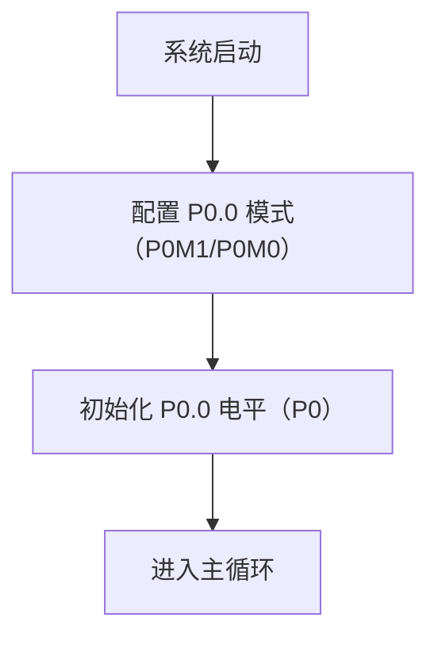
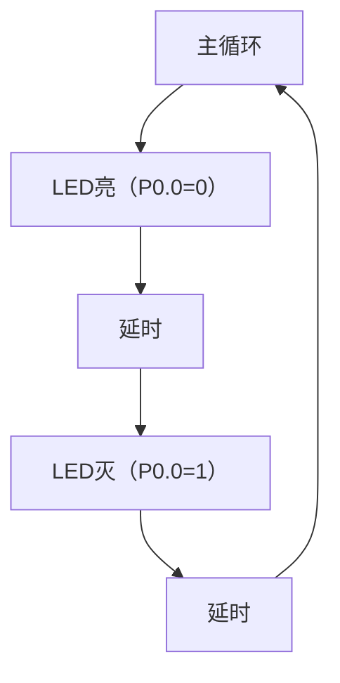

# 【极光 Orbit•STC8A-8H】03. 小刀初试：点亮你的LED灯

## 【极光 Orbit•STC8H】03. 小刀初试：点亮你的 LED 灯

### 七律 · 点灯初探

**单片方寸藏乾坤，LED明灭见真章。**
  
**端口配置定方向，寄存器值细推敲。**
  
**高低电平随心控，循环闪烁展锋芒。**
  
**嵌入式门初开启，从此代码手中扬。**

### 摘要

本教程以STC8H系列单片机为核心，通过直接操作寄存器的方式，实现LED灯的点亮与闪烁功能。教程从零开始讲解GPIO端口配置、寄存器操作及代码逻辑，涵盖硬件连接、软件编程、测试验证等环节。通过模块化代码设计（BSP层与DRV层分离），帮助初学者理解寄存器与硬件的对应关系，掌握基础的单片机开发技能。

---

### 关键字

STC8H, 单片机, 寄存器编程, GPIO配置, LED闪烁

---

### 引言

STC8H系列单片机基于8051内核，具备丰富的GPIO资源和灵活的寄存器配置能力。本教程通过直接操作寄存器的方式，实现LED的点亮与闪烁功能。教程采用模块化设计，将硬件抽象（BSP层）与功能实现（DRV层）分离，代码注释详细说明寄存器与硬件的对应关系，适合嵌入式开发初学者入门。

---

### 准备工作

在开始之前，请确保你已经准备好以下工具和材料：

* **STC8 单片机【极光 Orbit•STC8H】开发板**
* **Keil C51 或 STC-ISP 开发环境**

---

### 硬件设计

LED（Light Emitting Diode，发光二极管）是一种能够将电能转化为光能的半导体器件。LED的正常工作电流通常为10-20mA，工作电压约为1.7-3.3V，具体取决于LED的颜色和类型。

一般的 LED 的正常发光电流为 10~20MA 而低电流 LED 的工作电流在 2mA 以下（亮度与普通发光管相同）。通过 LED 的电流约为（VCC - Vd）/ RA2 。其中 Vd 为 LED 导通后的压降，约为 1.7V 左右。这个导通压降根据 LED 颜色的不同，以 及工作电流的大小的不同，会有一定的差别。下面一些参数供大家参考(供电电压 5V，LED 直径为 5mm) 。

* 红色的压降为 1.82-1.88V，电流 5-8mA，
* 绿色的压降为 1.75-1.82V，电流 3-5mA，
* 橙色的压降为 1.7-1.8V，电流 3-5mA
* 兰色的压降为 3.1-3.3V，电流 8-10mA，
* 白色的压降为 3-3.2V，电流 10-15mA，

STC8 单片机的 GPIO 采用灌电流方式点亮 LED 灯。具体硬件设计如下：

* **LED 连接**
  ：LED 的阳极通过限流电阻连接到 VCC，阴极连接到单片机的 P1 口。
* **灌电流方式**
  ：当 P1 口的某个引脚输出低电平时，LED 点亮；输出高电平时，LED 熄灭。
* STC8H8K64U单片机


  P1.0引脚


  限流电阻


  LED阴极


  VCC电源
* **示例电路**
  ：
* 

#### 2. 初始化要求

* **GPIO配置**
  ：将P0.0配置为推挽输出模式。
* **时钟设置**
  ：默认使用内部时钟（无需额外配置）。

---

### 软件配置

#### 1. 寄存器配置详解

##### **端口输出值配置（P0寄存器）**

* **作用**
  ：控制P0端口各引脚的电平高低。
* **配置**
  ：

  ```c
  P0 = 0x00; // P0.0输出低电平（LED亮）  
  P0 = 0xFF; // P0.0输出高电平（LED灭）  

  ```

### 代码实现（模块化设计）

#### 1. BSP层：LED硬件抽象（bsp\_led.c/.h）

##### **bsp\_led.h**

```c
#ifndef __BSP_LED_H  
#define __BSP_LED_H  

void bsp_led_init(void);  
void bsp_led_on(void);  
void bsp_led_off(void);  

#endif  

```

##### **bsp\_led.c**

```c
#include "bsp_led.h"  

void bsp_led_init(void) {  
    // 1. 设置P0.0为推挽输出模式  
    P0MDOUT |= 0x01; // P0MDOUT的第0位控制P0.0模式（1=推挽，0=开漏）  

    // 2. 初始化P0.0为高电平（LED灭）  
    P0 = 0xFF;       // P0的所有引脚输出高电平  
}  

void bsp_led_on(void) {  
    P0 &= ~0x01;     // 清零P0.0（输出低电平，LED亮）  
}  

void bsp_led_off(void) {  
    P0 |= 0x01;      // 置位P0.0（输出高电平，LED灭）  
}  

```

---

#### 2. 主函数（main.c）

```c
#include "bsp_led.h"  

void main(void) {  
    bsp_led_init(); // 初始化LED  

    while (1) {  
        bsp_led_on();  // LED亮  
        _nop_();       // 延时（可替换为精确延时函数）  
        _nop_();  
        bsp_led_off(); // LED灭  
        _nop_();  
        _nop_();  
    }  
}  

```

---

### 流程图与状态转换图

#### 1. 系统初始化流程



#### 2. 主循环流程



### 测试验证

#### 1. 硬件连接

* 将STC8H的P0.0引脚连接LED阳极，阴极通过220Ω电阻接地。

#### 2. 预期输出

* **LED状态**
  ：LED应以一定频率闪烁。

#### 3. 调试方法

* **检查端口配置**
  ：确认P0MDOUT的第0位是否置1（推挽输出）。
* **验证电平输出**
  ：使用万用表或示波器测量P0.0的高低电平。

---

### 文件结构

```
STC8H_Led_Project/  
├── Projects/  
│   ├── EVMDK/  
│   │   ├── STC8H_Led.uvproj  
│   │   └── Output/STC8H_Led.hex  
├── Drivers/  
│   ├── BSP/  
│   │   ├── bsp_led.c  
│   │   └── bsp_led.h  
│   └── Module/  // 可选，本例未使用  
│       └── ...  
└── Users/  
    ├── main.c  
    └── startup_stc8h.asm  // 启动文件（需根据芯片型号选择）  

```

### 代码与寄存器对应关系

#### 1. **关键寄存器说明**

| 寄存器 | 作用描述 | 示例代码 |
| --- | --- | --- |
| **P0M1** | 控制P0端口各引脚的高2位模式 | `P0M1 &= ~0x01;` |
| **P0M0** | 控制P0端口各引脚的低2位模式 | `P0M0 &= ~0x01;` |
| **P0** | 直接控制P0端口各引脚的电平高低 | `P0 &= ~0x01;` （LED亮） |

---

### 总结

本教程通过直接操作STC8H的GPIO寄存器，实现了LED的点亮与闪烁功能。模块化代码设计（BSP层与DRV层分离）降低了代码耦合度，注释详细说明了寄存器与硬件的对应关系。开发者可基于此框架扩展更多功能（如按键输入、PWM输出），为深入学习单片机开发奠定基础。

---

### 完整代码

#### 1. **BSP层代码**

**`BSP/bsp_led.c`**

```c
#include "bsp_led.h"  

void bsp_led_init(void) {  
    // 1. 初始化P0.0为高电平（LED灭）  
    P0 = 0xFF;       // P0的所有引脚输出高电平  
}  

void bsp_led_on(void) {  
    P0 &= ~0x01;     // 清零P0.0（输出低电平，LED亮）  
}  

void bsp_led_off(void) {  
    P0 |= 0x01;      // 置位P0.0（输出高电平，LED灭）  
}  

```

**`BSP/bsp_led.h`**

```c
#ifndef __BSP_LED_H  
#define __BSP_LED_H  

void bsp_led_init(void);  
void bsp_led_on(void);  
void bsp_led_off(void);  

#endif  

```

---

#### 2. **主函数代码**

**`Users/main.c`**

```c
#include "bsp_led.h"  

void main(void) {  
    bsp_led_init(); // 初始化LED  

    while (1) {  
        bsp_led_on();  // LED亮  
        _nop_();       // 延时（可替换为精确延时函数）  
        _nop_();  
        bsp_led_off(); // LED灭  
        _nop_();  
        _nop_();  
    }  
}  

```

---

通过本教程，开发者可掌握STC8H单片机的GPIO寄存器配置方法，为后续复杂项目开发提供基础。