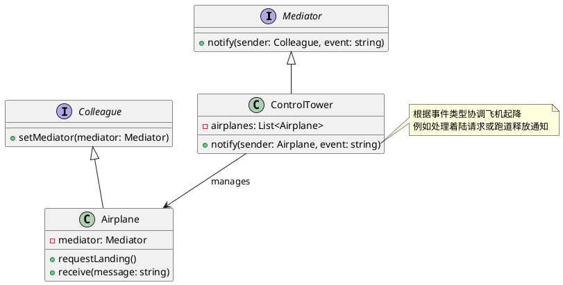

# Golang学习笔记\_48——中介者模式

[Golang学习笔记\_45——备忘录模式](https://blog.csdn.net/LuckyLay/article/details/146096029)
  
[Golang学习笔记\_46——状态模式](https://blog.csdn.net/LuckyLay/article/details/146096336)
  
[Golang学习笔记\_47——访问者模式](https://blog.csdn.net/LuckyLay/article/details/146096547)

---

---

### 一、核心概念

#### 1. 定义

**中介者模式**
是一种
**行为型设计模式**
，通过引入中介对象来封装一组对象间的交互，实现对象间解耦。其核心特点包括：

* **交互中心化**
  ：所有对象通信通过中介者进行
* **解耦网络**
  ：消除对象间的直接依赖关系
* **动态协调**
  ：可随时调整交互规则而不影响对象

#### 2. 解决的问题

•
**复杂网状依赖**
：对象间直接引用形成复杂网络
  
•
**修改扩散风险**
：单个对象变更影响多个关联对象
  
•
**复用困难**
：因高度耦合导致组件难以独立复用

#### 3. 核心角色

| 角色 | 作用 |
| --- | --- |
| Mediator | 定义对象间通信接口 |
| ConcreteMediator | 实现具体协调逻辑，维护同事对象引用 |
| Colleague | 定义同事对象接口，持有中介者引用 |
| ConcreteColleague | 具体业务对象，通过中介者与其他对象交互 |

#### 4. 类图




### 二、特点分析

**优点**

1. **简化依赖**
   ：将N:N关系转为1:N关系
2. **集中控制**
   ：交互规则统一维护于中介者
3. **职责清晰**
   ：各对象专注核心职责

**缺点**

1. **复杂度转移**
   ：中介者可能成为复杂单体
2. **性能瓶颈**
   ：高频通信场景存在吞吐限制
3. **过度设计**
   ：简单场景增加不必要抽象

### 三、适用场景

#### 1. 航空管制系统

```go
type AirTrafficControl interface {
    RequestLanding(planeID string)
    NotifyTakeoff(planeID string)
}

type Boeing747 struct {
    controlTower AirTrafficControl
}

func (b *Boeing747) LandingRequest() {
    b.controlTower.RequestLanding("BOEING-747")
}

```

#### 2. 分布式交易系统

```go
type TradeMediator interface {
    ExecuteOrder(order Order, traderID string)
}

type StockExchange struct {
    participants map[string]Trader
}

func (s *StockExchange) ExecuteOrder(o Order, src string) {
    for id, trader := range s.participants {
        if id != src {
            trader.ReceiveOrder(o)
        }
    }
}

```

#### 3. GUI组件交互

```go
type UIComponent interface {
    OnClick(mediator UIMediator)
}

type LoginDialog struct {
    mediator UIMediator
}

func (l *LoginDialog) Submit() {
    l.mediator.Notify(l, "submit")
}

```

### 四、Go语言实现示例


#### 完整实现代码

```go
package mediator_demo

import (
    "fmt"
    "sync"
)

// Mediator Interface
type ChatMediator interface {
    Register(user User)
    Broadcast(sender User, message string)
}

// Concrete Mediator
type chatRoom struct {
    users map[string]User
    lock  sync.RWMutex
}

func NewChatRoom() ChatMediator {
    return &chatRoom{
        users: make(map[string]User),
    }
}

func (c *chatRoom) Register(user User) {
    c.lock.Lock()
    defer c.lock.Unlock()
    c.users[user.GetID()] = user
}

func (c *chatRoom) Broadcast(sender User, msg string) {
    c.lock.RLock()
    defer c.lock.RUnlock()
    
    for id, user := range c.users {
        if id != sender.GetID() {
            user.Receive(sender.GetName(), msg)
        }
    }
}

// Colleague Interface
type User interface {
    GetID() string
    GetName() string
    Send(message string)
    Receive(sender string, message string)
}

// Concrete Colleague
type chatUser struct {
    id       string
    name     string
    mediator ChatMediator
}

func NewUser(id, name string, med ChatMediator) User {
    u := &chatUser{
        id:       id,
        name:     name,
        mediator: med,
    }
    med.Register(u)
    return u
}

func (c *chatUser) GetID() string  { return c.id }
func (c *chatUser) GetName() string { return c.name }

func (c *chatUser) Send(msg string) {
    fmt.Printf("[%s] 发送消息: %s\n", c.name, msg)
    c.mediator.Broadcast(c, msg)
}

func (c *chatUser) Receive(sender, msg string) {
    fmt.Printf("[%s] 收到来自 %s 的消息: %s\n", c.name, sender, msg)
}

// 客户端使用示例
func ExampleUsage() {
    room := NewChatRoom()
    
    user1 := NewUser("001", "Alice", room)
    user2 := NewUser("002", "Bob", room)
    user3 := NewUser("003", "Charlie", room)

    user1.Send("大家好！")
    user2.Send("欢迎新人！")
    user3.Send("需要帮助吗？")
}

```

#### 执行结果

```text
=== RUN   TestExampleUsage
[Alice] 发送消息: 大家好！
[Bob] 收到来自 Alice 的消息: 大家好！
[Charlie] 收到来自 Alice 的消息: 大家好！
[Bob] 发送消息: 欢迎新人！
[Alice] 收到来自 Bob 的消息: 欢迎新人！
[Charlie] 收到来自 Bob 的消息: 欢迎新人！
[Charlie] 发送消息: 需要帮助吗？
[Alice] 收到来自 Charlie 的消息: 需要帮助吗？
[Bob] 收到来自 Charlie 的消息: 需要帮助吗？
--- PASS: TestExampleUsage (0.00s)
PASS

```

### 五、高级应用

#### 1. 智能路由中介

```go
type SmartRouter struct {
    nodes      map[string]Node
    trafficMgr *TrafficAnalyzer
}

func (s *SmartRouter) Route(message Message) {
    if s.trafficMgr.IsCongested(message.Destination) {
        s.RedirectToBackup(message)
    } else {
        s.SendDirect(message)
    }
}

```

#### 2. 事务协调器

```go
type TransactionCoordinator struct {
    services []Microservice
    sagaLog  *SagaLogger
}

func (t *TransactionCoordinator) BeginSaga() {
    for _, svc := range t.services {
        if err := svc.Prepare(); err != nil {
            t.CompensateAll()
            break
        }
    }
}

```

### 六、与其他模式对比

| 模式 | 核心区别 | 典型应用场景 |
| --- | --- | --- |
| **观察者模式** | 广播通知 vs 定向协调 | 事件订阅系统 |
| **代理模式** | 控制访问 vs 协调交互 | 延迟加载对象 |
| **门面模式** | 简化接口 vs 协调交互 | 复杂子系统封装 |

### 七、实现建议

1. **接口分层设计**

```go
type AdvancedMediator interface {
    Register(Colleague)
    Unregister(string)
    QueryColleagues(filter func(Colleague) bool) []Colleague
}

```

2. **并发安全处理**

```go
type SafeMediator struct {
    colleagues sync.Map
}

func (s *SafeMediator) Register(c Colleague) {
    s.colleagues.Store(c.ID(), c)
}

```

3. **消息协议优化**

```go
type Message struct {
    Header map[string]string
    Body   []byte
    Metadata ProtocolMetadata
}

```

4. **性能监控扩展**

```go
type InstrumentedMediator struct {
    mediator    Mediator
    metrics     *PrometheusCollector
}

func (i *InstrumentedMediator) Broadcast(msg Message) {
    start := time.Now()
    i.mediator.Broadcast(msg)
    i.metrics.ObserveLatency(time.Since(start))
}

```

### 八、典型应用

1. **微服务编排**
   ：服务间调用协调
2. **物联网中枢**
   ：设备联动控制中心
3. **多人游戏同步**
   ：玩家动作协调引擎
4. **工作流引擎**
   ：任务节点调度中枢

在Go语言中实现建议：

* 使用
  `context.Context`
  传递协调上下文
* 结合channel实现事件总线机制
* 采用接口组合实现策略可插拔
* 利用sync.Pool优化高频消息对象