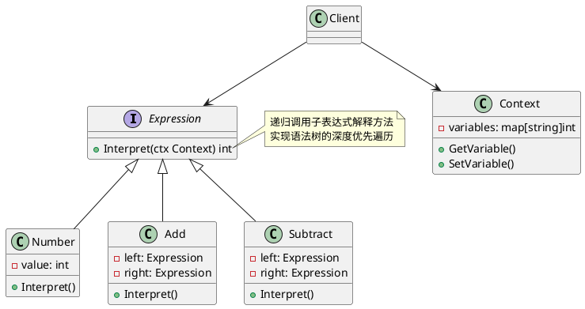

# Golang学习笔记_49——解释器模式

[Golang学习笔记_46——状态模式](https://blog.csdn.net/LuckyLay/article/details/146096336)
  
[Golang学习笔记_47——访问者模式](https://blog.csdn.net/LuckyLay/article/details/146096547)
  
[Golang学习笔记_48——中介者模式](https://blog.csdn.net/LuckyLay/article/details/146097269)

---

---

### 一、核心概念

#### 1. 定义

**解释器模式**
是一种
**行为型设计模式**
，通过定义语言的文法结构和解释器，实现对特定语法规则的解析执行。其核心特点包括：
  
•
**文法抽象**
：将语法规则转化为类层次结构
  
•
**递归解析**
：通过组合模式构建抽象语法树（AST）
  
•
**动态扩展**
：支持新增表达式类型而不修改现有代码

#### 2. 解决的问题

•
**语法解析**
：将复杂语法规则转化为可执行结构
  
•
**表达式求值**
：实现数学公式、逻辑表达式等动态计算
  
•
**领域语言**
：为特定领域创建专用解释型语言（DSL）

#### 3. 核心角色

| 角色 | 作用 |
| --- | --- |
| AbstractExpression | 定义解释操作的抽象接口（Interpret()） |
| TerminalExpression | 实现基本语法元素的解释逻辑（终结符） |
| NonTerminalExpression | 处理复合语法结构的解释逻辑（非终结符） |
| Context | 存储解释器全局状态和变量环境 |
| Client | 构建语法树并触发解释过程 |

#### 4. 类图




### 二、特点分析

**优点**

1. **扩展灵活**
   ：新增表达式类型只需添加新类
2. **结构清晰**
   ：语法规则与执行逻辑解耦
3. **领域适配**
   ：可定制领域专用语言解释器

**缺点**

1. **维护成本**
   ：复杂文法导致类数量膨胀
2. **性能损耗**
   ：递归解析影响执行效率
3. **适用局限**
   ：适合语法规则稳定的场景

### 三、适用场景

#### 1. 金融公式引擎

```go
type Formula interface {
    Eval(ctx *FinanceContext) float64
}

type ROIFormula struct { // 投资回报率公式
    Invest  Formula
    Revenue Formula
}

func (f *ROIFormula) Eval(ctx *FinanceContext) float64 {
    return (f.Revenue.Eval(ctx) - f.Invest.Eval(ctx)) / f.Invest.Eval(ctx)
}

```

#### 2. 智能合约解析

```go
type ContractClause interface {
    Execute(ledger *BlockchainLedger)
}

type TransferClause struct { // 资产转移条款
    From   string
    To     string
    Amount Formula
}

```

#### 3. 业务规则引擎

```go
type Rule interface {
    Match(ctx *BusinessContext) bool
}

type CompositeRule struct { // 组合规则
    Rules []Rule
    Op    LogicalOperator
}

```

### 四、Go语言实现示例


#### 完整实现代码

```go
package interpreter

import "fmt"

// 抽象表达式
type BooleanExp interface {
	Evaluate(ctx *Context) bool
}

// 终结符表达式
type VariableExp struct {
	name string
}

func (v *VariableExp) Evaluate(ctx *Context) bool {
	return ctx.Lookup(v.name)
}

// 非终结符表达式
type AndExp struct {
	left, right BooleanExp
}

func (a *AndExp) Evaluate(ctx *Context) bool {
	return a.left.Evaluate(ctx) && a.right.Evaluate(ctx)
}

type OrExp struct {
	left, right BooleanExp
}

func (o *OrExp) Evaluate(ctx *Context) bool {
	return o.left.Evaluate(ctx) || o.right.Evaluate(ctx)
}

// 上下文
type Context struct {
	variables map[string]bool
}

func NewContext() *Context {
	return &Context{
		variables: make(map[string]bool),
	}
}

func (c *Context) Assign(name string, value bool) {
	c.variables[name] = value
}

func (c *Context) Lookup(name string) bool {
	return c.variables[name]
}

// 客户端使用
func Example() {
	ctx := NewContext()
	ctx.Assign("A", true)
	ctx.Assign("B", false)

	exp := &OrExp{
		left:  &VariableExp{"A"},
		right: &AndExp{
			left:  &VariableExp{"B"},
			right: &VariableExp{"C"},
		},
	}

	fmt.Println(exp.Evaluate(ctx)) // 输出: true
}

```

#### 执行结果

```text
=== RUN   TestExample
true
--- PASS: TestExample (0.00s)
PASS

```

### 五、高级应用

#### 1. 表达式缓存优化

```go
type CachedExpression struct {
    exp     BooleanExp
    cache   map[*Context]bool
    rwMutex sync.RWMutex
}

func (c *CachedExpression) Evaluate(ctx *Context) bool {
    c.rwMutex.RLock()
    if val, exists := c.cache[ctx]; exists {
        c.rwMutex.RUnlock()
        return val
    }
    c.rwMutex.RUnlock()

    val := c.exp.Evaluate(ctx)
    
    c.rwMutex.Lock()
    c.cache[ctx] = val
    c.rwMutex.Unlock()
    
    return val
}

```

#### 2. 并行解释器

```go
type ParallelInterpreter struct {
    expressions []BooleanExp
    workerPool  chan struct{}
}

func (p *ParallelInterpreter) EvalAll(ctx *Context) []bool {
    results := make([]bool, len(p.expressions))
    var wg sync.WaitGroup
    
    for i, exp := range p.expressions {
        p.workerPool <- struct{}{}
        wg.Add(1)
        
        go func(idx int, e BooleanExp) {
            defer wg.Done()
            results[idx] = e.Evaluate(ctx)
            <-p.workerPool
        }(i, exp)
    }
    
    wg.Wait()
    return results
}

```

### 六、与其他模式对比

| 模式 | 核心区别 | 典型应用场景 |
| --- | --- | --- |
| **组合模式** | 树形结构 vs 语法树 | UI组件嵌套 |
| **访问者模式** | 状态遍历 vs 语法解析 | 编译器优化 |
| **策略模式** | 算法选择 vs 语法解释 | 支付方式选择 |

### 七、实现建议

1. **文法分层**
   ：使用EBNF定义语法规范

   ```go
   // 语法定义示例
   type Grammar struct {
       Productions map[string][]ProductionRule
   }

   ```
2. **错误恢复**
   ：实现语法错误检测机制

   ```go
   type SyntaxError struct {
       Position int
       Message  string
   }

   func (e *SyntaxError) Error() string {
       return fmt.Sprintf("[%d] %s", e.Position, e.Message)
   }

   ```
3. **内存管理**
   ：采用Flyweight模式共享终结符

   ```go
   var terminalPool = sync.Pool{
       New: func() interface{} {
           return &TerminalExp{name: ""}
       },
   }

   ```
4. **性能监控**
   ：集成运行时指标采集

   ```go
   type MetricsInterceptor struct {
       evalDuration  prometheus.Histogram
       parseDuration prometheus.Histogram
   }

   ```

### 八、典型应用

1. **规则引擎**
   ：风控系统的条件判断
2. **查询语言**
   ：数据库SQL解析器
3. **编译前端**
   ：编程语言的词法/语法分析
4. **工业控制**
   ：PLC指令解释执行

在Go语言中实践建议：

* 使用接口组合实现表达式扩展
* 结合
  `text/scanner`
  实现词法分析
* 采用
  `sync.Pool`
  优化高频表达式对象
* 通过
  `go/ast`
  包实现复杂语法树操作