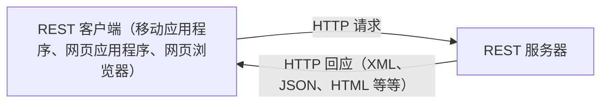

# Python Flask 构建REST API 简介

## Python Flask 构建REST API 简介

REST 或 ReST 是 Representational State Transfer（表征状态传输）的首字母缩写，是客户端机器请求远程机器上存在的资源信息的一种架构。API 是应用编程接口（Application Programming Interface）的缩写，是一套与运行在不同机器上的应用软件进行交互的规则和协议。不同软件实体之间的交互并非新要求。在过去的几十年中，已经提出和发明了许多技术，以实现软件级交互的无缝和便捷。其中值得注意的技术包括远程过程调用（RPC）、远程方法调用（RMI）、CORBA 和 SOAP 网络服务。这些技术都有局限性，比如与某种编程语言绑定（如 RMI），或与专有传输机制绑定，或仅使用某种类型的数据格式。RESTful API（即通常所说的 REST API）几乎完全消除了这些限制。

HTTP 协议的灵活性和简单性使其成为 REST API 的传输机制的有利候选。使用 HTTP 的另一个好处是，它允许使用多种数据格式（如文本、XML 和 JSON）进行数据交换，而不会受限于一种格式，如 XML 是基于 SOAP 的 API 的唯一格式。REST API 与任何一种特定语言无关，这使它成为构建网络交互 API 的实际选择。下图展示了从 REST 客户端到使用 HTTP 的 REST 服务器的 REST API 调用的架构视图：



REST API 依赖于 HTTP 请求，并使用其本地方法，如 GET、PUT、POST 和 DELETE。从应用程序接口设计的角度来看，HTTP 方法的使用简化了客户端和服务器端软件的实施。开发 REST 应用程序接口时要牢记 CRUD 操作概念。CRUD 代表创建（
`Create`
）、读取（
`Read`
）、更新（
`Update`
）和删除（
`Delete`
）。这就是 HTTP 方法与 CRUD 操作一一对应的地方，例如，
`GET`
表示
`Read`
，
`POST`
表示
`Create`
，
`PUT`
表示
`Update`
，
`DELETE`
表示
`Delete`
操作。

在使用 HTTP 方法构建 REST API 时，我们必须根据方法的幂等性能力谨慎选择正确的方法。在数学中，如果一个操作即使重复多次也能得到相同的结果，那么这个操作就被认为是幂等的。从其余 API 的设计角度来看，
`POST`
方法不具有幂等性，这意味着我们必须确保 API 客户端不会为同一组数据多次发起
`POST`
请求。
`GET`
、
`PUT`
和
`DELETE`
方法是幂等的，不过如果我们第二次尝试删除相同的资源，很可能会得到 404 错误代码。不过，从等价性的角度来看，这种行为是可以接受的。

### 将 Flask 用于 REST API

可以使用不同的库和框架构建 Python REST API。构建 REST API 的最流行框架是 Django、Flask（使用 Flask-RESTful 扩展）和 FastAPI。这些框架各有优缺点。如果网络应用程序也使用 Django 构建，那么 Django 是构建 REST API 的合适选择。不过，如果只使用 Django 开发应用程序接口，那就有点矫枉过正了。Flask-RESTful 扩展可与 Flask 网络应用程序无缝协作。Django 和 Flask 都拥有强大的社区支持，这有时是选择库或框架时的一个重要因素。FastAPI 被认为是性能最好的，如果目标只是为应用程序构建 REST API，那么它是一个不错的选择。但是，FastAPI 的社区支持与 Django 和 Flask 的支持水平不同。

我们选择了用于 REST API 开发的 Flask RESTful 扩展，以继续我们在网页应用程序开发方面的讨论。请注意，我们只需使用 Flask 就能构建一个简单的API，在本节中，我们将重点使用 REST 架构风格来构建 API。这意味着我们将使用 HTTP 方法对资源执行操作，该资源将由 Python 对象表示。

Flask-RESTful 支持的独特之处在于，它提供了一种方便的方法来 设置响应代码和响应头作为返回语句的一部分。

要使用 Flask 和 Flask-RESTful 扩展，我们需要安装 Flask-RESTful 扩展。我们可以使用以下 pip 命令将其安装到虚拟环境中：

```
pip install Flask-RESTful

```

在讨论如何实现 REST API 之前，最好先熟悉一下与 API 相关的一些术语和概念。一些与 API 相关的术语和概念。

#### 资源

资源是 REST 应用程序接口的关键元素，而 Flask-RESTful 扩展库为其提供了支持。资源对象是通过从基本资源类（
`Resource`
类）（可从 Flask-RESTful 扩展库中获取）扩展我们的类来定义的。基础资源类（
`Resource`
类）提供了几个神奇的函数来帮助 API 开发，并自动将 HTTP 方法与资源对象中定义的 Python 方法关联起来。

#### API 端点

API 端点是客户端软件与服务器软件之间建立通信的入口点。简单来说，API 端点是服务或服务器 URL 的替代术语，程序在该服务或 URL 上监听 API 请求。通过 Flask-RESTful 扩展，我们可以将某个 URL（或多个 URL）与资源对象关联起来，从而定义 API 端点。在 Flask 实现中，我们通过从基本资源类（
`Resource`
类）扩展来实现资源对象。

#### 路由

应用程序接口路由的概念与 Flask 中的网络应用程序路由相似，唯一不同的是，在应用程序接口中，我们需要将资源对象（
`Resource Object`
）映射到一个或多个端点 URL 上。

#### 参数解析（Argument parsing）

使用查询字符串或 HTML 表单编码数据可以解析 API 的请求参数。不过，这种方法并不可取，因为查询字符串或 HTML 表单都不是为了与 API 配合使用而设计的。推荐的方法是从 HTTP 请求中直接提取参数。为便于实现这一目的，Flask-RESTful 扩展提供了一个特殊的类
`reqparse`
。这个
`reqparse`
类类似于
`argparse`
，后者是解析命令行参数的常用选择。

<完>