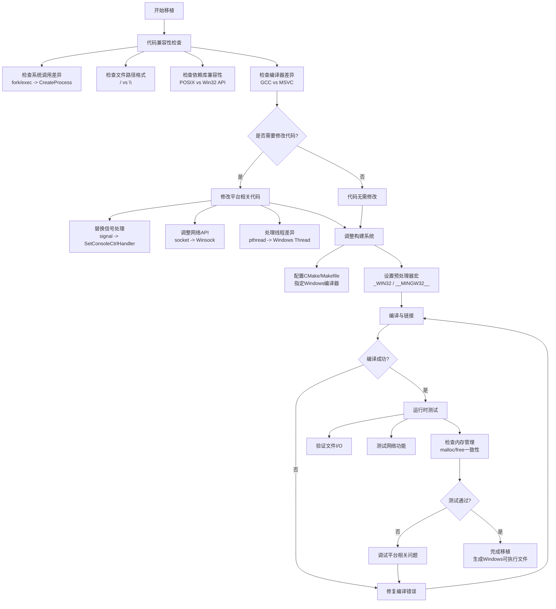

# 使用Mermaid语法绘制的C语言程序从Linux移植到Windows的流程图

以下是使用Mermaid语法绘制的C语言程序从Linux移植到Windows的流程图：

流程图说明：

1. **代码兼容性检查**
   ：重点检查系统调用、文件路径、库函数和编译器差异
2. **代码修改**
   ：处理进程创建、信号处理、网络API和线程模型的差异
3. **构建配置**
   ：通过CMake/Makefile配置Windows编译环境
4. **编译阶段**
   ：处理可能的编译错误
5. **运行时验证**
   ：重点测试跨平台差异较大的功能模块
6. **调试循环**
   ：测试失败时返回修改代码或构建配置

注：实际移植过程中可能需要多次迭代（用红色虚线箭头表示调试循环），特别是在处理隐式平台依赖和未文档化的行为差异时。

## 将节点定义和连接分离

以下是将节点定义和流向分离后的Mermaid流程图：

#### 改进说明：

1. **结构分离**
   ：

   * 使用
     `%% 节点定义 %%`
     和
     `%% 流向定义 %%`
     明确划分两部分
   * 所有节点先集中声明，再统一定义连接关系
2. **可维护性增强**
   ：

   * 节点修改时只需调整节点定义部分
   * 流程调整时只需修改流向定义部分
3. **可读性提升**
   ：

   * 节点ID与标签分离（如
     `A[开始移植]`
     ）
   * 复杂连接关系更清晰（特别是条件分支和循环）
4. **Mermaid特性保留**
   ：

   * 使用
     `{}`
     定义菱形判断节点
   * 通过
     `|条件|`
     标注分支路径
   * 保持原有的注释和换行符

> 这种分离方式特别适合需要频繁调整流程的场景，同时便于团队协作时快速理解流程结构。

---

## grok3

以下是使用Mermaid语法绘制的C语言程序从Linux移植到Windows的流程图，用于说明移植过程中的关键步骤。该流程图从开始移植到完成，涵盖了代码分析、修改、编译、测试等阶段，并包括了一个决策点以处理测试中发现的问题。

#### Mermaid语法流程图

是

否

开始移植过程

分析代码中的Linux特定部分

研究Windows等效方案

使用Windows API修改代码

管理Windows下的依赖项

调整文件路径和处理

更新Windows下的构建系统

在Windows上编译程序

在Windows上测试程序

是否正常工作?

优化和完善

移植完成

#### 流程图说明

1. **开始移植过程 (S)**
   ：启动C程序从Linux到Windows的移植工作。
2. **分析代码中的Linux特定部分 (A)**
   ：检查代码，识别依赖Linux特性的部分，如系统调用或特定库函数。
3. **研究Windows等效方案 (B)**
   ：为Linux特定功能寻找Windows下的替代方案，例如Windows API。
4. **使用Windows API修改代码 ©**
   ：更新代码，将Linux特定部分替换为Windows兼容的实现。
5. **管理Windows下的依赖项 (D)**
   ：确保程序依赖的库在Windows上可用，或找到替代方案。
6. **调整文件路径和处理 (E)**
   ：修改文件路径相关代码，适应Windows的文件系统特性（如路径分隔符和大小写不敏感）。
7. **更新Windows下的构建系统 (F)**
   ：调整构建脚本（如Makefile），使其适用于Windows编译器。
8. **在Windows上编译程序 (G)**
   ：使用Windows编译器构建程序。
9. **在Windows上测试程序 (H)**
   ：运行程序，验证其功能是否符合预期。
10. **是否正常工作? (I)**
    ：测试结果的决策点。
    * **是**
      ：如果程序正常工作，进入优化阶段。
    * **否**
      ：如果发现问题，返回“修改代码”步骤，修复问题后重新编译和测试。
11. **优化和完善 (J)**
    ：对程序进行性能优化或进一步改进。
12. **移植完成 (K)**
    ：移植过程结束，程序可在Windows上运行。

#### 注意事项

* 该流程图假设移植过程是一个高层次的概览，实际操作中可能需要多次迭代。
* 如果测试失败，返回“修改代码”是一个简化处理，具体问题可能需要调整依赖项或构建系统等其他步骤。

这个流程图清晰地展示了从Linux到Windows移植C程序的主要步骤，适用于指导开发者完成移植任务。