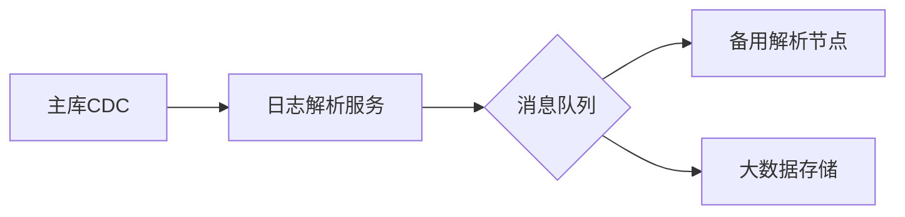

# SQL Server表数据变更捕获的5种方法及实战对比
在数据驱动的业务场景中，准确捕获SQL
Server表数据变更是数据审计、业务分析、系统集成等场景的必备能力。本文深入解析五种主流变更捕获方案，并提供企业级方案选型指南，帮助开发者构建高效可靠的变更追踪体系。
## 一、变更捕获核心技术原理
### 1.1 事务日志解析技术
SQL Server通过事务日志（Transaction
Log）记录所有数据修改操作，包含INSERT/UPDATE/DELETE的完整操作记录。事务日志采用LSN（Log Sequence
Number）唯一标识每个操作，包含操作类型、时间戳、用户信息等元数据。
### 1.2 行版本控制机制
基于行版本的时间戳追踪技术，通过tempdb数据库维护行版本链。当启用READ\_COMMITTED\_SNAPSHOT或ALLOW\_SNAPSHOT\_ISOLATION时，系统自动生成行版本标识，配合时间戳字段实现精准变更追踪。

## 二、五大变更捕获方案详解
### 2.1 原生变更数据捕获（CDC）
**启用步骤：**
```sql
-- 启用数据库级CDC
EXEC sys.sp\_cdc\_enable\_db
-- 启用表级CDC
EXEC sys.sp\_cdc\_enable\_table
@source\_schema = 'dbo',
@source\_name = 'OrderTable',
@role\_name = 'CDC\_Admin'
```
**数据查询：**
```sql
SELECT * FROM cdc.dbo\_OrderTable\_CT
WHERE \_\_$operation IN (1,2,4) -- 1=删除 2=插入 4=更新
```
**核心优势：**
\- 零代码侵入，自动捕获DML操作
\- 完整记录变更前后的数据状态
\- 支持事务一致性读取
### 2.2 自定义DML触发器
**创建示例：**
```sql
CREATE TRIGGER trg\_OrderTable\_Audit
ON OrderTable
AFTER INSERT, UPDATE, DELETE
AS
BEGIN
    SET NOCOUNT ON;
    
    INSERT INTO AuditLog(ChangeType, OldData, NewData)
    SELECT 
        CASE WHEN deleted.Id IS NULL THEN 'INSERT'
             WHEN inserted.Id IS NULL THEN 'DELETE'
             ELSE 'UPDATE' END,
        (SELECT * FROM deleted FOR JSON AUTO),
        (SELECT * FROM inserted FOR JSON AUTO)
    FROM inserted
    FULL OUTER JOIN deleted ON inserted.Id = deleted.Id
END
```
**性能优化建议：**
\- 使用内存优化表存储审计数据
\- 异步写入采用Service Broker队列
\- 避免在触发器中执行复杂业务逻辑
### 2.3 时间戳字段追踪
**字段定义技巧：**
```sql
ALTER TABLE OrderTable
ADD 
    LastModified datetime2 DEFAULT SYSUTCDATETIME(),
    ModifiedBy nvarchar(128) DEFAULT ORIGINAL\_LOGIN()
```
**查询增量数据：**
```sql
SELECT * 
FROM OrderTable
WHERE LastModified > @lastSyncTime
```
### 2.4 变更跟踪（Change Tracking）
**配置命令：**
```sql
ALTER DATABASE SalesDB
SET CHANGE\_TRACKING = ON
(WITH TRACKING\_CLEANUP = ON, CHANGE\_RETENTION = 2 DAYS)
ALTER TABLE OrderTable
ENABLE CHANGE\_TRACKING
WITH (TRACK\_COLUMNS\_UPDATED = ON)
```
**增量查询接口：**
```sql
SELECT 
    ct.SYS\_CHANGE\_VERSION,
    ct.SYS\_CHANGE\_OPERATION,
    ct.SYS\_CHANGE\_COLUMNS
FROM CHANGETABLE(CHANGES OrderTable, @lastVersion) AS ct
```
### 2.5 第三方日志解析工具
典型工具对比：
| 工具名称 | 协议支持 | 处理延迟 | 数据格式 |
|----------------|----------|----------|------------|
| Debezium | Kafka | <100ms | Avro/JSON |
| Attunity | 多种协议 | 1s | 自定义二进制 |
| SQLServer Connector | ODBC | 2s | CSV |

SQL Server表数据变更捕获
## 三、企业级方案选型指南
### 3.1 功能对比矩阵
| 维度 | CDC | 触发器 | 时间戳 | CT | 第三方工具 |
|-----------------|-------|--------|--------|-------|------------|
| 捕获删除操作 | ✔️ | ✔️ | ❌ | ✔️ | ✔️ |
| 记录历史值 | ✔️ | ✔️ | ❌ | ❌ | ✔️ |
| 实时性 | 秒级 | 实时 | 实时 | 秒级 | 近实时 |
| 存储开销 | 高 | 中 | 低 | 低 | 中 |
| 开发复杂度 | 低 | 高 | 低 | 中 | 中 |
### 3.2 典型场景推荐
\- **金融交易审计**：CDC+历史表归档
\- **实时数据同步**：Debezium+Kafka管道
\- **移动端增量同步**：变更跟踪+版本号追踪
\- **用户行为分析**：时间戳+批处理导出
## 四、高可用架构设计实践
### 4.1 容灾备份策略

### 4.2 性能优化方案
1\. 分区CDC捕获表按时间范围分区
2\. 采用列式存储压缩历史数据
3\. 设置合理的捕获作业调度策略
4\. 启用Change Tracking的自动清理任务
## 五、疑难问题解决方案
**Q1：CDC导致事务日志暴涨怎么办？**
\- 设置定期日志备份作业
\- 调整捕获作业的polling间隔
\- 启用日志自动增长预警
**Q2：如何解决跨数据库变更追踪？**
\- 使用分布式事务协调器
\- 构建中央变更数据中心
\- 采用Service Broker跨库通知
**Q3：大数据量下的性能瓶颈如何突破？**
\- 采用水平分片策略
\- 使用内存优化变更表
\- 启用变更批处理模式
## 结语
不同变更捕获方案在实时性、数据完整性、系统开销等方面各有优劣。建议根据业务场景的SLA要求、数据规模、技术栈特点进行综合评估。对于关键业务系统，可采用CDC+触发器的双保险机制，同时建议定期进行捕获性能测试和日志分析，确保系统长期稳定运行。