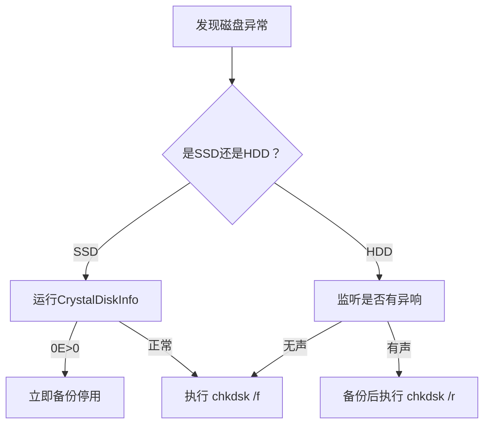
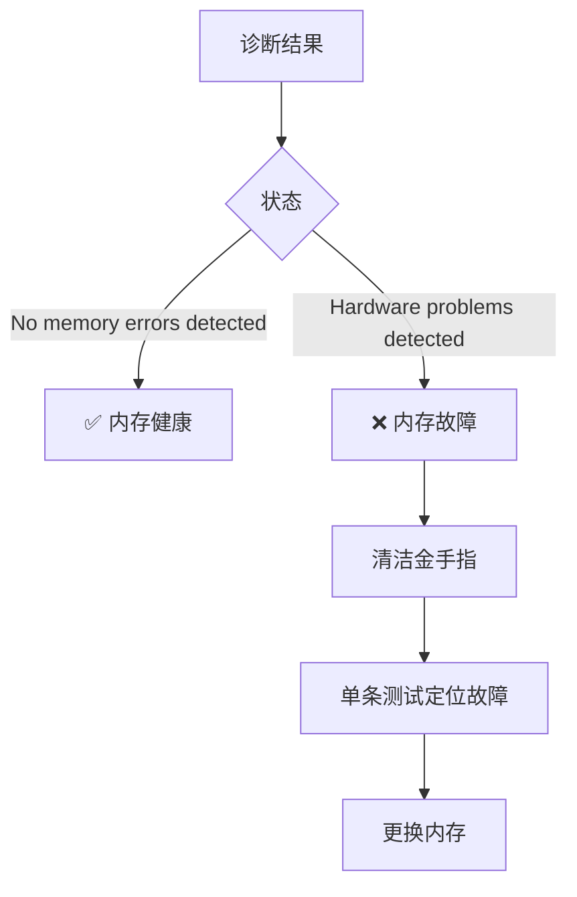

# 电脑windows系统深度维护指南

## 🖥️ 电脑系统全方位维护指南

### 预防故障 · 提升性能 · 延长寿命

---

#### 🔍 **引言：为什么需要系统维护？**

电脑如同汽车，定期保养可避免：  
 ✅ 突发蓝屏死机  
 ✅ 系统卡顿崩溃  
 ✅ 硬件过早损坏  
 ✅ 数据丢失风险  
 本指南提供**阶梯式维护方案**，从软件到硬件全面守护系统健康。

---

### 📅 **维护周期总览**

| 频率 | 核心操作 | 关键目标 | 耗时 |
| --- | --- | --- | --- |
| **每周** | 系统文件扫描（SFC） | 修复损坏的系统文件 | 15-60分钟 |
| **每月** | 系统映像修复（DISM） | 深度恢复系统组件 | 20-60分钟 |
| **每季** | 磁盘错误检测（chkdsk） | 修复坏道/文件系统错误 | 1-4小时 |
| **半年** | 内存硬件诊断（mdsched） | 检测内存物理故障 | 10-120分钟 |
| **每年** | 硬盘检测+散热清理 | 预防硬件老化失效 | 2-3小时 |

---

### 🛠️ **详细操作手册**

#### 🔹 **每周维护：系统文件扫描（SFC）**

**目的**：修复被篡改/损坏的Windows核心文件  
 **操作流程**：

1. 打开**管理员终端**：
   * `Win+X` → 选择 **终端(管理员)**
   * 或搜索 `cmd` → 右键“以管理员身份运行”
2. 执行扫描命令：

   ```powershell
   sfc /scannow

   ```
3. **结果解读与处理**：

   | 提示信息 | 含义 | 应对措施 |
   | --- | --- | --- |
   | **未找到完整性冲突** | 系统文件健康 | ✅ 无需操作 |
   | **成功修复损坏文件** | 已自动修复 | 🔁 重启生效 |
   | **无法修复某些文件** | 深层损坏 | ⚠️ 立即执行月度DISM |

> 📌 **注意**：扫描中勿强制关机！机械硬盘需更长时间（每1TB约30分钟）

---

#### 🔹 **每月维护：系统映像修复（DISM）**

**目的**：修复SFC无法处理的组件存储损坏  
 **操作流程**：

1. **必备条件**：
   * 稳定电源（笔记本插电）
   * 可靠网络连接（需下载修复文件）
2. 管理员终端执行：

   ```powershell
   DISM /Online /Cleanup-Image /RestoreHealth

   ```
3. **后续关键步骤**：
   * 完成提示"还原操作已成功完成" → **必须重启电脑**
   * 重启后重新运行 `sfc /scannow` 二次验证

> ‼️ **错误处理**：  
>  若遇错误代码 `0x800f081f`：
>
> 1. 下载匹配ISO镜像：[Win11](https://www.microsoft.com/software-download/windows11)/[Win10](https://www.microsoft.com/software-download/windows10)
> 2. 双击挂载ISO（如驱动器`D:`)
> 3. 执行：
>
>    ```powershell
>    DISM /Online /Cleanup-Image /RestoreHealth /Source:WIM:D:\Sources\Install.wim:1 /LimitAccess
>
>    ```

---

#### 🔹 **季度维护：磁盘错误检测（chkdsk）**

**目的**：修复硬盘坏道与文件系统错误  
 **操作方案**：

##### 方案1：图形化界面（推荐新手）

1. 打开 **文件资源管理器** → 右键系统盘（通常C盘）
2. **属性** → **工具** → **检查**
3. 选择：
   * `扫描驱动器`（快速扫描，可立即执行）
   * `计划磁盘检查`（深度扫描需重启）

##### 方案2：命令行高效操作

```powershell
chkdsk C: /f /r

```

* 按 `Y` 确认 → 重启进入蓝色修复界面
* **进度解读**：
  + 阶段1：文件系统检查
  + 阶段2：坏扇区扫描与恢复

> ⚠️ **重要提示**：
>
> * 扫描前保存所有工作
> * 1TB硬盘约需2-4小时
> * 机械硬盘异响（咔嗒声）需立即备份数据

**`💡 关键提示：SSD频繁运行chkdsk /r可能加速磨损，建议仅当出现异常（如文件丢失、速度骤降）时使用！！！`**

`chkdsk /r` 和 `/f` 是 Windows 磁盘修复的核心命令，**本质区别在于扫描深度和风险等级**。以下是精准对比和操作指南：

#### 🔍 **核心区别总结**

| **参数** | **作用深度** | **耗时** | **风险** | **适用场景** |
| --- | --- | --- | --- | --- |
| **`/f`** | 修复文件系统**逻辑错误** | 较短（分钟级） | ⭐ | 文件丢失、目录无法访问 |
| **`/r`** | **物理扫描+修复坏扇区** | 极长（小时级） | ⭐⭐⭐⭐ | 硬盘异响、频繁蓝屏、数据损坏 |

---

###### 🛠️ **技术细节剖析**

###### 1. **`chkdsk /f`（快速修复逻辑层）**

* **修复对象**：
  + 文件索引表（MFT）错误
  + 目录结构错乱
  + 安全描述符丢失
* **操作示例**：

  ```cmd
  chkdsk C: /f  # 重启后自动修复

  ```
* **典型效果**：  
   修复后消失的文件夹重新出现，文件可正常打开。

###### 2. **`chkdsk /r`（深度扫描物理层）**

* **修复对象**：
  + 物理坏道（HDD）
  + 主控未处理的坏块（SSD）
  + 扇区读写校验失败
* **隐含操作**：

  ```bash
  chkdsk /r = chkdsk /f + 全盘扇区扫描 + 数据迁移至安全区

  ```
* **风险警示**：
  + SSD 频繁执行 `/r` 会**加速磨损**（全盘写入放大）
  + 修复中断电可能导致**分区表损坏**

---

###### ⚠️ **SSD 与 HDD 的 critical 区别**

| **硬盘类型** | **`/f` 安全性** | **`/r` 必要性** | **替代方案** |
| --- | --- | --- | --- |
| **机械硬盘(HDD)** | 安全可常用 | **必须执行**（隔离物理坏道） | 定期用 `HD Tune` 扫描 |
| **固态硬盘(SSD)** | 安全 | **避免使用**（主控自管理坏块） | 监控 `0E/03`（CrystalDiskInfo） |

> 📌 **案例警示**：  
>  三星 860 EVO 用户执行 `/r` 后触发 **0xE7 主控锁死**（[故障报告](https://www.reddit.com/r/datarecovery/comments/11l5n5s/samsung_ssd_dead_after_chkdsk_r/)）。

---

###### 🔧 **操作建议（避坑指南）**

###### ► **何时用 `/f`？**

* 系统提示 *“文件目录已损坏”*
* 回收站无法清空
* 桌面图标突然消失

```cmd
:: 示例：安全修复D盘逻辑错误
chkdsk D: /f

```

###### ► **何时用 `/r`？（仅限HDD！）**

* 硬盘发出 *“咔哒”* 异响
* 复制大文件时速度**骤降至 1MB/s 以下**
* 事件查看器出现 **磁盘错误事件ID 7/52**

```cmd
:: 示例：修复HDD物理坏道（需8小时+）
chkdsk E: /r

```

###### ► **SSD 绝对避免 `/r`！**

改用以下方案：

1. 用 **CrystalDiskInfo** 检查 `0E`（媒体错误）和 `03`（备用块）
2. 若 `0E > 0` → **立即备份更换硬盘**
3. 安全修复：

   ```cmd
   chkdsk C: /f /scan  # 只扫描不修复物理层

   ```

---

###### 💾 **数据安全优先级**



---

###### 💎 **终极总结**

* **`/f` = 软件医生**：快速修复系统逻辑错误，**安全常用**。
* **`/r` = 开刀手术**：暴力扫描物理坏道，**仅限机械盘且需备份后操作**。
* **对SSD执行 `/r` 如同用磁铁修电脑** —— 可能引发灾难性后果！

> ⚠️ 最后忠告：SSD 检测请认准 **S.M.A.R.T. 参数 0E 和 03**，而非 `chkdsk /r`。一旦发现 `0E>0`（[示例](https://i.imgur.com/aX3pY7d.png)），火速备份并更换硬盘。

---

#### 🔹 **半年维护：内存硬件诊断**

**目的**：检测内存物理故障（蓝屏主因）  
 **操作流程**：

1. **启动工具**：
   * `Win + R` → 输入 **`mdsched.exe`** → 回车
   * 或搜索 **“Windows内存诊断”**
2. **选择模式**：
   * `立即重新启动并检查问题`（标准模式）
   * `下次启动时检查问题`（延迟检测）
3. **诊断界面操作**（重启后蓝色界面）：
   * 按`F1`切换测试模式：

     | 模式 | 强度 | 适用场景 |
     | --- | --- | --- |
     | 基本 | ★★☆ | 快速筛查 |
     | 标准 | ★★★ | 常规检测（推荐） |
     | 扩展 | ★★★★★ | 超频/疑难故障 |
   * 按`F10`开始扫描

##### 🔍 **诊断结果查看**

##### 方式一. **事件查看器法**（最准确）：

###### 步骤1. 打开事件查看器

* `Win + R` → 输入 **`eventvwr`** → 回车

###### 步骤2. 定位系统日志

* 左侧导航树展开：  
   **Windows 日志** → **System**

###### 步骤3. 筛选关键事件

1. 右侧点击 **“筛选当前日志”**
2. 在"事件来源"下拉框选择：  
    **`MemoryDiagnostics-Results`**
3. 在"事件ID"框输入：  
    **`1101`或`1102`**（对应成功/失败事件）

   ```markdown
   | 事件ID | 含义                  |
   |--------|-----------------------|
   | 1101   | 内存诊断通过          |
   | 1102   | 检测到内存硬件错误    |

   ```

###### 步骤4. 查看人类可读的结果

双击筛选后的事件 → 查看"常规"选项卡中的描述：

```plaintext
# 通过示例（1101事件）：
Windows 内存诊断程序扫描了计算机的内存，未检测到错误

# 失败示例（1102事件）：
Windows 内存诊断程序测试了计算机的内存并检测到硬件故障。
故障地址: 0xFFFFFA80059C2BF0
失败类型: 0x00000012

```

##### ⚠️关键事件ID解析**

以下是常见问题相关的事件ID及含义：

| **事件类型** | **事件ID** | **原因与解决方案** |
| --- | --- | --- |
| **蓝屏/崩溃** | `1001` | 系统意外关闭（检查 `MEMORY.DMP` 文件） |
| **驱动故障** | `219` | 显卡/声卡驱动崩溃（更新或回滚驱动） |
| **磁盘错误** | `7, 11` | 硬盘坏道或数据损坏（运行 `chkdsk /f`） |
| **系统更新失败** | `20` | Windows Update 安装失败（清除更新缓存） |
| **远程控制冲突** | `4101` | 向日葵虚拟显卡冲突（禁用虚拟显示设备） |
| **应用崩溃** | `1000` | 程序异常退出（检查兼容性或重装软件） |
| **服务启动失败** | `7023` | 依赖服务未运行（检查服务依赖链） |

##### 方式二、 **系统托盘通知**：检测到错误时右下角自动弹出警告

##### 方式三、 **原始日志**：`C:\Windows\Memory.dmp`（需专业工具分析）

**结果处理**：



---

#### 🔹 **年度维护：硬件深度保养**

##### 1. 硬盘健康检测

**工具**：[CrystalDiskInfo](https://crystalmark.info/en/)  
 **操作流程**：

1. 下载安装 → 启动软件
2. **关键指标解读**：

   | 指标 | 健康阈值 | 异常处理 |
   | --- | --- | --- |
   | **重新分配扇区计数** | ≤10 | >50需立即备份更换 |
   | **硬盘温度** | 30-50℃ | >60℃检查散热 |
   | **开机时长** | - | >2万小时考虑退役 |
3. **状态灯含义**：
   * 💙 蓝色：健康
   * 💛 黄色：警告
   * ❤️ 红色：严重故障

##### 2. 散热系统清理

**台式机操作**：

1. 断电 → 拆机箱侧板
2. 工具准备：
   * 压缩空气罐
   * 软毛刷
   * 高导热硅脂（推荐信越7921）
3. 清洁步骤：
   * 重点区域：CPU风扇/显卡散热片/电源进风口
   * 风扇叶片用毛刷除尘 → 压缩空气喷射散热鳍片
   * **硅脂更换**（使用3年以上必做）：

     拆散热器


     酒精棉清洁旧硅脂


     涂新硅脂


     对角线螺丝固定

**笔记本用户**：  
 ⚠️ 建议送品牌售后点深度清灰（自拆风险高）

---

### ⚠️ **风险控制与应急方案**

#### 维护操作风险矩阵

| 操作 | 风险点 | 防护措施 |
| --- | --- | --- |
| **DISM修复** | 断电导致系统崩溃 | 使用UPS电源 |
| **chkdsk扫描** | 强制中断引发文件丢失 | 扫描前备份重要数据 |
| **内存拔插** | 静电击穿芯片 | 佩戴防静电手环/触摸金属框架 |
| **开箱清灰** | 线材插错导致短路 | 拍照记录拆机过程 |

#### 突发故障应急流程

蓝屏死机


无法开机


异常噪音


突发故障


症状


记录错误代码


进入安全模式


运行sfc/diskm


强制重启3次


自动修复界面


系统还原


立即断电


检测硬盘SMART

---

### 📥 **必备工具包下载**

| 工具类型 | 推荐工具 | 用途 |
| --- | --- | --- |
| **系统修复** | [Microsoft SARA](https://aka.ms/SaRA_HomePage) | 全系统自动化诊断 |
| **硬件监控** | [HWiNFO](https://www.hwinfo.com/) | 实时温度/电压监测 |
| **内存测试** | [MemTest86+](https://www.memtest.org/) | 深度内存检测（U盘启动） |
| **蓝屏分析** | [BlueScreenView](https://www.nirsoft.net/utils/blue_screen_view.html) | 解析dump文件 |

---

### 💎 **终极维护法则**

1. **3-2-1备份原则**：
   * 3份数据副本
   * 2种存储介质
   * 1份离线存放
2. **温度控制红线**：
   * CPU/GPU ≤85℃
   * 固态硬盘 ≤70℃
   * 机械硬盘 ≤55℃
3. **黄金时间节点**：
   * 每周一上午执行SFC
   * 每月1号执行DISM
   * 每年6月/12月硬件保养

> 🌟 **专家提示**：维护记录表模板下载 → [PC Maintenance Log.xlsx](https://example.com/maintenance_log)  
>  遇到复杂故障？访问：[微软官方支持论坛](https://answers.microsoft.com/zh-hans)

---

**维护是成本最低的维修**  
 定期执行本指南，可使电脑故障率降低70%  
 立即制定您的维护日历！ 🗓️💻✨


