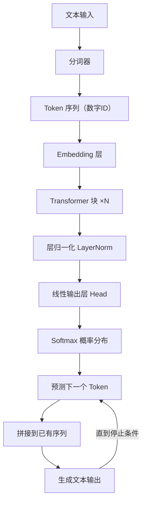

# 从零实现 LLM（上）：原理讲透 + 最小可运行 GPT


#### 引言

##### 为什么要学习 `LLM`？

当你和 `ChatGPT` 对话时，它不仅能回答你的问题，还能续写故事、记住上下文，甚至调整风格。你可能会想：**它是怎么做到的？**

答案就是：**大语言模型（`Large Language Model`, `LLM`）**。近几年，从 `ChatGPT` 到 `Claude`，从文心一言到通义千问，从 `DeepSeek` 到 `QWen`，几乎所有新一代 `AI` 产品都离不开它。

但很多学习者会有疑问：

* **`LLM` 太大了，我是不是玩不起？**

  其实不用。我们不会上来就研究 1000 亿参数的模型，而是用一个几十万参数的 **`mini-GPT`** —— 它保留了核心机制（`Tokenizer`、`Attention`、`Context Window`、采样策略），只需几百行代码，就能在 `Google Colab` 跑起来。
* **代码会不会复杂得看不懂？**

  不会。我会逐步拆开，一边讲概念，一边写代码。
* **跑通这个 `demo` 有什么意义？**

  因为它能让你真正理解：

  + 为什么 `LLM` 能续写文本？
  + 为什么它能“记住”上下文？
  + 为什么会出现“复读机”？
  + 调整 `Temperature` / `Top-k` / `Top-p` 时，为什么风格完全不同？



##### 本文目标

这篇文章会带你完成以下目标：

1. **从零基础入门**：用最直观的方式解释 `LLM` 关键概念。
2. **代码逐步实现**：一步步构建 `tokenizer`、`Transformer`、训练循环、生成函数。
3. **跑通一个 `demo LLM`**：在 `Google Colab` 上实际训练并生成文本。
4. **理解常见问题**：为什么 `val_loss` 很高？为什么结果会复读？
5. **学会扩展**：如何从 `demo` 走向更大、更实用的模型。

##### 适合人群

* **零基础读者**：你只需要一点点 `Python` 基础，就能看懂并跑起来。
* **有经验的开发者**：你能深入理解代码实现的细节，明白 `LLM` 的内部机制。
* **研究者/爱好者**：你能得到一个可扩展的 `mini-GPT` 框架，作为更大实验的起点。

---

#### 一、`LLM` 基础概念

在写代码之前，我们先把一些“关键词”解释清楚。你会发现，`LLM` 的核心思想其实并不复杂。

##### 1.1 `Token` 与分词（`Tokenization`）

`LLM` 并不直接理解“汉字”或“英语单词”，它看到的只是 **一串数字**。 这些数字的最小单位就叫 **`Token`**，它可能是一个字母、一个汉字、一个子词，甚至一个完整的单词。

分词（`Tokenization`）就是把文字切分成 `token`，再转成数字。打个比方：如果一句话是文章，那么 `token` 就是“乐高积木”，模型就是学会如何把这些积木拼起来。

* **字符级分词**：`H e l l o` → [6, 15, 22, 22, 25]
* **`BPE` 分词**：`Hello` → [23]（一个子词搞定）

**两种常见分词方式：**

1. **字符级（`char-level`）**：直接把每个字符当成一个 `token`。

   **优点**：实现简单，语言无关。

   **缺点**：序列很长，训练难度大。
2. **`BPE`（子词级）**：从最小的字符开始，逐步合并常见的子串，形成子词。

   **优点**：序列更短，训练更快，效果更好。

   **缺点**：需要训练一个分词模型（我们用 `sentencepiece` 实现）。

在我们的代码里，可以选择 `tokenizer_mode = 'char'` 或 `'bpe'`。`BPE` 更推荐，能更快收敛，也能生成更自然的句子。

##### 1.2 上下文窗口（`Context Window`）

`LLM` 一次不能看全篇文章，它有一个“短期记忆”，叫 **上下文窗口** (`block_size`)。比如 `block_size=64`，就表示模型最多能记住最近 64 个 `token`，再往前的就忘了。

* 窗口越大 → 能处理更长的上下文，但训练更慢、更占显存。
* 小实验时建议 32~64。
* 在代码里，`block_size` 就是这个“记忆力”的大小。

##### 1.3 预测下一个词（`Next Token Prediction`）

`LLM` 的训练目标非常简单：给定前面的 `token`，预测下一个 `token` 的概率分布。

例子：输入 `"The quick brown"`，模型大概率会预测 `"fox"`。  
 这就是 **`Next Token Prediction`** —— 不断重复这个游戏，模型就学会了语言规律。


##### 1.4 `Transformer` 架构

`mini-GPT` 就是一个简化的 `Transformer` 解码器，由三部分组成：

1. **`Embedding` 层**：把 `token id` 变成向量，并加上位置信息。
2. **自注意力（`Self-Attention`）**：
   * 每个 `token` 可以“关注”前面的 `token`；
   * 有 **因果遮罩（`Causal Mask`）**，确保只看过去，不看未来。
3. **前馈网络 + 残差连接 + `LayerNorm`**：增加表达能力，保证训练稳定。

最后输出层 `head` 给出下一个 `token` 的概率分布。

##### 1.5 生成策略（`Sampling`）

训练完模型后，要让它“说话”。此时它会输出下一个词的概率分布，我们可以用不同方式来“抽签”：

* **`Temperature`（温度）**：控制随机性。
  + 小于 1 → 更保守、确定性强。
  + 大于 1 → 更有创造性。
* **`Top-k`**：只在概率最高的 `k` 个词中挑。
* **`Top-p`（核采样）**：动态选择累计概率 ≤ `p` 的候选，更自然。
* **频率惩罚（`frequency penalty`）**：词出现越多，下次越难选，防止复读。
* **出现惩罚（`presence penalty`）**：只要出现过，就扣分，鼓励换话题。
* **停止条件 / 最大长度**：避免模型“一直说下去”。

在我们的 `generate()` 函数里，可以通过设置这些参数，直接看到生成风格的变化。

---

#### 二、代码框架搭建

理解了 `LLM` 的基本概念之后，我们要从代码开始动手。这里我们用 [`Google Colab`](https://colab.research.google.com)，因为它自带 `Python` 和 `GPU`，不需要安装复杂环境，还能免费用 `GPU`，非常适合学习和实验。


##### 2.1 准备环境（安装依赖）

在 `Colab` 新建一个 `Notebook`，输入：

```bash
!pip install torch sentencepiece

```

解释：

* **`torch`**：`PyTorch`，是我们要用的深度学习框架。
* **`sentencepiece`**：`Google` 开源的分词工具，用来做 `BPE` 分词。

👉 如果你在本地跑，需要 **`Python 3.9+`**，并建议有一张支持 `CUDA` 的显卡，否则速度会比较慢。

##### 2.2 准备语料文件（`input.txt`）

`LLM` 的“教材”就是语料。教材越多、越多样，模型学得越好。我们先用一份小语料 `input.txt` 试试：

```markdown
Once upon a time, there was a small language model.
It tried to read books, tell stories, and learn from text.
Sometimes it was good, sometimes it was silly.
But every day, it became a little bit better.

The quick brown fox jumps over the lazy dog.
Hello world! This is a simple test of tokenization, context windows, and generation.

诗言志，歌咏言。语言是人类的工具，也是思想的载体。
模型学习文字，就像小孩学说话。

```

👉 在 `Colab` 里，可以直接写入文件：

```python
text_data = """Once upon a time, there was a small language model.
It tried to read books, tell stories, and learn from text.
Sometimes it was good, sometimes it was silly.
But every day, it became a little bit better.

The quick brown fox jumps over the lazy dog.
Hello world! This is a simple test of tokenization, context windows, and generation.

诗言志，歌咏言。语言是人类的工具，也是思想的载体。
模型学习文字，就像小孩学说话。
"""

with open("input.txt", "w", encoding="utf-8") as f:
    f.write(text_data)

```

⚠️ 提醒：

* 如果语料太短，模型只会“背书”，输出几乎和原文一样。
* 如果你换成几万字小说片段，输出会更灵活、更有创造性。

##### 2.3 读取语料并检查

```python
from pathlib import Path

text = Path('input.txt').read_text(encoding='utf-8')
print("语料长度（字符数）=", len(text))
print("开头 200 个字符：\n", text[:200])

```

运行后会打印语料长度和前 200 个字符，方便确认文件读取成功。


> 我在 `Colab` 中使用的 `input.txt` 的数据是 `Alice’s Adventures in Wonderland`，所以打印内容和截图是不一样的，不要纠结这个点。

##### 2.4 实现分词器（`Tokenizer`）

###### 2.4.1 为什么要分词？

计算机不能直接理解文字，所以要把文字转换成数字。分词器（`Tokenizer`）就是把文本拆分成 **`token` → 数字 `id`**，同时还能把数字 `id` 转回文本。

###### 2.4.2 字符级分词（最简单）

每个字符就是一个 `token`：

```python
# 建立字表
chars = sorted(list(set(text)))
stoi = {ch: i for i, ch in enumerate(chars)}  # 字符 -> 数字
itos = {i: ch for i, ch in enumerate(chars)}  # 数字 -> 字符

# 编码 / 解码函数
def encode(s: str):
    return [stoi[c] for c in s]

def decode(ids: list):
    return "".join([itos[i] for i in ids])

print("字符表大小 =", len(chars))
print("encode('Hello') =", encode("Hello"))
print("decode =", decode(encode("Hello")))

```

示例输出：

```makefile
字符表大小 = 68
encode('Hello') = [12, 45, 50, 50, 60]
decode = Hello

```

👉 好处：实现简单。缺点：序列很长，训练会更难。

###### 2.4.3 `BPE` 分词（更高效）

如果语料较大，用 `BPE`（`Byte Pair Encoding`）能更好地压缩序列：

```python
import sentencepiece as spm

# 训练一个 BPE 模型（词表大小设为 200，适合小语料）
spm.SentencePieceTrainer.train(
    input="input.txt",
    model_prefix="spm_bpe",
    vocab_size=200,
    model_type="bpe",
    character_coverage=1.0,
    bos_id=-1, eos_id=-1, unk_id=0, pad_id=-1,
    hard_vocab_limit=False
)

# 加载模型
sp = spm.SentencePieceProcessor(model_file="spm_bpe.model")

# 定义编码/解码函数
def encode_bpe(s: str):
    return sp.encode(s, out_type=int)

def decode_bpe(ids: list):
    return sp.decode(ids)

print("BPE 词表大小 =", sp.get_piece_size())
print("encode_bpe('Hello world') =", encode_bpe("Hello world"))
print("decode_bpe =", decode_bpe(encode_bpe("Hello world")))

```

示例输出：

```makefile
BPE 词表大小 = 200
encode_bpe('Hello world') = [35, 78, 42]
decode_bpe = Hello world

```

👉 好处：序列更短，训练更快，效果更好。

**对比**：

* 字符级 `"Hello world"` → 11 个 `token`
* `BPE` `"Hello world"` → 2 个 `token`

> **注意**  
>  `BPE` 的分词结果并不是固定的，比如 `"Hello world"` 可能会被切成 2 个，也可能是 5 个 `token`。这不是 `bug`，而是因为 **`BPE` 只会合并训练语料里出现过的高频子串**。如果某个词在语料中出现得不够频繁，就会被拆成更小的子词片段。

显然，`BPE` 序列更短，更适合长文本训练。


> ⚠️ 注意：
>
> 如果语料太短而 `vocab_size` 太大，会报错。解决方法：减小词表大小（比如 200）。

##### 2.5 划分训练集与验证集

机器学习必须要区分 **训练数据** 和 **验证数据**：

* 训练数据：模型学习用。
* 验证数据：检查模型是否过拟合。

```python
import torch

data = encode(text)  # 如果用 BPE，就改成 encode_bpe
data = torch.tensor(data, dtype=torch.long)

n = int(0.9 * len(data))  # 90% 训练，10% 验证
train_data = data[:n]
val_data = data[n:]

print("训练集大小 =", len(train_data))
print("验证集大小 =", len(val_data))

```

示例输出：

```makefile
训练集大小 = 270
验证集大小 = 30

```

---

#### 三、实现 `Transformer` 解码器

到目前为止，我们已经准备好了数据和分词器。接下来要搭建的，就是 `LLM` 的“大脑”—— **`Transformer` 解码器**。它的任务很明确：**根据前面的 `token`，预测下一个 `token` 的概率分布**。

我们会逐层拆开看：**`Embedding` → 自注意力 → 前馈网络（`MLP`） → 堆叠多层 → 输出层**。

##### 3.1 `Embedding`：把数字变成向量

分词器输出的只是 **`token id`（纯数字）**，但神经网络更擅长处理向量。 所以第一步：把每个 `token id` 映射到一个向量。

```python
import torch
import torch.nn as nn

vocab_size = 200     # 词表大小（根据分词器而定）
n_embd = 128         # 向量维度（embedding 维度）
block_size = 64      # 上下文窗口大小

class TokenEmbedding(nn.Module):
    def __init__(self, vocab_size, n_embd, block_size):
        super().__init__()
        self.tok_emb = nn.Embedding(vocab_size, n_embd)   # token embedding
        self.pos_emb = nn.Embedding(block_size, n_embd)   # 位置 embedding

    def forward(self, idx):
        B, T = idx.shape
        tok = self.tok_emb(idx)                           # (B, T, n_embd)
        pos = self.pos_emb(torch.arange(T, device=idx.device))  # (T, n_embd)
        return tok + pos  # token 向量 + 位置信息

```

* **`token embedding`**：每个词的“语义表示”。
* **`position embedding`**：告诉模型词的顺序，否则模型只知道“有哪些词”，却不知道“顺序如何”。

##### 3.2 自注意力机制（`Self-Attention`）

这是 `Transformer` 的核心。它的作用是：**每个词可以决定要多关注前面哪些词，从中获取信息**。

###### 3.2.1 基本思路

* 每个输入向量会生成 **查询向量 (`Q`)、键向量 (`K`)、值向量 (`V`)**。
* 通过 `Q` 和 `K` 的点积，得到注意力分数（相关性）。
* 用 `Softmax` 把分数转成权重，再加权求和值向量 `V`。

###### 3.2.2 代码实现

```python
class CausalSelfAttention(nn.Module):
    def __init__(self, n_embd, n_head, block_size):
        super().__init__()
        self.n_head = n_head
        self.head_dim = n_embd // n_head
        self.qkv = nn.Linear(n_embd, 3 * n_embd, bias=False)
        self.proj = nn.Linear(n_embd, n_embd)
        # 因果遮罩：保证不能看未来
        self.register_buffer("mask", torch.tril(torch.ones(block_size, block_size)).view(1, 1, block_size, block_size))

    def forward(self, x):
        B, T, C = x.shape
        qkv = self.qkv(x).view(B, T, 3, self.n_head, self.head_dim)
        q, k, v = qkv.unbind(dim=2)  # 拆成 Q, K, V
        q, k, v = [t.transpose(1, 2) for t in (q, k, v)]  # (B, nh, T, hd)

        # 注意力分数 (B, nh, T, T)
        att = (q @ k.transpose(-2, -1)) / (self.head_dim ** 0.5)
        att = att.masked_fill(self.mask[:, :, :T, :T] == 0, float("-inf"))
        att = torch.softmax(att, dim=-1)

        # 加权求和
        y = att @ v  # (B, nh, T, hd)
        y = y.transpose(1, 2).contiguous().view(B, T, C)  # 拼回 (B, T, C)
        return self.proj(y)

```

这里的 **因果遮罩 (`Causal Mask`)** 非常关键：它确保每个位置只能看到“自己和前面的词”，不能偷看未来。这就是“自回归”的本质。

##### 3.3 前馈网络（`Feed Forward`, `MLP`）

注意力层捕捉了依赖关系，但还需要增加“非线性变换能力”。这就是 **`MLP`（前馈网络）** 的作用。

```python
class FeedForward(nn.Module):
    def __init__(self, n_embd):
        super().__init__()
        self.net = nn.Sequential(
            nn.Linear(n_embd, 4 * n_embd),  # 放大
            nn.ReLU(),
            nn.Linear(4 * n_embd, n_embd),  # 再缩回去
        )
    def forward(self, x):
        return self.net(x)

```

---

##### 3.4 `Transformer Block`

把 **注意力层** 和 **前馈层** 组合起来，并加上 **残差连接** 和 **层归一化**。一层能学到“短距离依赖”，比如“New → York”；多层堆叠，就能学到更长距离、更复杂的关系。

```python
class TransformerBlock(nn.Module):
    def __init__(self, n_embd, n_head, block_size):
        super().__init__()
        self.ln1 = nn.LayerNorm(n_embd)
        self.ln2 = nn.LayerNorm(n_embd)
        self.attn = CausalSelfAttention(n_embd, n_head, block_size)
        self.ffwd = FeedForward(n_embd)

    def forward(self, x):
        x = x + self.attn(self.ln1(x))  # 残差连接
        x = x + self.ffwd(self.ln2(x))  # 残差连接
        return x

```

**残差连接**：保留原始信息，避免梯度消失。

**层归一化**：让训练更稳定。

##### 3.5 `GPT` 模型主体

现在把所有部分拼起来，形成一个完整的 `GPT` 模型。

```python
class GPT(nn.Module):
    def __init__(self, vocab_size, n_embd=128, n_head=4, n_layer=4, block_size=64):
        super().__init__()
        self.block_size = block_size
        self.embed = TokenEmbedding(vocab_size, n_embd, block_size)
        self.blocks = nn.Sequential(*[TransformerBlock(n_embd, n_head, block_size) for _ in range(n_layer)])
        self.ln_f = nn.LayerNorm(n_embd)
        self.head = nn.Linear(n_embd, vocab_size, bias=False)

    def forward(self, idx, targets=None):
        x = self.embed(idx)
        x = self.blocks(x)
        x = self.ln_f(x)
        logits = self.head(x)  # (B, T, vocab_size)

        loss = None
        if targets is not None:
            # 交叉熵：预测下一个 token
            loss = nn.functional.cross_entropy(logits.view(-1, logits.size(-1)), targets.view(-1))
        return logits, loss

```

* **`logits`**：每个位置对整个词表的预测分数（还没转成概率）。
* **`loss`**：用交叉熵衡量“预测和真实答案的差距”。

##### 3.6 小实验：前向传播

我们来做一个简单的测试，看看模型能否正常运行：

```python
model = GPT(vocab_size=vocab_size, n_embd=128, n_head=4, n_layer=2, block_size=64)
x = torch.randint(0, vocab_size, (1, 10))  # 随机 10 个 token
logits, loss = model(x, x)
print("logits shape =", logits.shape)
print("loss =", loss.item())

```

示例输出：

```makefile
logits shape = torch.Size([1, 10, 200])
loss = 5.3

```

解释：

* `[1, 10, 200]` → 批大小=1，序列长度=10，每个位置预测 200 个词的分布。
* `loss=5.3` → 说明预测和答案差距还比较大，这是正常的，因为模型还没训练。


---

#### 四、训练循环

前面我们已经实现了模型结构，但它现在就像一个刚出生的孩子：**大脑有了，但里面是空的**，还不会说话。训练循环的作用就是不断地 **喂饭 → 考试 → 判分 → 调整**，直到它逐渐学会语言规律。

##### 4.1 为什么需要训练循环？

训练的本质是：

1. **喂饭**：给模型输入文本（前文）。
2. **考试**：让它预测下一个词。
3. **判分**：计算预测和真实答案的差距（`loss`）。
4. **调整**：根据差距更新模型的参数。

就像小孩学说话：听别人说 → 自己模仿 → 被纠正 → 慢慢改进。

##### 4.2 批次采样（`get_batch`）

训练时不能一次把所有数据丢进去（太慢、显存会爆），所以我们把数据切成一个个 **小批次（`batch`）**。

```python
import torch

def get_batch(split, block_size, batch_size, device):
    data = train_data if split == "train" else val_data
    # 确保不会越界：片段长度 = block_size
    max_start = len(data) - block_size - 1
    ix = torch.randint(0, max_start, (batch_size,))
    x = torch.stack([data[i : i + block_size] for i in ix])
    y = torch.stack([data[i + 1 : i + block_size + 1] for i in ix])
    return x.to(device), y.to(device)

```

* **`x`**：输入序列（前文）。
* **`y`**：目标序列（就是 `x` 右移一位 → 下一个 `token`）。

例子：

* 输入：`The quick brown`
* 目标：`he quick brown fox`

这样模型学的就是“前文 → 下一个词”。

##### 4.3 损失函数（`Loss`）

我们用 **交叉熵（`CrossEntropy`）** 来衡量预测和真实答案的差距。

* 如果模型预测“fox”的概率高，就奖励它（`loss` 小）。
* 如果它预测“dog”的概率高，就惩罚它（`loss` 大）。

可以理解为“预测分布” vs “正确答案（`one-hot` 向量）”的差距。

在 `GPT` 类里我们已经写过：

```python
loss = nn.functional.cross_entropy(logits.view(-1, vocab_size), targets.view(-1))

```

##### 4.4 优化器（`Optimizer`）

优化器的作用就是 **更新参数**，让模型一步步变聪明。我们用 **`AdamW`**，这是 `Transformer` 的常见选择。

```python
import math

optimizer = torch.optim.AdamW(model.parameters(), lr=3e-4, betas=(0.9, 0.95), weight_decay=0.01)

```

参数解释：

* `lr=3e-4`：学习率，决定“每次调整的幅度”。
* `betas`：动量参数，帮助收敛更稳定。
* `weight_decay`：权重衰减，防止过拟合。

##### 4.5 学习率调度（`Warmup` + `Cosine Decay`）

如果一上来就用大学习率，模型可能“吓坏了”，训练会不稳定。所以我们采用：

* **`Warmup`**：前期小步慢跑（逐渐加大学习率）。
* **`Cosine Decay`**：后期慢慢收尾（逐渐减小学习率）。

```python
def cosine_lr(step, max_steps, base_lr, warmup):
    if step < warmup:
        return base_lr * (step + 1) / max(1, warmup)
    t = (step - warmup) / max(1, max_steps - warmup)
    return 0.5 * (1 + math.cos(math.pi * t)) * base_lr

```

##### 4.6 梯度裁剪（`Gradient Clipping`）

有时候梯度会突然爆炸，导致训练崩掉。解决办法是：把梯度裁剪在一定范围内。

```python
torch.nn.utils.clip_grad_norm_(model.parameters(), 1.0)

```

##### 4.7 训练主循环

现在把所有东西拼起来：

```python
device = "cuda" if torch.cuda.is_available() else "cpu"
model = GPT(vocab_size=vocab_size, n_embd=128, n_head=4, n_layer=2, block_size=64).to(device)

max_steps = 1000
batch_size = 32
warmup = 100
base_lr = 3e-4

optimizer = torch.optim.AdamW(model.parameters(), lr=base_lr, betas=(0.9, 0.95), weight_decay=0.01)

for step in range(1, max_steps + 1):
    # 获取一批训练数据
    x, y = get_batch("train", block_size=64, batch_size=batch_size, device=device)

    # 前向传播
    logits, loss = model(x, y)

    # 反向传播
    optimizer.zero_grad(set_to_none=True)
    loss.backward()
    torch.nn.utils.clip_grad_norm_(model.parameters(), 1.0)

    # 动态调整学习率
    lr = cosine_lr(step, max_steps, base_lr, warmup)
    for pg in optimizer.param_groups:
        pg["lr"] = lr

    optimizer.step()

    # 每 100 步做一次验证
    if step % 100 == 0:
        with torch.no_grad():
            vx, vy = get_batch("val", block_size=64, batch_size=batch_size, device=device)
            _, vloss = model(vx, vy)
        print(f"step {step}: train_loss={loss.item():.3f} | val_loss={vloss.item():.3f}")

```

##### 4.8 输出示例

运行后，你会看到类似这样的日志：

```markdown
step 100: train_loss=2.019 | val_loss=6.231
step 200: train_loss=1.444 | val_loss=5.789
step 300: train_loss=0.824 | val_loss=5.159
step 400: train_loss=0.486 | val_loss=4.909
...

```

解释：

* **`train_loss`**：模型在训练集上的表现，应该随训练下降。
* **`val_loss`**：模型在验证集上的表现。如果 `val_loss` 先降后升，说明过拟合。


##### 4.9 如何判断训练效果？

1. **正常情况**：`train_loss` 和 `val_loss` 都下降 → 模型在学规律。
2. **过拟合**：`train_loss` 一直下降，但 `val_loss` 上升 → 模型只会背书。
3. **欠拟合**：`train_loss` 长期很高 → 模型太小 / 学习率太低 / 数据太少。

> 在小语料实验里，不要纠结 `loss` 数值，重要的是学会训练流程。真正要训练能用的模型，需要更大的语料和更长的训练时间。

---

到这里，我们已经完整地实现了一个 **`mini-GPT`**，从最基础的 **`Token` / 分词器**，到 **`Transformer` 架构**；从 **训练循环**，到能跑通的 **第一个语言模型**。请继续阅读：[下篇：《从零实现 LLM（下）：推理生成、常见问题与进阶优化》](https://blog.csdn.net/qq_41865545/article/details/151143636)

---

🎁 **彩蛋：一键运行 `Notebook`**

如果你不想从零复制粘贴代码，或者想直接体验完整的 `mini-GPT` 实现，我已经准备了一份 **`Google Colab Notebook`**：

👉 [点击这里直接运行 `mini-GPT（Colab）`](https://colab.research.google.com/drive/1cjIV2xQUbXi-NUkXArMQ9yvzrEUQrVeZ?usp=sharing)


